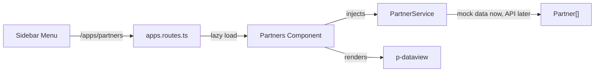

# Add Partners Page to Partnerships Section

## Architecture

The "Partnerships" section lives under `src/app/apps/` with routes defined in [`src/app/apps/apps.routes.ts`](src/app/apps/apps.routes.ts). The new Partners page will follow the same standalone component pattern used by Opportunity and other features.



## Files to Create

- **`src/app/types/partner.ts`** -- `Partner` interface with fields: `id`, `name`, `country`, `type`, `status`, etc. Follows the pattern of existing types like [`src/app/types/member.ts`](src/app/types/member.ts).

- **`src/app/apps/partners/partner.service.ts`** -- Injectable service with a `getPartners()` method. Returns mock data for now; the real endpoint will be `https://localhost:44426/partnerships/partners`. Uses `HttpClient` ready to swap in the real API call.

- **`src/app/apps/partners/partners.ts`** -- Standalone component using PrimeNG `DataViewModule`. Follows the DataView pattern from [`src/app/pages/uikit/listdemo.ts`](src/app/pages/uikit/listdemo.ts) but adapted for partner data. Supports both list and grid layouts. Uses `ChangeDetectionStrategy.OnPush` and signals.

- **`src/app/apps/partners/index.ts`** -- Barrel export (matches pattern in [`src/app/apps/opportunity/index.ts`](src/app/apps/opportunity/index.ts)).

## Files to Modify

- **[`src/app/apps/apps.routes.ts`](src/app/apps/apps.routes.ts)** -- Add a new lazy-loaded route:

```typescript
{
    path: 'partners',
    loadComponent: () => import('./partners').then((c) => c.Partners),
    data: { breadcrumb: 'Partners' }
}
```

- **[`src/app/layout/components/app.menu.ts`](src/app/layout/components/app.menu.ts)** -- Add a "Partners" menu item under the Partnerships section:

```typescript
{
    label: 'Partners',
    icon: 'pi pi-fw pi-building',
    routerLink: ['/apps/partners']
}
```

## Component Design (Partners)

- Page header with title "Partners" and a layout toggle (list/grid via `p-select-button`)
- **List layout**: Each partner card shows name, country, type, and status tag in a horizontal row
- **Grid layout**: Card-based view with partner details stacked vertically
- Status tags use PrimeNG `p-tag` with severity mapped from partner status (Active = success, Inactive = danger, etc.)
- Each partner card includes a "View" button that will eventually navigate to the detail page at `/apps/partners/:id`
- Mock data will include ~8-10 sample partners with realistic names, countries, and statuses
