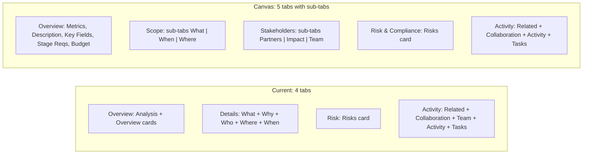

# Align Implementation with Canvas Structure

## Current State vs Canvas



## Changes Required

### 1. Update tab definitions in the TS class

In `[opportunity.ts](src/app/apps/opportunity/opportunity.ts)`, change `detailTabs` from 4 to 5 tabs:

- `overview` -- Overview
- `scope` -- Scope (icon: `pi pi-briefcase`)
- `stakeholders` -- Stakeholders (icon: `pi pi-users`)
- `risk` -- Risk & Compliance (icon: `pi pi-chart-line`)
- `activity` -- Activity (icon: `pi pi-history`)

Add sub-tab signals:
- `activeScopeSub = signal('what')` for the Scope sub-tabs
- `activeStakeholderSub = signal('partners')` for the Stakeholders sub-tabs

### 2. Restructure the template tab boundaries

The current "Details" tab (line 274) contains What, Why, Who, Where, When as accordion cards all dumped together. Split into two new tabs with sub-tab navigation:

**Scope tab** (`uxDetailTab="scope"`) -- gets sub-tab pills (What | When | Where):
- What = existing `section-what` card (deliverables/products & services)
- When = existing `section-when` card (timeline)
- Where = existing `section-where` card (geography)
- Sub-tabs shown/hidden via `@if (activeScopeSub() === 'what')` etc.

**Stakeholders tab** (`uxDetailTab="stakeholders"`) -- gets sub-tab pills (Partners | Impact | Team):
- Partners = existing `section-who` card (funding & client partners)
- Impact = existing `section-why` card (impact, beneficiaries, SDGs, cross-cutting concerns)
- Team = existing `section-team` card (currently in Activity tab -- needs moving)

### 3. Move "Team" from Activity tab to Stakeholders tab

The `section-team` card (currently lines 795-888) moves from the Activity `ng-template` into the Stakeholders `ng-template`, displayed when `activeStakeholderSub() === 'team'`.

### 4. Sub-tab pill component pattern

Add a small inline sub-tab navigation row at the top of Scope and Stakeholders tabs. Uses simple `<button>` elements styled with Tailwind, matching the canvas `SubTabs` pattern:

```html
<div class="flex gap-2 mb-4">
  <button class="px-3.5 py-1.5 rounded-full text-sm font-semibold border cursor-pointer transition-all"
    [class]="activeScopeSub() === 'what'
      ? 'bg-primary-50 dark:bg-primary-900/30 text-primary-700 dark:text-primary-300 border-primary-200 dark:border-primary-700'
      : 'bg-surface-0 dark:bg-surface-800 text-surface-500 dark:text-surface-400 border-surface-200 dark:border-surface-700'"
    (click)="activeScopeSub.set('what')">
    What
  </button>
  ...
</div>
```

### 5. Files modified

Only **one file** changes: `[src/app/apps/opportunity/opportunity.ts](src/app/apps/opportunity/opportunity.ts)`

- **TS class**: Update `detailTabs` array (5 tabs), add `activeScopeSub` and `activeStakeholderSub` signals
- **Template**: Split the `uxDetailTab="details"` ng-template into `uxDetailTab="scope"` and `uxDetailTab="stakeholders"`, add sub-tab pill rows, wrap section cards in `@if` blocks, move Team card

No changes to the `DetailLayoutComponent` library component -- it already supports any number of tabs.
