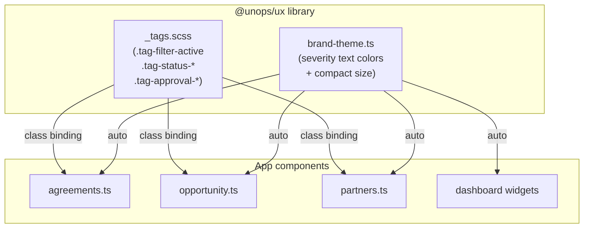

# Centralize Tag / Chip Styling into the Library

## Problem

Tag styling is scattered across 7+ app-level files using three different mechanisms (`::ng-deep`, `styleClass` with Tailwind `!important` utilities, inline `severity`). This makes it easy for new pages to drift from established patterns.

## Approach

Consolidate into **two library-level locations**, each handling a different concern:

1. **`brand-theme.ts`** (PrimeNG theme API) -- global base sizing and severity text colors that apply to every `<p-tag>` automatically.
2. **New `_tags.scss`** partial (layout SCSS) -- opt-in CSS classes for interactive filter chips and status/approval semantic colors.

This keeps the theme layer for "every tag looks like this" defaults, and SCSS for "apply this named variant" patterns that components opt into via a class name.



---

## Detailed changes

### 1. Extend `brand-theme.ts` component overrides

**File:** [projects/unops-ux/src/lib/theme/brand-theme.ts](projects/unops-ux/src/lib/theme/brand-theme.ts)

Add a compact tag sizing variant to the existing `tag` component overrides. PrimeNG's tag preset API supports `root` padding and label font-size, which replaces the three duplicated `::ng-deep` blocks in the dashboard widgets:

```typescript
tag: {
    root: {
        padding: '0.25rem 0.5rem'
    },
    label: {
        fontWeight: '600'
    },
    colorScheme: {
        // ... existing light/dark severity overrides stay as-is
    }
}
```

> **Decision point:** Making padding globally smaller affects every tag. If you want the compact sizing only on dashboard delta badges, we keep it in the SCSS partial as `.tag-compact` instead. I recommend the global approach since almost every tag in the project already uses `styleClass="px-2 py-1"` anyway -- they all want to be compact.

### 2. Create `_tags.scss` in the library

**New file:** `projects/unops-ux/src/assets/_tags.scss`

Define three reusable class families using only existing CSS custom properties and Tailwind utilities (no new variables):

- **`.tag-filter-active`** -- replaces both `.agreement-filter-active` and `.doc-filter-active`
- **`.tag-status-{active,draft,closed,archived}`** -- replaces `STATUS_CLASSES` map in `partner.service.ts`
- **`.tag-approval-{approved,not-approved}`** -- replaces `APPROVAL_CLASSES` map

Each class provides light-mode and `.app-dark` overrides using the existing `var(--p-*)` / `var(--color-*)` custom properties already in the project.

### 3. Wire `_tags.scss` into the library stylesheet

**File:** [projects/unops-ux/src/assets/layout.scss](projects/unops-ux/src/assets/layout.scss) -- add `@use './_tags';` (line 18, before `_animations`).

### 4. Migrate app components to use the centralized classes

| File | What changes |
|---|---|
| [agreements.ts](src/app/apps/agreements/agreements.ts) | Replace `agreement-filter-active` class with `tag-filter-active`; delete the component `styles` block |
| [opportunity.ts](src/app/apps/opportunity/opportunity.ts) | Replace `doc-filter-active` class with `tag-filter-active`; delete the component `styles` block for `.doc-filter-active` |
| [partner.service.ts](src/app/apps/partners/partner.service.ts) | Replace `STATUS_CLASSES` / `APPROVAL_CLASSES` Tailwind `!important` strings with the new `.tag-status-*` / `.tag-approval-*` class names |
| [partners.ts](src/app/apps/partners/partners.ts) | No template changes needed (already uses `getStatusClass` / `getApprovalClass`) |
| [partner-detail.ts](src/app/apps/partners/partner-detail.ts) | Same as above |
| [statcardwidget.ts](src/app/pages/dashboards/marketing/components/statcardwidget.ts) | Delete the `::ng-deep .p-tag` styles block (handled by `brand-theme.ts` now) |
| [socialmediarevenuewidget.ts](src/app/pages/dashboards/ecommerce/components/socialmediarevenuewidget.ts) | Same |
| [socialmediauserswidget.ts](src/app/pages/dashboards/ecommerce/components/socialmediauserswidget.ts) | Same |

### 5. Update the Design-System Maintenance Ledger

**File:** [.cursor/rules/project-handover.mdc](.cursor/rules/project-handover.mdc) -- append a ledger entry recording the new `_tags.scss` partial and the `brand-theme.ts` tag sizing addition.

---

## What does NOT change

- The existing severity text color overrides in `brand-theme.ts` (lines 117-127) stay exactly as they are.
- Tags that only use PrimeNG `severity` without custom classes continue to work unchanged.
- No new SCSS variables or CSS custom properties are introduced -- all classes reference existing tokens.
