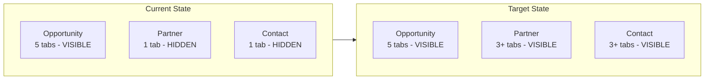

# Consistent Tabbed Navigation on All Detail Pages

## Current State

The `ux-detail-layout` component ([detail-layout.ts](projects/unops-ux/src/lib/components/detail-layout/detail-layout.ts)) already provides the full tab infrastructure:
- Sticky header with collapsible meta row
- Desktop pill-style tab bar + mobile dropdown (responsive at 1024px)
- Scrollable tab panels with persistent sidebar
- Auto-hides the tab bar when `tabs.length <= 1`

**Problem:** Partner and Contact detail pages each declare only 1 tab (`Overview`), so the tab bar is hidden. This makes the navigation inconsistent with Opportunity (5 tabs visible).



## Approach

### 1. Add standard tabs to Partner detail page

**File:** [src/app/apps/partners/partner-detail.ts](src/app/apps/partners/partner-detail.ts)

Current (line 422-424):
```typescript
detailTabs: DetailTab[] = [
    { value: 'overview', label: 'Overview', icon: 'pi pi-home' }
];
```

Add tabs following the same pattern as Opportunity. Suggested standard set for Partner:

```typescript
detailTabs: DetailTab[] = [
    { value: 'overview', label: 'Overview', icon: 'pi pi-home' },
    { value: 'agreements', label: 'Agreements', icon: 'pi pi-file' },
    { value: 'contacts', label: 'Contacts', icon: 'pi pi-users' },
    { value: 'activity', label: 'Activity', icon: 'pi pi-history' }
];
activeTab = signal('overview');
```

Add corresponding `ng-template` blocks for each new tab:

```html
<ng-template uxDetailTab="agreements">
    <!-- Placeholder: related agreements content -->
</ng-template>
<ng-template uxDetailTab="contacts">
    <!-- Placeholder: related contacts content -->
</ng-template>
<ng-template uxDetailTab="activity">
    <!-- Placeholder: activity feed -->
</ng-template>
```

Also convert `activeTab` from a plain string to a `signal('overview')` for consistency with the Opportunity reference implementation.

### 2. Add standard tabs to Contact detail page

**File:** [src/app/apps/contacts/contact-detail.ts](src/app/apps/contacts/contact-detail.ts)

Same pattern -- current single tab (line 410-412) expands to:

```typescript
detailTabs: DetailTab[] = [
    { value: 'overview', label: 'Overview', icon: 'pi pi-home' },
    { value: 'interactions', label: 'Interactions', icon: 'pi pi-comments' },
    { value: 'activity', label: 'Activity', icon: 'pi pi-history' }
];
activeTab = signal('overview');
```

Add matching `ng-template` blocks with placeholder content for each new tab.

### 3. Create a developer cursor rule for detail pages

**File:** `.cursor/rules/detail-page-tabs.mdc`

Create a rule that ensures any new detail page:
- Uses `ux-detail-layout` as its page shell
- Declares at least 2 tabs in `detailTabs` (so the tab bar is always visible)
- Uses `signal()` for `activeTab` (not a plain string)
- Follows the naming pattern: `overview` as the default first tab
- Includes `ng-template [uxDetailTab]` blocks for every declared tab
- References the Opportunity detail page as the canonical example

### 4. (Follow-up) Agreement detail page

Agreement currently has no `:id` detail route. When that page is created, it should follow the same `ux-detail-layout` pattern with tabs. This is noted for future work and will be enforced by the cursor rule from step 3.

## What does NOT need to change

- The `ux-detail-layout` component itself -- it already handles tab visibility, responsive behavior, positioning, and content projection correctly.
- The global tab styling in `_tabs.scss` -- already provides consistent pill-style tabs.
- The layout integration in `_content.scss` -- already handles scroll containment for any page using `ux-detail-layout`.
