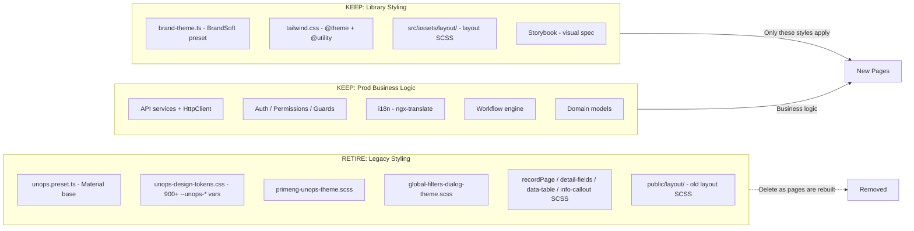
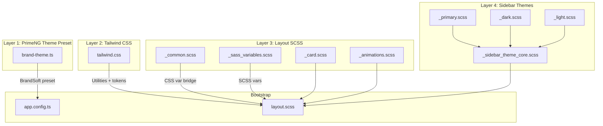

# Design Library Adoption Advisory: Full Styling Replacement

## Goal

Every page in OpportunityPlus will be **gradually rebuilt** using **only** the components and styling from the `unops-ng21_ux` design library. The legacy styling layer in the prod app (Material theme, `--unops-*` tokens, custom SCSS overrides) will be completely retired. The design library is the **single source of truth** for all visual design.



---

## What the Team Has Now (and what goes away)

### Prod app files to DELETE (gradually, as pages are rebuilt)

These files in the OpportunityPlus repo contain the legacy styling that will be fully replaced:

- **`src/styles/themes/unops.preset.ts`** -- Material-based PrimeNG preset (~5200 lines). Contains its own UNOPS color primitives, border-radius overrides, component-level overrides. **Replaced by**: [brand-theme.ts](src/app/layout/service/brand-theme.ts) from the design library (142 lines, Aura-based).

- **`src/styles/unops-design-tokens.css`** -- 900+ `--unops-*` CSS custom properties (primary, secondary, accent, neutral, surface, spacing, shadow, typography, animation, etc.). **Replaced by**: PrimeNG auto-generated `--p-*` tokens (from `brand-theme.ts`) + Tailwind `@theme` color tokens (from `tailwind.css`). No `--unops-*` variables should exist in the final state.

- **`src/styles/unops-design-tokens.scss`** -- SCSS `@use` wrapper around the CSS tokens. **Deleted** with the CSS file.

- **`src/styles/primeng-unops-theme.scss`** -- Layer-3 PrimeNG component overrides (icon fields, overlays, tabs, spinners). **Replaced by**: The design library's `brand-theme.ts` component overrides (button, tag) handle this at the theme preset level. Any remaining gaps should be raised back to the design library, not patched locally.

- **`src/styles/global-filters-dialog-theme.scss`** -- Custom dialog styling for global filters. **Replaced by**: Standard `p-dialog` styling from the library's Aura/BrandSoft preset.

- **`src/styles/themes/styles/recordPage.scss`**, **`src/styles/detail-fields.scss`**, **`src/styles/data-table.scss`**, **`src/styles/info-callout.scss`** -- Page-specific SCSS overrides. **Replaced by**: Library's Tailwind utility classes and `.card` SCSS from `_card.scss`. New pages should not need custom SCSS files.

- **`src/styles/unops-utilities.scss`** -- Custom utility classes. **Replaced by**: Library's Tailwind `@utility` definitions (typography, stagger, badge, button utilities in `tailwind.css`).

- **`public/layout/layout.scss`** (and its partials) -- The prod app's current layout SCSS. **Replaced by**: The design library's `src/assets/layout/layout.scss` and all its partials.

### Prod app styles.scss -- before and after

**Current** (to be retired):
```scss
@use './styles/unops-design-tokens.scss' as unops;
@use './tailwind.css';
@use '../public/layout/layout.scss';
@use 'primeicons/primeicons.css';
@use './styles/primeng-unops-theme.scss';
@use './styles/global-filters-dialog-theme.scss';
@use './styles/unops-utilities.scss';
@use './styles/themes/styles/recordPage.scss';
@use './styles/detail-fields.scss';
@use './styles/data-table.scss';
@use './styles/info-callout.scss';
```

**Target** (only library styling):
```scss
@use './tailwind.css';
@use './assets/layout/layout.scss';
@use 'primeicons/primeicons.css';
```

Three imports instead of eleven. All visual styling flows from `brand-theme.ts` (via PrimeNG) and `tailwind.css` (via Tailwind utilities), with layout chrome from the library's SCSS partials.

---

## Design Library File Map (the ONLY styling that applies)

These are the files in `unops-ng21_ux` that define the complete styling system. **Nothing else** should be added to the prod app.



### Layer 1 -- PrimeNG Theme Preset

**[src/app/layout/service/brand-theme.ts](src/app/layout/service/brand-theme.ts)** -- The master token definition. Wraps Aura with UNOPS brand overrides. Exports `BrandSoft` (default), `BrandCrisp`, `BrandContrast`.

- **`primitive`** -- 17 UNOPS color families (deepsea, gray, red, orange, yellow, lemon, lime, babygreen, green, olive, teal, ocean, blue, darkblue, midnight, cherry) with 50-950 scales. Aliases to Tailwind names (slate->gray, emerald->green, indigo->darkblue, etc.)
- **`semantic`** -- Font: `"Noto Sans"`. Primary: `darkblue` scale. Surfaces: `deepsea` (light), `darkblue` (dark).
- **`components`** -- Button: primary uses `{primary.600}`. Tag: accessible text colors for WCAG AA contrast.

### Layer 2 -- Tailwind CSS

**[src/assets/tailwind.css](src/assets/tailwind.css)** -- Tailwind v4 CSS-first config. Mirrors brand colors as `@theme` values. Disables Tailwind defaults (`--color-*: initial`).

- 17 brand color scales as `--color-{family}-{shade}`
- Font size scale, breakpoints
- Animation tokens (`fade-in`, `fade-in-up`, `scale-in-subtle`, `slide-in-right`, `enter-liquid`, etc.) with `@keyframes`
- Typography utilities (`title-h1`-`h7`, `body-large`-`xsmall`, `label-large`-`xsmall`)
- Button/badge utilities (`body-button`, `social-button`, `badge`)
- Stagger delays (`stagger-1` through `stagger-6`)
- Dark mode: `@custom-variant dark` using `.app-dark`

### Layer 3 -- Layout SCSS

- **[_common.scss](src/assets/layout/variables/_common.scss)** -- Bridges `--p-*` to layout shorthand vars (`--primary-color`, `--text-color`, `--surface-border`, etc.) + fluid font scale via `clamp()`
- **[_sass_variables.scss](src/assets/layout/_sass_variables.scss)** -- `$breakpoint: 992px`, `$sidebarShadow`
- **[_card.scss](src/assets/layout/_card.scss)** -- `.card` base (padding, border, radius) + filled/transparent variants
- **[_animations.scss](src/assets/layout/_animations.scss)** -- Page entrance (`router-outlet + *`), card hover lift, `prefers-reduced-motion` guard

### Layer 4 -- Sidebar Themes

- **[_primary.scss](src/assets/layout/sidebar/themes/_primary.scss)** -- Default gradient sidebar (blue-600 -> midnight-850), dark mode variant
- **[_dark.scss](src/assets/layout/sidebar/themes/_dark.scss)** -- Dark surface sidebar
- **[_light.scss](src/assets/layout/sidebar/themes/_light.scss)** -- White surface sidebar with primary tints
- All feed into **[_sidebar_theme_core.scss](src/assets/layout/sidebar/_sidebar_theme_core.scss)** via `--d-*` custom properties

### Bootstrap

- **[app.config.ts](src/app.config.ts)** -- `providePrimeNG({ theme: { preset: BrandSoft, options: { darkModeSelector: '.app-dark' } } })`
- **[layout.scss](src/assets/layout/layout.scss)** -- Master entry that `@use`s all partials in order

---

## The Rule: No Local Styling

When building new pages, the team must follow one absolute rule:

**If a style is not in the design library, it does not go in the prod app.**

- No new `--unops-*` variables
- No new SCSS override files
- No inline `style` attributes with hard-coded values
- No `::ng-deep` overrides of PrimeNG components
- If PrimeNG component styling needs adjustment, raise it to the design library's `brand-theme.ts` component overrides -- not as a local patch

If the library does not provide a token, utility, or pattern the team needs, **flag it** so it can be added to the design library first, then consumed in the prod app.

---

## How to Build a New Page

### Step-by-step workflow

1. **Pick the archetype** from the design library. The library provides 8 proven page patterns:

   - **Searchable list** -- `app-partners` ([partners.ts](src/app/apps/partners/partners.ts)): `p-dataview` + search + filter chips + status tags + row navigation
   - **Two-column detail** -- `app-partner-detail` ([partner-detail.ts](src/app/apps/partners/partner-detail.ts)): Header card + main/sidebar + divider sections
   - **Tabbed detail** -- `app-partner-detail-v2` ([partner-detail-v2.ts](src/app/apps/partners/partner-detail-v2.ts)): Header + `p-tabs` strip
   - **Feed + table + drawer** -- `app-files` / `app-agreements`: Activity timeline + `p-table` + `p-drawer` editor
   - **Task board** -- `app-tasklist`: Filter sidebar + `p-accordion` groups + `TaskDrawer`
   - **Multi-section record** -- `app-opportunity` ([opportunity.ts](src/app/apps/opportunity/opportunity.ts)): Activity, documents, tasks, file upload, AI sidebar
   - **Communication layout** -- `app-chat` / `app-mail-inbox`: Three-pane panels
   - **CMS editor** -- `app-edit`: Rich text + accordion metadata sidebar

2. **Copy the template** into an external `.html` file (team convention is `templateUrl`)

3. **Wire up the component** using the team's conventions:
   - `inject()` for DI
   - `signal()` / `computed()` for state
   - `ChangeDetectionStrategy.OnPush`
   - `@if` / `@for` / `@switch` control flow (no legacy directives)
   - `TranslateModule` in imports, `{{ 'KEY' | translate }}` wrapping all labels
   - `HasPermissionDirective` for gated actions

4. **Replace mock data** with real `HttpClient` API calls to the existing backend endpoints

5. **No custom SCSS** -- all styling comes from Tailwind utilities (`text-surface-900`, `bg-blue-50`, `animate-fade-in-up`, `stagger-2`, etc.) and the `.card` class from the layout SCSS. If you need a visual element the library does not provide, flag it.

### Page mapping

| Prod App Page | Library Archetype | Key Library Components |
|--------------|-------------------|----------------------|
| Home Dashboard | `app-dashboard` | `opportunity-stat-card-widget`, `mini-line-chart`, `multi-line-chart`, `custom-meter`, `gauge-chart`, `recent-opportunities-widget` |
| Partner List | `app-partners` | `p-dataview`, `p-iconfield`, `p-tag`, filter chip pattern |
| Partner Detail | `app-partner-detail-v2` | `p-tabs`, `p-tag`, `p-divider`, `p-button`, two-column layout |
| Opportunity List | `app-partners` (adapt) | Same DataView + filter pattern with opportunity fields |
| Opportunity Detail | `app-opportunity` | Activity timeline, `p-table`, `p-accordion`, `p-fileupload`, `TaskDrawer`, AI insight card |
| Contact List | `app-partners` (adapt) | DataView with contact fields |
| Contact Detail | `app-partner-detail` | Two-column detail, definition lists |
| Interaction List | `app-mail-inbox` | `p-table` with folder sidebar, category filters |
| Interaction Detail | `app-mail-detail` | Thread reader, reply composer |
| Agreement View | `app-agreements` | Activity feed + table + drawer |
| Office Detail | `app-partner-detail-v2` | Tabbed detail (financials, scope, roles, etc.) |
| Admin Pages | `app-tasklist` + `app-files` | Filter sidebar + table + drawer |
| AI Assistant | `app-chat` | Three-pane layout |

### Dashboard widgets to reuse directly

The `src/app/pages/dashboards/dashboard/` folder provides chart wrappers that produce the exact visuals from the design library. These can be copied as-is and wired to real data:

- `line-chart`, `multi-line-chart`, `mini-line-chart`, `bar-chart` -- Chart.js via `p-chart`
- `gauge-chart` -- donut-style gauge
- `custom-meter` -- `p-meter-group` segmented bar
- `meter-chart` -- custom DOM bars (no PrimeNG dependency)

---

## Adoption Sequence

### Phase 1: Foundation Swap

Replace the styling foundation in the prod app so that all new pages render correctly from day one:

1. Replace `unops.preset.ts` with `brand-theme.ts` (`BrandSoft` from Aura base)
2. Replace `tailwind.css` with the design library's `tailwind.css` (brand colors, utilities, animations)
3. Replace `public/layout/` with the design library's `src/assets/layout/` (all SCSS partials)
4. Replace the layout components (`src/app/layouts/`) with the design library's `src/app/layout/components/`
5. Simplify `styles.scss` to three imports (tailwind, layout, primeicons)
6. Existing pages will look different after the Material-to-Aura switch -- that is expected because they are being rebuilt anyway

### Phase 2: Page-by-Page Rebuild (priority order)

1. **Partners** -- v2 already started; complete and delete all legacy partner styles/components
2. **Home Dashboard** -- highest visibility; use library's dashboard widget set
3. **Opportunity Detail** -- most complex; library's `app-opportunity` is the richest reference
4. **Contact List + Detail** -- same pattern as Partners v2
5. **Interaction List + Detail** -- mail inbox/detail pattern
6. **Agreements / Documents** -- feed + table + drawer pattern
7. **Office Detail** -- tabbed detail
8. **Admin Pages** -- task/file pattern

### Phase 3: Legacy Cleanup

Once all pages are rebuilt:

1. Delete `unops-design-tokens.css` and `unops-design-tokens.scss`
2. Delete `primeng-unops-theme.scss` and `global-filters-dialog-theme.scss`
3. Delete `unops-utilities.scss`, `recordPage.scss`, `detail-fields.scss`, `data-table.scss`, `info-callout.scss`
4. Delete the old `public/layout/` folder
5. Grep for any remaining `--unops-` references and remove them
6. Run `npm run check-compat` (from the design library) to verify dependency alignment

---

## Storybook as the Spec

The design library includes ~79 Storybook stories organized as:
- **Foundations** -- design tokens, accessibility
- **Components** -- every PrimeNG component with UNOPS branding
- **Blocks** -- compositions (stat grids, tables, meters, heroes)
- **Pages** -- full-page stories for every feature area

This is the **visual contract**. When building a new page, if it does not match the corresponding Storybook story, the page is wrong. No custom CSS exceptions.
