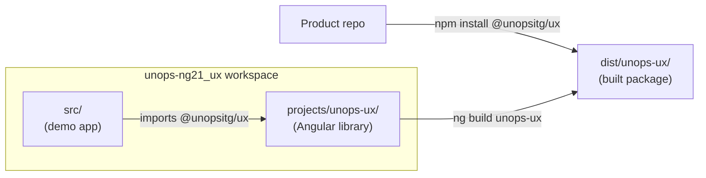

# Extract Angular Library (`@unopsitg/ux`)

## Architecture

The library lives inside the existing workspace under `projects/unops-ux/`. During development, the app imports from library source via tsconfig paths. For distribution, `ng build unops-ux` produces an npm-publishable package.



## What moves to the library vs what stays

**Moves to `@unopsitg/ux`:**
- `brand-theme.ts` (presets, primitives)
- `layout.service.ts` + `LayoutConfig`/`LayoutState` types
- All layout components: `AppLayout`, `AppSidebar`, `AppTopbar`, `AppMenu`, `AppMenuitem`, `AppBreadcrumb`, `AppFooter`, `AppSearch`, `AppRightMenu`, `AppConfigurator`, `AuthLayout`
- Shared types (14 files under `src/app/types/`)
- SCSS layout assets (`src/assets/layout/`)
- Tailwind CSS brand theme (`src/assets/tailwind.css`)
- SVG logo assets (`src/assets/opp/`)

**Stays in the app (demo/template-specific):**
- `LandingLayout` (depends on page-specific `TopbarWidget`/`FooterWidget`)
- All page components, feature apps, stories
- The hardcoded menu model (moves from `AppMenu` into the app as a provider)
- `environment.ts` files
- Storybook config

## Key refactors for reusability

### 1. Menu model becomes injectable

Currently `AppMenu` hardcodes the full UNOPS menu tree. In the library, this becomes an `InjectionToken`:

```typescript
// Library provides the token + interface
export interface MenuItem { label?: string; icon?: string; routerLink?: string[]; items?: MenuItem[]; /* ... */ }
export const MENU_MODEL = new InjectionToken<MenuItem[]>('MENU_MODEL');

// AppMenu injects it instead of hardcoding
export class AppMenu {
  model = inject(MENU_MODEL);
}

// Consuming project provides their menu
providers: [{ provide: MENU_MODEL, useValue: myMenuItems }]
```

### 2. Sidebar logo becomes configurable

Currently `AppSidebar` hardcodes `assets/opp/AppLogo/...` paths. In the library:

```typescript
export interface SidebarLogoConfig {
  expanded: string;
  compact: string;
  alt: string;
}
export const SIDEBAR_LOGO = new InjectionToken<SidebarLogoConfig>('SIDEBAR_LOGO', {
  factory: () => ({
    expanded: 'assets/opp/AppLogo/AppLogo-onDark_H.svg',
    compact: 'assets/opp/AppLogo/AppLogo-onDark_compact.svg',
    alt: 'UNOPS'
  })
});
```

The token has UNOPS defaults via `factory`, so this repo's app needs zero config — other projects override it.

### 3. Remove `environment` dependency

`AppMenu` currently imports `environment` for `storybookBaseUrl`. Since the menu model moves out of the library, this dependency disappears naturally.

### 4. Fix import paths

Library code uses relative paths internally (no `@/` alias). The app's ~55 files importing from `@/app/layout/` update to `@unopsitg/ux` or `@unopsitg/ux/layout`.

## Library project structure

```
projects/unops-ux/
  src/
    public-api.ts                   # barrel: re-exports everything
    lib/
      theme/
        brand-theme.ts              # brandPrimitives, BrandSoft/Crisp/Contrast, brandPresets
        index.ts
      layout/
        tokens.ts                   # MENU_MODEL, SIDEBAR_LOGO injection tokens
        layout.service.ts
        components/
          app.layout.ts
          app.sidebar.ts            # uses SIDEBAR_LOGO token
          app.topbar.ts
          app.menu.ts               # uses MENU_MODEL token
          app.menuitem.ts
          app.breadcrumb.ts
          app.footer.ts
          app.search.ts
          app.rightmenu.ts
          app.configurator.ts
          app.authlayout.ts
        index.ts
      types/
        index.ts                    # barrel for all 14 type files
        partner.ts, customer.ts, ...
    assets/
      layout/                       # all SCSS partials (copied to dist)
      opp/                          # SVG logos (copied to dist)
      styles.scss                   # SCSS entry point
      tailwind.css                  # brand color definitions
  ng-package.json                   # ng-packagr config + asset globs
  package.json                      # @unopsitg/ux, peerDependencies
  tsconfig.lib.json
  tsconfig.lib.prod.json
  README.md
```

## Library `package.json` (key fields)

```json
{
  "name": "@unopsitg/ux",
  "version": "21.0.0",
  "peerDependencies": {
    "@angular/common": "^21",
    "@angular/core": "^21",
    "@angular/router": "^21",
    "@primeuix/themes": "^2.0.0",
    "primeng": "^21.0.4",
    "primeicons": "^7.0.0"
  }
}
```

## Consuming project usage

After `npm install @unopsitg/ux`:

```typescript
// app.config.ts
import { BrandSoft, MENU_MODEL, SIDEBAR_LOGO } from '@unopsitg/ux';

export const appConfig: ApplicationConfig = {
  providers: [
    providePrimeNG({ theme: { preset: BrandSoft, options: { darkModeSelector: '.app-dark' } } }),
    { provide: MENU_MODEL, useValue: myMenuItems },
    { provide: SIDEBAR_LOGO, useValue: { expanded: 'assets/logo.svg', compact: 'assets/logo-sm.svg', alt: 'My App' } }
  ]
};
```

```json
// angular.json — reference library styles
"styles": [
  "node_modules/@unopsitg/ux/assets/styles.scss",
  "node_modules/@unopsitg/ux/assets/tailwind.css"
]
```

```json
// angular.json — copy library assets (logos, images)
"assets": [
  { "glob": "**/*", "input": "node_modules/@unopsitg/ux/assets/opp", "output": "assets/opp" }
]
```

## Distribution

- **GitHub Packages**: GitHub Actions workflow builds the library on tag push (`v*`), publishes to `@unops` scope on GitHub npm registry
- **Git URL fallback**: `npm install github:unops/unops-ng21_ux` works because `package.json` has a `postinstall` script that runs `ng build unops-ux` (or the dist is committed to a `lib-dist` branch)
- **Workspace scripts**: `npm run build:lib` added for local builds

## Files changed in the app (import updates)

~55 files currently import from `@/app/layout/` — these update to `@unopsitg/ux` or `@unopsitg/ux/layout`. This is a mechanical find-and-replace. The `@/` alias continues to work for app-specific code (pages, features).

5 files import from `@/app/types/` — these update to `@unopsitg/ux`.

[`angular.json`](angular.json) gets a new `unops-ux` project entry under `projects`.

[`tsconfig.json`](tsconfig.json) gets a path mapping: `"@unopsitg/ux": ["projects/unops-ux/src/public-api.ts"]` so the app resolves library imports from source during development.
