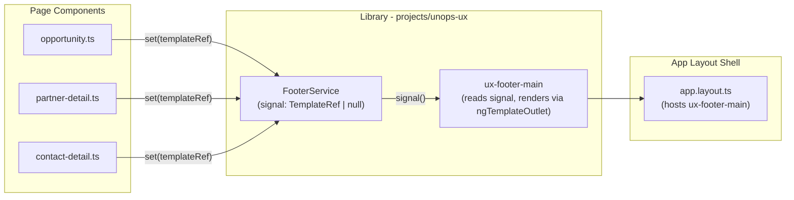

# Footer-Main Shared Component

## Architecture



## 1. Create `FooterService`

**File:** `projects/unops-ux/src/lib/layout/footer.service.ts`

```typescript
import { Injectable, signal, TemplateRef } from '@angular/core';

@Injectable({ providedIn: 'root' })
export class FooterService {
    readonly content = signal<TemplateRef<unknown> | null>(null);
}
```

Pages call `footerService.content.set(tpl)` on init, and `footerService.content.set(null)` on destroy.

## 2. Create `FooterMainComponent`

**File:** `projects/unops-ux/src/lib/components/footer-main/footer-main.ts`

- Selector: `ux-footer-main`
- Replaces the current `AppFooter` (`[app-footer]`) in the shell
- Styled with PrimeNG tokens (`--p-primary-50`, `--p-text-color`, etc.) and backdrop blur
- Renders `ngTemplateOutlet` from the service signal
- When no page content is set, shows copyright fallback ("(c) UNOPS 2026")
- Height: `2.5rem`, full width of `layout-content-wrapper-inside`
- PrimeNG compatible: uses `CommonModule` for `ngTemplateOutlet`; any PrimeNG component in the projected template will render normally since templates are compiled in the page's context

Key styles (using PrimeNG tokens, no hardcoded values):
```css
:host {
    display: flex;
    align-items: center;
    height: 2.5rem;
    padding: 0.75rem 2rem;
    background: color-mix(in srgb, var(--p-primary-50) 20%, transparent);
    backdrop-filter: blur(24px);
    font-size: var(--font-size-xs, 0.75rem);
    line-height: 1.5;
    color: var(--p-text-color);
}
:host-context(:root[class*='app-dark']) {
    background: color-mix(in srgb, var(--p-primary-900) 50%, transparent);
    color: var(--p-surface-100);
}
```

## 3. Replace `AppFooter` in `app.layout.ts`

In [app.layout.ts](projects/unops-ux/src/lib/layout/components/app.layout.ts), replace `<div app-footer></div>` with `<ux-footer-main />`. This places it inside `layout-content-wrapper-inside` after `main.layout-content`, so it naturally sits at the bottom of the content area without needing `position: fixed`.

## 4. Migrate existing pages

Each page that currently uses `<ux-detail-footer>` or `[ux-detail-footer]`:

- **`opportunity.ts`**: Move the metadata `<div>` into an `<ng-template #footerContent>`, inject `FooterService`, set on init, clear on destroy. Remove `<ux-detail-footer>`.
- **`partner-detail.ts`**: Same pattern with the "Back to list" `<p-button>`.
- **`contact-detail.ts`**: Same pattern with the "Contacts" `<p-button>`.

Pattern each page follows:
```typescript
private footerService = inject(FooterService);
@ViewChild('footerContent', { static: true }) footerTpl!: TemplateRef<unknown>;

ngOnInit() {
    this.footerService.content.set(this.footerTpl);
}
// cleanup via DestroyRef:
constructor() {
    inject(DestroyRef).onDestroy(() => this.footerService.content.set(null));
}
```

## 5. Remove `DetailFooterComponent` and its slot from `detail-layout.ts`

- Remove the `<div class="flex-shrink-0 w-full z-100">` footer wrapper from the detail-layout template
- Remove or deprecate `DetailFooterComponent` (no longer needed since footer lives in the shell)
- Remove the `--ux-ai-card-offset: 15rem` from `.ux-dl__sidebar-inner` (footer is no longer inside the detail-layout flex column; revert to default `12rem`)

## 6. Export from library public API

Add `FooterService` and `FooterMainComponent` to [public-api.ts](projects/unops-ux/src/public-api.ts) and the components barrel export.

## 7. Sidebar footer alignment

The sidebar footer in [app.sidebar.ts](projects/unops-ux/src/lib/layout/components/app.sidebar.ts) (line 20) already has matching styles. No change needed -- it will visually align with the new `ux-footer-main` at the same viewport bottom position.