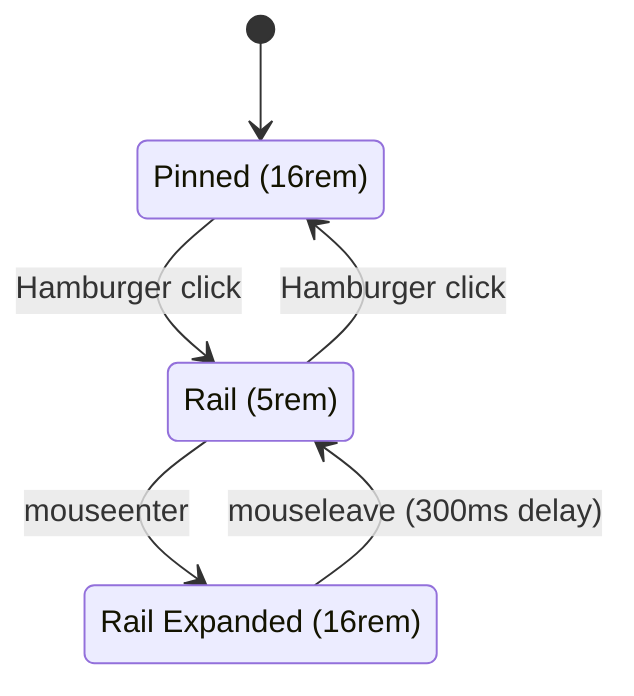

# Gmail-Style Sidebar Behavior

## Current vs Target

**Current:** Hamburger toggles `menuMode` between `'static'` (16rem, full menu tree) and `'compact'` (5rem, flyout popover submenus). These are entirely different CSS layout modes.

**Target (Gmail-like):** Hamburger toggles a `sidebarPinned` flag within a single mode. When unpinned, the sidebar collapses to a narrow icon rail. Hovering the rail smoothly expands it to full width showing the complete menu tree (no flyout popovers). Content always pushes. Other configurator modes (slim, horizontal, overlay, drawer, reveal, compact) remain available for demo purposes.



## Implementation

### 1. Layout Service -- add `sidebarPinned` state

File: [layout.service.ts](projects/unops-ux/src/lib/layout/layout.service.ts)

- Add `sidebarPinned: boolean` to `LayoutState` interface (default `true`)
- Add computed signal `isSidebarPinned = computed(() => this.layoutState().sidebarPinned)`
- Add computed signal `isRail = computed(() => !this.layoutState().sidebarPinned && this.isStatic())`
- Add `toggleSidebarPin()` method that flips `sidebarPinned` and resets `sidebarExpanded` to `false`
- Keep `changeMenuMode()` resetting `sidebarPinned: true` when switching to another mode (so the configurator always starts pinned)

### 2. Layout wrapper -- add rail CSS classes

File: [app.layout.ts](projects/unops-ux/src/lib/layout/components/app.layout.ts)

Add to `containerClass()`:
- `'layout-sidebar-rail': !layoutState.sidebarPinned && layoutConfig.menuMode === 'static'`
- Keep existing `layout-sidebar-expanded` (still driven by `sidebarExpanded`)

This produces the class combo `layout-static layout-sidebar-rail` when unpinned, and `layout-static layout-sidebar-rail layout-sidebar-expanded` when hovering the rail.

### 3. Sidebar component -- toggle pin instead of menuMode

File: [app.sidebar.ts](projects/unops-ux/src/lib/layout/components/app.sidebar.ts)

- Change `isSidebarExpanded` to `computed(() => this.layoutService.layoutState().sidebarPinned)` -- active state on hamburger = pinned
- Change `toggleSidebar()` to call `layoutService.toggleSidebarPin()` instead of `changeMenuMode()`
- Keep `onMouseEnter()` / `onMouseLeave()` but gate on `!sidebarPinned` (hover-expand only when in rail mode); currently gated on `!anchored` -- change to `!sidebarPinned`
- Remove the `anchored` gate (or repurpose; `anchored` will be unused for this flow)

### 4. Menu item -- tooltip in rail mode

File: [app.menuitem.ts](projects/unops-ux/src/lib/layout/components/app.menuitem.ts)

- Add `isRail = computed(() => this.layoutService.isRail())` (the new computed from service)
- Update tooltip `[tooltipDisabled]` to also show tooltips when `isRail() && !sidebarExpanded && root()` -- shows label tooltips on the icon rail when not hover-expanded
- Keep `isCompact()` tooltip logic for the existing compact configurator mode

### 5. Sidebar SCSS -- new rail state styles

File: [_sidebar_vertical.scss](projects/unops-ux/src/assets/sidebar/_sidebar_vertical.scss)

Add a new `@media (min-width: $breakpoint)` block for `.layout-sidebar-rail`:

```scss
.layout-sidebar-rail {
    .layout-sidebar {
        width: 5rem;
    }

    // Icons centered, labels hidden
    .layout-menu {
        padding: 0 0.5rem;
    }
    .layout-menu ul a {
        justify-content: center;
        .layout-menuitem-text { opacity: 0; max-width: 0; overflow: hidden; }
        .layout-submenu-toggler { opacity: 0; max-width: 0; overflow: hidden; }
        .layout-menuitem-icon { margin-right: 0; }
    }
    .layout-menu .layout-root-menuitem > .layout-menuitem-root-text {
        max-height: 0; opacity: 0; padding: 0;
    }
    .menu-separator { max-height: 0; opacity: 0; margin: 0; }
    .layout-menu-container { padding: 0.5rem 0; }

    // Expanded on hover -- full width, labels visible
    &.layout-sidebar-expanded {
        .layout-sidebar { width: 16rem; }
        .layout-menu { padding: 0 0 0 1rem; }
        .layout-menu ul a {
            justify-content: flex-start;
            .layout-menuitem-text { opacity: 1; max-width: 12rem; }
            .layout-submenu-toggler { opacity: 1; max-width: 2rem; }
            .layout-menuitem-icon { margin-right: 0.5rem; }
        }
        .layout-menu .layout-root-menuitem > .layout-menuitem-root-text {
            max-height: 2.5rem; opacity: 1; padding: 0.5rem 0;
        }
        .menu-separator { max-height: 1.75rem; opacity: 0.5; margin: 0.875rem 0; }
        .layout-menu-container { padding: 1rem 0 2rem 1rem; }
    }
}
```

The existing transitions on `.layout-sidebar` (width 0.45s), `.layout-menuitem-text` (opacity 0.3s, max-width 0.4s), `.menu-separator`, and `.layout-menu-container` padding already handle the animation -- no new keyframes needed. The cubic-bezier `(0.32, 0.72, 0, 1)` already provides a smooth, Gmail-like ease.

### 6. Content wrapper transition

File: [_content.scss](projects/unops-ux/src/assets/_content.scss)

Already has `transition: all 0.45s cubic-bezier(0.32, 0.72, 0, 1)` on `.layout-content-wrapper`. Since the sidebar width change pushes content via flex, this transition will smoothly animate the content area adjusting. No changes needed here.

### 7. Sidebar header -- stays as-is

The hamburger button in `.sidebar-header` stays centered. In rail mode, the sidebar is 5rem wide which centers the 2.25rem button nicely. When expanded, the button stays at the top-left of the wider sidebar. No template changes needed.

## Files changed (summary)

- `projects/unops-ux/src/lib/layout/layout.service.ts` -- new state + computed + method
- `projects/unops-ux/src/lib/layout/components/app.layout.ts` -- new CSS class in `containerClass()`
- `projects/unops-ux/src/lib/layout/components/app.sidebar.ts` -- toggle pin, hover gate
- `projects/unops-ux/src/lib/layout/components/app.menuitem.ts` -- tooltip for rail
- `projects/unops-ux/src/assets/sidebar/_sidebar_vertical.scss` -- rail state CSS

## What stays unchanged

- All other menu modes (compact, slim, horizontal, overlay, drawer, reveal) and their SCSS
- The Theme Configurator panel
- Mobile behavior (same hamburger in topbar, slide-out sidebar)
- Topbar logo placement (from earlier changes)
- Sidebar theme system (primary/light/dark gradient)