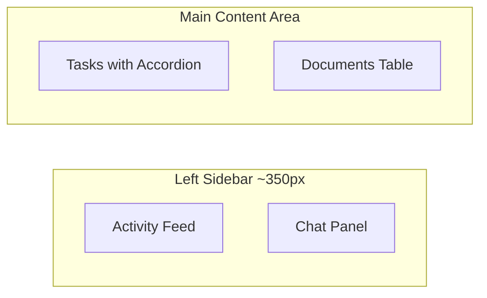

# Opportunity Page

## Layout



The page uses a responsive two-column layout:
- **Left sidebar** (~350px, collapsible on mobile): Activity Feed timeline on top, Chat panel below
- **Main content** (flex-1): Tasks section with accordion and search, Documents table with filters below

## Files to Create

### 1. `src/app/apps/opportunity/opportunity.ts`

The main page component. It will:
- Compose the sidebar + main layout using Tailwind flex/grid
- **Left sidebar**: Reuse the Activity Feed UI from [files.ts](src/app/apps/files/files.ts) (lines 79-127 -- the timeline card) and embed the `ChatBox` + `ChatMenu` from [chat/](src/app/apps/chat/)
- **Main area top**: Adapt the Task List accordion from [tasklist/index.ts](src/app/apps/tasklist/index.ts) (the search + accordion section, without the full sidebar filter panel -- use inline filter tabs instead)
- **Main area bottom**: Adapt the Documents table from [files.ts](src/app/apps/files/files.ts) (lines 195-271 -- filter chips + `p-table`)
- Include the existing `TaskDrawer` for task editing and a simplified file edit `p-drawer`
- Use opportunity-themed demo data (opportunity-related tasks, documents, activity, chat)

### 2. `src/app/apps/opportunity/index.ts`

Barrel export file (re-exports `Opportunity` component), following the pattern of other apps like `src/app/apps/files/index.ts`.

## Files to Modify

### 3. Route registration -- [src/app/apps/apps.routes.ts](src/app/apps/apps.routes.ts)

Add a new lazy-loaded route:

```typescript
{
    path: 'opportunity',
    loadComponent: () => import('./opportunity').then((c) => c.Opportunity),
    data: { breadcrumb: 'Opportunity' }
}
```

### 4. Sidebar menu -- [src/app/layout/components/app.menu.ts](src/app/layout/components/app.menu.ts)

Add an "Opportunity" entry in the Apps section (lines 46-98), before the existing CMS entry:

```typescript
{
    label: 'Opportunity',
    icon: 'pi pi-fw pi-briefcase',
    routerLink: ['/apps/opportunity']
}
```

## Key Design Decisions

- The component is self-contained with its own demo data rather than importing from other apps, keeping it decoupled
- Chat is embedded as a compact panel (conversation list + message thread) rather than the full-page chat layout
- Activity feed is taken directly from the Files page pattern (timeline with colored dots)
- Task section uses inline horizontal filter tabs (like the mobile task UI) instead of a dedicated sidebar, since the page already has its own sidebar
- Documents table uses the same `p-table` pattern with filter chips and sortable columns
- On mobile, the sidebar collapses and can be toggled via a button
