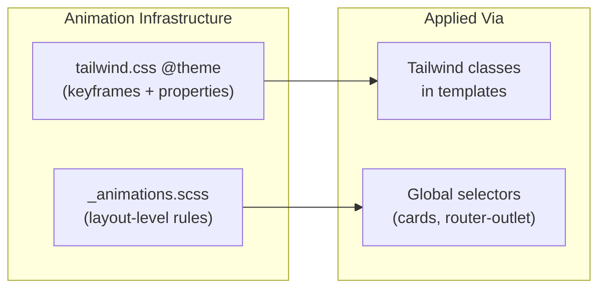

# Subtle CSS Animations Across All Pages

## Approach

Pure CSS/Tailwind -- no `@angular/animations`, no new packages. Animations are defined centrally in two places and applied via classes in templates. The feel targets ~60% barely-there fade-ins with ~30% gentle slide/scale accents, all smooth and playful.

## Architecture



---

## Phase 1 -- Animation infrastructure (2 files)

### 1a. New keyframes and animation tokens in [`tailwind.css`](src/assets/tailwind.css)

Add to the existing `@theme` block (after the current `--animate-wiggle` entry, ~line 245):

```css
--animate-fade-in: fade-in 0.35s ease-out both;
--animate-fade-in-up: fade-in-up 0.4s ease-out both;
--animate-fade-in-down: fade-in-down 0.35s ease-out both;
--animate-scale-in-subtle: scale-in-subtle 0.35s ease-out both;
--animate-slide-in-right: slide-in-right 0.4s ease-out both;

@keyframes fade-in {
  from { opacity: 0; }
  to   { opacity: 1; }
}
@keyframes fade-in-up {
  from { opacity: 0; transform: translateY(10px); }
  to   { opacity: 1; transform: translateY(0); }
}
@keyframes fade-in-down {
  from { opacity: 0; transform: translateY(-8px); }
  to   { opacity: 1; transform: translateY(0); }
}
@keyframes scale-in-subtle {
  from { opacity: 0; transform: scale(0.97); }
  to   { opacity: 1; transform: scale(1); }
}
@keyframes slide-in-right {
  from { opacity: 0; transform: translateX(16px); }
  to   { opacity: 1; transform: translateX(0); }
}
```

Also add stagger-delay utilities as `@utility` blocks:

```css
@utility stagger-1 { animation-delay: 50ms; }
@utility stagger-2 { animation-delay: 100ms; }
@utility stagger-3 { animation-delay: 150ms; }
@utility stagger-4 { animation-delay: 200ms; }
@utility stagger-5 { animation-delay: 250ms; }
@utility stagger-6 { animation-delay: 300ms; }
```

### 1b. New [`_animations.scss`](src/assets/layout/_animations.scss) partial

Create this file and `@use` it in [`layout.scss`](src/assets/layout/layout.scss) (after `_card`).

Contents:

- **Page entrance** -- CSS-only route transition via `router-outlet + *`:

```scss
router-outlet + * {
  animation: fade-in-up 0.35s ease-out both;
}
```

This targets the routed component host element (the sibling immediately after `<router-outlet>`). Every lazy-loaded page fades in on navigation with zero template changes.

- **Card hover lift** -- playful micro-interaction on `.card`:

```scss
.card {
  transition:
    transform 0.25s ease,
    box-shadow 0.25s ease;

  &:hover {
    transform: translateY(-2px);
    box-shadow: 0 4px 12px rgba(0, 0, 0, 0.06);
  }
}
```

- **Respect reduced-motion** -- wrap all custom animations:

```scss
@media (prefers-reduced-motion: reduce) {
  *, *::before, *::after {
    animation-duration: 0.01ms !important;
    animation-iteration-count: 1 !important;
    transition-duration: 0.01ms !important;
  }
}
```

---

## Phase 2 -- Dashboard widget stagger (template changes)

Apply `animate-fade-in-up` + `stagger-N` classes to dashboard widget wrappers so cards cascade in one by one.

### Files to edit:

- [`dashboard.ts`](src/app/pages/dashboards/dashboard/dashboard.ts) -- hero gets `animate-fade-in-down`, stat cards get `animate-fade-in-up stagger-1`, chart row gets `stagger-2`, bottom row gets `stagger-3`
- [`bankingdashboard.ts`](src/app/pages/dashboards/banking/bankingdashboard.ts) -- same stagger pattern on widget rows
- [`marketingdashboard.ts`](src/app/pages/dashboards/marketing/marketingdashboard.ts) -- same

---

## Phase 3 -- Feature app pages (template changes)

### Partners

- [`partners.ts`](src/app/apps/partners/partners.ts) -- DataView toolbar gets `animate-fade-in`, individual partner cards in the `@for` loop get `animate-fade-in-up` with computed stagger via `[style.animation-delay.ms]="i * 50"`
- [`partner-detail.ts`](src/app/apps/partners/partner-detail.ts) -- profile header card `animate-fade-in`, detail sections `animate-fade-in-up` with stagger

### Opportunity / Agreements / Files / CMS / Mail / Chat

- Add `animate-fade-in-up` to top-level card wrappers in each component (light touch -- 1 class per component, no per-item stagger needed for table-heavy pages)

Estimated files: `opportunity.ts`, `agreements.ts`, `files.ts`, `cms/list.ts`, `cms/detail.ts`, `cms/edit.ts`, `mail-inbox.ts`, `chat/index.ts`, `tasklist/index.ts`

---

## Phase 4 -- Auth and landing pages (template changes)

### Auth pages

- [`login.ts`](src/app/pages/auth/login.ts), `register.ts`, `forgotpassword.ts`, `newpassword.ts`, `verification.ts`, `lockscreen.ts` -- the central auth card gets `animate-scale-in-subtle` for a polished entrance

### Landing pages

- Already have some `animate-fadein` usage; add `animate-fade-in-up` with stagger to feature/pricing cards for consistency

---

## Phase 5 -- E-commerce and other pages

- Product cards in [`productlist.ts`](src/app/pages/ecommerce/productlist.ts) -- `animate-fade-in-up` with stagger on grid items
- [`crud.ts`](src/app/pages/crud/crud.ts) -- `animate-fade-in` on the card wrapper
- [`invoice.ts`](src/app/pages/invoice/invoice.ts) -- `animate-fade-in` on the card

---

## What we are NOT changing

- **PrimeNG component internals** -- accordion, dialog, drawer, and tooltip animations are handled by PrimeNG's own CSS; we leave those untouched
- **Existing layout SCSS transitions** -- sidebar, topbar, content wrapper transitions already use smooth 0.45s cubic-bezier; no modifications
- **No new dependencies** -- no `@angular/animations`, no third-party animation libraries
- **No `@angular/router` changes** -- page transitions are pure CSS via `router-outlet + *`, not `withViewTransitions()`

---

## Accessibility

- All animations wrapped in `@media (prefers-reduced-motion: reduce)` guard
- Durations kept short (250-400ms) to avoid motion sickness
- No looping animations on content (existing infinite-scroll/float/wiggle on landing are decorative and already in place)

---

## Design-System Ledger Entry

Will append a new entry to the compatibility log in the `design-system-maintenance.mdc` rule documenting the new keyframes and animation tokens added to `tailwind.css` and the new `_animations.scss` partial.