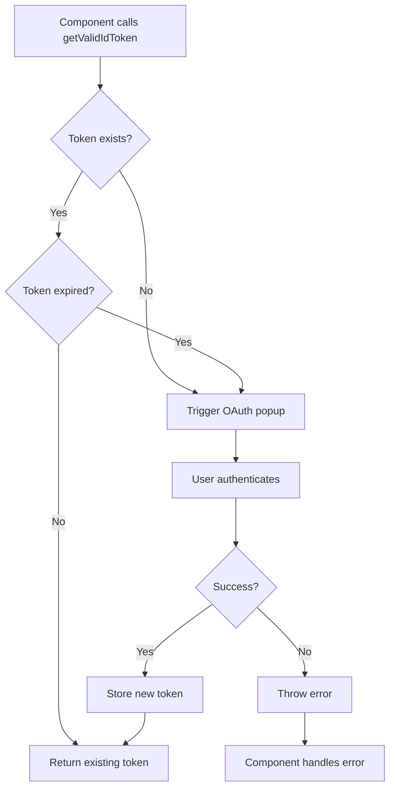

# Google OAuth Architecture - UNOPS Opportunity+ System

## Overview

The Google OAuth implementation in the UNOPS Opportunity+ system is **already architected at the application level** with centralized token management. Individual components do not trigger OAuth flows directly; instead, they use the centralized `GoogleOAuthService`.

## Architecture Diagram

```
┌─────────────────────────────────────────────────────────────┐
│                     Application Level                        │
├─────────────────────────────────────────────────────────────┤
│                                                               │
│  ┌──────────────────────────────────────────────────────┐  │
│  │  GoogleOAuthService (Singleton)                       │  │
│  │  - Manages ID token lifecycle                         │  │
│  │  - Validates token expiration automatically           │  │
│  │  - Triggers OAuth only when needed                    │  │
│  │  - Provides getValidIdToken() to components           │  │
│  └──────────────────────────────────────────────────────┘  │
│                           ▲                                   │
│                           │                                   │
│                           │ Uses                              │
│                           │                                   │
│  ┌──────────────────────────────────────────────────────┐  │
│  │  SocialAuthService (@abacritt/angularx-social-login) │  │
│  │  - External library                                   │  │
│  │  - Configured in app.config.ts                        │  │
│  │  - Handles Google Sign-In popup                       │  │
│  └──────────────────────────────────────────────────────┘  │
│                                                               │
└─────────────────────────────────────────────────────────────┘
                              ▲
                              │
                              │ inject() and use
                              │
┌─────────────────────────────────────────────────────────────┐
│                     Component Level                          │
├─────────────────────────────────────────────────────────────┤
│                                                               │
│  Components call:                                             │
│  const token = await this.googleOAuthService.getValidIdToken() │
│                                                               │
│  Examples:                                                    │
│  - OpportunityStatementSectionComponent (export to doc)     │
│  - [Any future component needing OAuth]                      │
│                                                               │
└─────────────────────────────────────────────────────────────┘
```

## Key Components

### 1. GoogleOAuthService

**Location**: `UNOPS.PAO.ClientApp/src/app/core/services/auth/google-oauth.service.ts`

**Purpose**: Centralized application-level OAuth token management

**Key Features**:
- ✅ Singleton service (`providedIn: 'root'`)
- ✅ Automatically subscribes to `SocialAuthService.authState` 
- ✅ Validates token expiration (55-minute buffer on 1-hour tokens)
- ✅ Exposes `getValidIdToken()` method that:
  - Returns existing token if valid
  - Triggers OAuth flow if token is invalid or expired
  - Handles errors gracefully

**Public API**:
```typescript
export class GoogleOAuthService {
  // Check if current token is valid
  isTokenValid(): boolean

  // Get current token (returns null if invalid)
  getCurrentIdToken(): string | null

  // Get valid token (triggers auth if needed) - PRIMARY METHOD
  async getValidIdToken(forceRefresh?: boolean): Promise<string>

  // Force token refresh
  async refreshToken(): Promise<string>

  // Sign out
  async signOut(): Promise<void>

  // Get current user info
  getCurrentUser(): SocialUser | null

  // Observable of token state
  token$: Observable<GoogleOAuthToken | null>
}
```

### 2. SocialAuthService Configuration

**Location**: `UNOPS.PAO.ClientApp/src/app/app.config.ts`

**Configuration**:
```typescript
{
  provide: 'SocialAuthServiceConfig',
  useFactory: socialAuthConfigFactory,
  deps: [ConfigurationService],
}

const socialAuthConfigFactory = (configService: ConfigurationService) => {
  return {
    autoLogin: false,  // Manual trigger only
    providers: [
      {
        id: GoogleLoginProvider.PROVIDER_ID,
        provider: new GoogleLoginProvider(
          configService.getConfig().googleClientId
        ),
      },
    ],
  };
};
```

### 3. Component Usage Pattern

**✅ CORRECT USAGE** - OpportunityStatementSectionComponent:
```typescript
export class OpportunityStatementSectionComponent {
  private readonly googleOAuthService = inject(GoogleOAuthService);

  async exportToGoogleDoc(): Promise<void> {
    try {
      // Get valid token - triggers auth popup if needed
      const idToken = await this.googleOAuthService.getValidIdToken();

      // Use token for API call
      const response = await fetch('https://api.ai.unops.org/v1/convert/markdown-to-google-doc', {
        method: 'POST',
        headers: {
          Authorization: `Bearer ${idToken}`,
        },
        body: formData,
      });

      // Handle 401/403 errors - refresh token and retry
      if (response.status === 401 || response.status === 403) {
        await this.googleOAuthService.refreshToken();
        return this.exportToGoogleDoc(); // Retry
      }
    } catch (authError) {
      // Handle authentication failure
      this.feedbackService.showErrorToast({
        detail: 'Authentication failed. Please try again.'
      });
    }
  }
}
```

**❌ INCORRECT USAGE** - Don't do this:
```typescript
// DON'T inject SocialAuthService directly in components
export class SomeComponent {
  private readonly socialAuthService = inject(SocialAuthService); // ❌ WRONG

  async someMethod() {
    // DON'T trigger sign-in directly
    await this.socialAuthService.signIn(GoogleLoginProvider.PROVIDER_ID); // ❌ WRONG
  }
}
```

## Token Types & Purposes

### ID Token (Managed by GoogleOAuthService)
- **Purpose**: Identity verification for API calls
- **Used by**: Components that need to authenticate to external APIs (e.g., AI services)
- **Example**: Export opportunity statement to Google Docs
- **Lifetime**: 1 hour (managed with 55-minute buffer)

### Access Token (Managed by GoogleDriveService)
- **Purpose**: Google Drive API access
- **Used by**: Document upload/export features that interact directly with Drive API
- **Example**: Converting Office files to PDF via Drive API
- **Lifetime**: 1 hour (managed separately)
- **Note**: This is a separate OAuth flow for Drive API scopes, not related to ID tokens

## Token Validation Flow



## Implementation Checklist

When adding OAuth functionality to a new component:

- [ ] Inject `GoogleOAuthService` (not `SocialAuthService`)
- [ ] Call `await this.googleOAuthService.getValidIdToken()` when token needed
- [ ] Wrap in try-catch to handle authentication failures
- [ ] Show appropriate user feedback for auth failures
- [ ] Handle 401/403 errors by refreshing token and retrying
- [ ] Never trigger `SocialAuthService.signIn()` directly

## Current Implementation Status

### ✅ Correctly Implemented
- **GoogleOAuthService**: Singleton service managing tokens at app level
- **OpportunityStatementSectionComponent**: Uses service correctly for export to Google Docs
- **SocialAuthComponent**: Login component (appropriate use of SocialAuthService)

### ⚠️ Separate OAuth Flow (Intentional)
- **GoogleDriveService**: Has its own OAuth flow for Drive API access tokens
  - This is correct because it needs Drive API scopes, not just ID tokens
  - Uses `google.accounts.oauth2.initTokenClient()` directly
  - Manages access tokens in localStorage separately

### 🔍 Verification Needed
When adding new features that need Google authentication:
1. Check if feature needs ID token (identity) or access token (API access)
2. If ID token: Use `GoogleOAuthService.getValidIdToken()`
3. If Drive API access: Use `GoogleDriveService.initializeAuth()`

## Testing OAuth Flow

### Manual Testing Steps
1. Clear browser storage (to remove any cached tokens)
2. Navigate to a feature that needs OAuth (e.g., opportunity statement export)
3. Click export button
4. Verify Google OAuth popup appears
5. Authenticate with Google account
6. Verify export completes successfully
7. Try export again immediately
8. Verify OAuth popup does NOT appear (using cached token)
9. Wait 55+ minutes
10. Try export again
11. Verify OAuth popup appears (token expired)

### Console Logging
GoogleOAuthService provides detailed console logging:
- `🔑 Using existing Google OAuth token` - Token is valid, reusing
- `🔐 Triggering Google OAuth authentication...` - Token invalid/expired, triggering OAuth
- `✅ Google OAuth authentication successful` - OAuth completed
- `⏰ Google OAuth token has expired` - Token expiration detected

## Security Considerations

### Token Storage
- Tokens stored in memory only (BehaviorSubject)
- NOT persisted to localStorage (security best practice for ID tokens)
- Tokens cleared on application reload (user must re-authenticate)

### Token Expiration
- Google ID tokens expire after 1 hour
- Service uses 55-minute buffer to prevent edge cases
- Automatic refresh on 401/403 errors

### Scopes
- ID tokens include only basic profile scopes
- Drive API access requires separate OAuth flow with appropriate scopes
- Never request more scopes than necessary

## Future Enhancements

Potential improvements to consider:

1. **Token Persistence** (if needed):
   - Store encrypted tokens in localStorage for session persistence
   - Automatically restore tokens on app reload
   - Add token refresh on app initialization

2. **Better Error Messaging**:
   - Differentiate between user cancellation vs auth failure
   - Provide specific guidance for different error scenarios

3. **Token Preemptive Refresh**:
   - Refresh token before 55-minute expiration
   - Background refresh to avoid user interruption

4. **Multi-Provider Support**:
   - Extend to support other OAuth providers if needed
   - Unified interface for different providers

## Troubleshooting

### OAuth Popup Blocked
**Symptom**: User clicks export, nothing happens
**Cause**: Browser popup blocker
**Solution**: 
- Inform user to allow popups for the site
- Provide manual link to trigger OAuth

### Token Refresh Loop
**Symptom**: Continuous OAuth popups
**Cause**: Invalid client configuration
**Solution**:
- Verify Google Client ID in configuration
- Check CORS settings on API endpoints
- Ensure token audience matches client ID

### 401 Errors Despite Valid Token
**Symptom**: API returns 401 even with fresh token
**Cause**: API expecting different token format or audience
**Solution**:
- Verify API expects Google ID token (not access token)
- Check token audience matches API configuration
- Verify API has proper IAP/authentication configuration

## References

- [Angular Social Login Library](https://github.com/abacritt/angularx-social-login)
- [Google OAuth 2.0 Documentation](https://developers.google.com/identity/protocols/oauth2)
- [Google ID Tokens](https://developers.google.com/identity/gsi/web/guides/verify-google-id-token)

---

**Last Updated**: 2025-01-30  
**Maintained By**: UNOPS Opportunity+ Development Team

