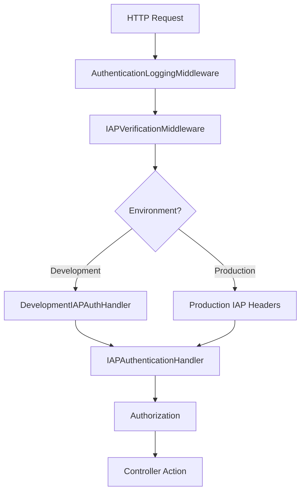
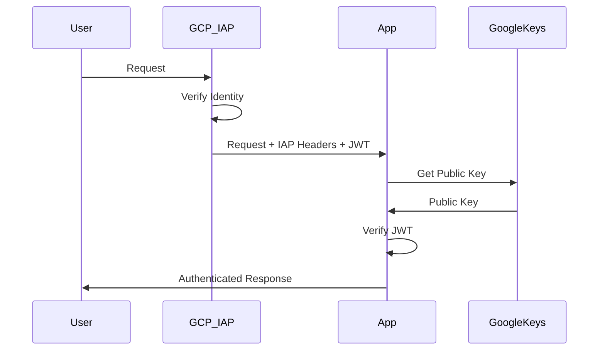
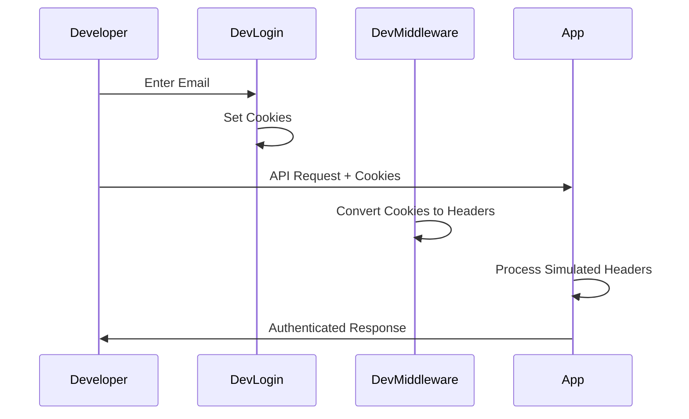

# Identity-Aware Proxy (IAP) Authentication Guide

## Overview

This guide covers the Identity-Aware Proxy (IAP) authentication implementation in the UNOPS PAO application, including both production Google Cloud IAP integration and comprehensive development simulation features.

## Table of Contents

1. [Production IAP Authentication](#production-iap-authentication)
2. [Development Simulation](#development-simulation)
3. [Configuration](#configuration)
4. [Architecture](#architecture)
5. [Troubleshooting](#troubleshooting)
6. [Best Practices](#best-practices)

---

## Production IAP Authentication

### What is Google Cloud IAP?

Google Cloud Identity-Aware Proxy (IAP) provides secure access to applications by:

- **Verifying user identity** before granting access
- **Enforcing access policies** based on user context
- **Adding authentication headers** to all requests
- **Issuing JWT tokens** for secure validation

### IAP Headers

When deployed behind Google Cloud IAP, requests include these headers:

```http
X-Goog-Authenticated-User-Email: accounts.google.com:user@example.com
X-Goog-Authenticated-User-Id: accounts.google.com:123456789
X-Goog-IAP-JWT-Assertion: eyJhbGciOiJFUzI1NiIsInR5cCI6IkpXVCIsImtpZCI6IjEyMzQ1In0...
```

### Production Configuration

**File:** `appsettings.json`
```json
{
  "IAP": {
    "ProjectNumber": "1069310298210",
    "ProjectId": "unops-partneropportunity", 
    "BackendServiceId": "5621759121444863191",
    "RequireJwtVerification": true,
    "AllowHeaderFallback": false,
    "AutoProvisionUsers": true,
    "DefaultRole": "User",
    "DomainRoles": {
      "unops.org": "Internal"
    },
    "ExternalRoleMappings": {
      "admin": "Administrator",
      "partner": "Partner"
    }
  }
}
```

### Security Features

#### 1. JWT Token Verification
**File:** `UNOPS.PAO.UNOPSIdentity/Authentication/IAPVerificationMiddleware.cs`

```csharp
private async Task<ClaimsPrincipal> VerifyIapJwtAndGetPrincipalAsync(string jwt, HttpContext context)
{
    // Parse JWT and get key ID
    var handler = new JwtSecurityTokenHandler();
    var jsonToken = handler.ReadToken(jwt) as JwtSecurityToken;
    var kid = jsonToken.Header["kid"]?.ToString();
    
    // Get Google's public key for verification
    var publicKey = await GetPublicKeyAsync(kid);
    
    // Validate token with multiple audience formats
    var validationParameters = new TokenValidationParameters
    {
        ValidateIssuer = true,
        ValidIssuer = IAP_ISSUER,
        ValidateAudience = true,
        ValidAudiences = audiences,
        ValidateLifetime = true,
        IssuerSigningKey = publicKey,
        ClockSkew = TimeSpan.FromMinutes(5)
    };
    
    // Verify and return principal
    var validatedToken = handler.ValidateToken(jwt, validationParameters, out _);
    return validatedToken;
}
```

#### 2. Public Key Caching
```csharp
private static readonly Dictionary<string, JsonWebKey> _cachedKeys = new();
private static DateTime _keysLastRefreshed = DateTime.MinValue;
private static readonly SemaphoreSlim _refreshLock = new(1, 1);

private async Task<JsonWebKey> GetPublicKeyAsync(string kid)
{
    // Check cache first
    if (_cachedKeys.TryGetValue(kid, out var cachedKey) && 
        DateTime.UtcNow - _keysLastRefreshed < TimeSpan.FromHours(1))
    {
        return cachedKey;
    }
    
    // Refresh keys if needed
    await _refreshLock.WaitAsync();
    try
    {
        // Fetch from Google's public key endpoint
        var response = await httpClient.GetStringAsync(PUBLIC_KEY_URL);
        var keySet = JsonSerializer.Deserialize<JsonWebKeySet>(response);
        
        // Cache all keys
        _cachedKeys.Clear();
        foreach (var key in keySet.Keys)
        {
            _cachedKeys[key.Kid] = key;
        }
        _keysLastRefreshed = DateTime.UtcNow;
        
        return _cachedKeys[kid];
    }
    finally
    {
        _refreshLock.Release();
    }
}
```

#### 3. Multi-Layer Authentication
1. **Primary:** JWT token verification
2. **Fallback:** Email header validation (if enabled)
3. **User Provisioning:** Automatic user creation/update
4. **Role Assignment:** Domain-based and group-based role mapping

---

## Development Simulation

### Purpose

The development simulation system allows developers to:

- **Test IAP functionality** without Google Cloud deployment
- **Switch between different user identities** quickly
- **Simulate various user roles and permissions**
- **Test authentication flows** in isolation

### Key Components

#### 1. Development Login Page
**URL:** `/dev-login`
**File:** `UNOPS.PAO.Server/Infrastructure/DevelopmentLoginPageMiddleware.cs`

**Features:**
- Simple email input for quick login
- Pre-configured user list with different roles
- Cookie-based session persistence
- Automatic user provisioning

```html
<!-- Dev Login Interface -->
<input type="email" id="email-input" placeholder="Enter email address" />
<button onclick="loginWithEmail()">Login</button>

<!-- Quick Login Options -->
<button onclick="loginAs('admin@unops.org')">Login as Admin</button>
<button onclick="loginAs('partner@example.com')">Login as Partner</button>
<button onclick="loginAs('external@company.com')">Login as External</button>
```

#### 2. Cookie-Based Authentication
**Primary Cookie:** `DevIAPAuth` (HttpOnly, secure)
**Secondary Cookie:** `dev-user-email` (JavaScript accessible)

```csharp
// Set authentication cookies
Response.Cookies.Append("DevIAPAuth", email, new CookieOptions
{
    HttpOnly = true,
    Secure = Request.IsHttps,
    SameSite = SameSiteMode.Lax,
    Path = "/",
    Expires = DateTimeOffset.Now.AddDays(7)
});

Response.Cookies.Append("dev-user-email", email, new CookieOptions
{
    HttpOnly = false,  // Accessible to JavaScript
    Secure = false,    // Allow HTTP in development
    SameSite = SameSiteMode.Lax,
    Path = "/",
    Expires = DateTimeOffset.Now.AddDays(7)
});
```

#### 3. Header Simulation
**File:** `UNOPS.PAO.UNOPSIdentity/Authentication/DevelopmentIAPAuthHandler.cs`

The middleware automatically converts cookies to IAP headers:

```csharp
public async Task InvokeAsync(HttpContext context, RequestDelegate next)
{
    if (_environment.IsDevelopment())
    {
        // Get email from dev cookie
        if (context.Request.Cookies.TryGetValue("DevIAPAuth", out var cookieEmail))
        {
            // Simulate IAP headers
            context.Request.Headers["X-Goog-Authenticated-User-Email"] = $"accounts.google.com:{cookieEmail}";
            context.Request.Headers["X-Goog-Iap-Jwt-Assertion"] = "dev-jwt-placeholder";
            context.Request.Headers["X-Dev-IAP-Simulation"] = "true";
            context.Request.Headers["X-Dev-Auth-Timestamp"] = DateTime.UtcNow.Ticks.ToString();
        }
    }
    
    await next(context);
}
```

### Development Configuration

**File:** `appsettings.json`
```json
{
  "Development": {
    "IAPSimulation": {
      "Enabled": true,
      "UserEmail": "anushas@unops.org",
      "SkipValidationInDevelopment": true
    }
  },
  "IAP": {
    "SkipValidationInDevelopment": true,
    "AllowHeaderFallback": true
  }
}
```

### User Switching Feature

#### Quick User Switch
```javascript
// Switch user via JavaScript
function switchUser(email) {
    // Clear existing authentication
    localStorage.clear();
    sessionStorage.clear();
    
    // Set new user cookie
    document.cookie = `dev-user-email=${email};path=/;max-age=604800;`;
    
    // Redirect to refresh authentication
    window.location.href = `/dev-login?user=${encodeURIComponent(email)}`;
}
```

#### API Support for User Management
**File:** `UNOPS.PAO.UNOPSPresentation/Controllers/DevelopmentController.cs`

```csharp
[HttpGet("users")]
public async Task<IActionResult> GetDevelopmentUsers()
{
    var users = await _userManager.Users.ToListAsync();
    var userList = new List<object>();
    
    foreach (var user in users)
    {
        var roles = await _userManager.GetRolesAsync(user);
        userList.Add(new { Email = user.Email, Roles = roles });
    }
    
    return Ok(userList);
}

[HttpPost("login/{email}")]
public IActionResult SetDevelopmentUser(string email)
{
    Response.Cookies.Append("dev-user-email", email, new CookieOptions
    {
        HttpOnly = false,
        Path = "/",
        SameSite = SameSiteMode.Lax,
        Expires = DateTimeOffset.Now.AddDays(7)
    });
    
    return Ok(new { Email = email, CookieSet = true });
}
```

---

## Architecture

### Middleware Pipeline



### Authentication Flow

#### Production Flow


#### Development Flow


### File Structure

```
UNOPS.PAO.UNOPSIdentity/Authentication/
├── IAPAuthenticationExtensions.cs      # Service registration
├── IAPAuthenticationHandler.cs         # Main authentication handler
├── IAPAuthenticationOptions.cs         # Configuration options
├── IAPVerificationMiddleware.cs        # JWT verification & validation
├── DevelopmentIAPAuthHandler.cs        # Dev simulation middleware
└── UnopsUserValidator.cs              # IAP-aware user validation

UNOPS.PAO.Server/Infrastructure/
├── AuthenticationLoggingMiddleware.cs  # Debug logging
└── DevelopmentLoginPageMiddleware.cs   # Dev login page

UNOPS.PAO.UNOPSPresentation/Controllers/
└── DevelopmentController.cs           # Dev API endpoints
```

---

## Configuration

### Production Settings

#### Required Environment Variables
```bash
# Google Cloud Project
IAP__ProjectNumber=1069310298210
IAP__ProjectId=unops-partneropportunity
IAP__BackendServiceId=5621759121444863191

# Security Settings
IAP__RequireJwtVerification=true
IAP__AllowHeaderFallback=false
IAP__AutoProvisionUsers=true
```

#### Optional Role Mappings
```json
{
  "IAP": {
    "DomainRoles": {
      "unops.org": "Internal",
      "partner.org": "Partner"
    },
    "ExternalRoleMappings": {
      "admin": "Administrator",
      "readonly": "ReadOnly"
    },
    "ExternalGroupMappings": {
      "unops-admins": "Administrator",
      "external-partners": "Partner"
    }
  }
}
```

### Development Settings

#### Basic Configuration
```json
{
  "Development": {
    "IAPSimulation": {
      "Enabled": true,
      "UserEmail": "dev.user@unops.org",
      "SkipValidationInDevelopment": true
    }
  }
}
```

#### Advanced Development Options
```json
{
  "IAP": {
    "SkipValidationInDevelopment": true,
    "AllowHeaderFallback": true,
    "AutoProvisionUsers": true,
    "DefaultRole": "User"
  }
}
```

---

## Usage Examples

### Production Deployment

#### 1. Google Cloud Run Deployment
```yaml
# cloud-run-service.yaml
apiVersion: serving.knative.dev/v1
kind: Service
metadata:
  name: unops-pao-app
  annotations:
    run.googleapis.com/ingress: all
spec:
  template:
    metadata:
      annotations:
        run.googleapis.com/execution-environment: gen2
    spec:
      containers:
      - image: gcr.io/unops-partneropportunity/pao-app
        env:
        - name: IAP__ProjectNumber
          value: "1069310298210"
        - name: IAP__RequireJwtVerification
          value: "true"
```

#### 2. Load Balancer with IAP
```bash
# Enable IAP on load balancer backend service
gcloud compute backend-services update pao-backend-service \
    --global \
    --iap=enabled,oauth2-client-id=OAUTH_CLIENT_ID,oauth2-client-secret=OAUTH_CLIENT_SECRET
```

### Development Usage

#### 1. Start Development Server
```bash
# Run in development mode
dotnet run --environment=Development

# Access dev login page
open http://localhost:5000/dev-login
```

#### 2. Quick User Switch
```bash
# Login as specific user
curl -X POST http://localhost:5000/api/dev/login/admin@unops.org

# Get available users
curl http://localhost:5000/api/dev/users
```

#### 3. Test Different Scenarios
```javascript
// Frontend testing with different users
const testUsers = [
    'admin@unops.org',      // Full access
    'partner@company.com',  // Partner access
    'external@public.org'   // Limited access
];

for (const user of testUsers) {
    await switchUser(user);
    await runTestSuite();
}
```

---

## Troubleshooting

### Common Issues

#### 1. JWT Verification Failures

**Symptoms:**
- 401 Unauthorized errors
- "Invalid IAP JWT token" messages
- Authentication failures in production

**Solutions:**
```csharp
// Check JWT validation logs
_logger.LogDebug("JWT validation failed: {Error}", ex.Message);

// Verify project configuration
var audience = $"/projects/{projectNumber}/global/backendServices/{backendServiceId}";

// Check clock skew
ClockSkew = TimeSpan.FromMinutes(5) // Allow for time differences
```

#### 2. Development Simulation Not Working

**Symptoms:**
- Dev login redirects to regular login
- Cookies not being set
- Authentication still failing locally

**Diagnostics:**
```csharp
// Enable detailed logging
services.Configure<LoggerFilterOptions>(options => 
{
    options.AddFilter("UNOPS.PAO.UNOPSIdentity.Authentication", LogLevel.Debug);
});

// Check middleware order in Startup.cs
app.UseIAPVerification();              // First - logs original headers
app.UseMiddleware<DevelopmentIAPAuthHandler>(); // Second - adds dev headers
app.UseAuthentication();               // Third - processes headers
```

#### 3. User Role Assignment Issues

**Symptoms:**
- Users getting wrong roles
- Missing permissions
- External users treated as internal

**Solutions:**
```csharp
// Check domain mapping
var domain = email.Split('@')[1];
if (Options.DomainRoles.TryGetValue(domain, out var domainRole))
{
    await _userManager.AddToRoleAsync(user, domainRole);
}

// Verify group mappings from IAP headers
if (Request.Headers.TryGetValue("X-Goog-Authenticated-User-Groups", out var groups))
{
    // Process group-to-role mappings
}
```

### Debug Tools

#### 1. IAP Simulation Checker
**URL:** `/api/dev/check-iap-simulation`

```json
{
  "environment": "Development",
  "hasIapHeader": true,
  "iapHeaderValue": "accounts.google.com:dev@unops.org",
  "hasDevCookie": true,
  "cookieValue": "dev@unops.org",
  "headers": ["X-Goog-Authenticated-User-Email: accounts.google.com:dev@unops.org"]
}
```

#### 2. Authentication Debug Page
**URL:** `/api/dev/debug`

Provides interactive debugging interface with:
- Current authentication status
- All request headers
- Cookie values
- User claims and roles

#### 3. Logging Configuration
```json
{
  "Logging": {
    "LogLevel": {
      "UNOPS.PAO.UNOPSIdentity.Authentication": "Debug",
      "UNOPS.PAO.Server.Infrastructure": "Debug"
    }
  }
}
```

---

## Best Practices

### Security

#### 1. Production Security
- ✅ **Always enable JWT verification** in production
- ✅ **Disable header fallback** in production
- ✅ **Use HTTPS only** for all requests
- ✅ **Implement proper CORS** policies
- ✅ **Monitor authentication logs** for anomalies

#### 2. Development Security
- ✅ **Never use dev simulation** in production
- ✅ **Clear dev cookies** when switching environments
- ✅ **Use environment-specific** configuration
- ✅ **Test with realistic user scenarios**

### Performance

#### 1. JWT Validation Optimization
```csharp
// Cache public keys efficiently
private static readonly MemoryCache _keyCache = new MemoryCache(new MemoryCacheOptions
{
    SizeLimit = 100,
    CompactionPercentage = 0.1
});

// Use appropriate cache duration
_keyCache.Set(kid, publicKey, TimeSpan.FromHours(1));
```

#### 2. User Provisioning
```csharp
// Cache user lookups
private static readonly MemoryCache _userCache = new MemoryCache(new MemoryCacheOptions());

public async Task<PAOIdentityUser> GetOrCreateUserAsync(string email)
{
    var cacheKey = $"user:{email}";
    if (_userCache.TryGetValue(cacheKey, out PAOIdentityUser cachedUser))
    {
        return cachedUser;
    }
    
    var user = await _userManager.FindByEmailAsync(email) ?? await CreateUserAsync(email);
    _userCache.Set(cacheKey, user, TimeSpan.FromMinutes(15));
    return user;
}
```

### Development Workflow

#### 1. User Switching Best Practices
```javascript
// Clear state when switching users
function switchUser(email) {
    // Clear application state
    localStorage.clear();
    sessionStorage.clear();
    
    // Clear authentication caches
    if ('caches' in window) {
        caches.keys().then(names => {
            names.forEach(name => caches.delete(name));
        });
    }
    
    // Switch user
    window.location.href = `/dev-login?user=${encodeURIComponent(email)}`;
}
```

#### 2. Test Data Management
```csharp
// Create test users with appropriate roles
private async Task SeedTestUsersAsync()
{
    var testUsers = new[]
    {
        ("admin@unops.org", "Administrator"),
        ("partner@company.com", "Partner"),
        ("external@public.org", "External")
    };
    
    foreach (var (email, role) in testUsers)
    {
        var user = await _userManager.FindByEmailAsync(email);
        if (user == null)
        {
            user = new PAOIdentityUser { Email = email, UserName = email };
            await _userManager.CreateAsync(user);
            await _userManager.AddToRoleAsync(user, role);
        }
    }
}
```

#### 3. Integration Testing
```csharp
[Test]
public async Task IAP_Authentication_Should_Work_With_Valid_JWT()
{
    // Arrange
    var validJwt = GenerateValidTestJWT();
    var request = new HttpRequestMessage();
    request.Headers.Add("X-Goog-IAP-JWT-Assertion", validJwt);
    
    // Act
    var response = await _client.SendAsync(request);
    
    // Assert
    Assert.AreEqual(HttpStatusCode.OK, response.StatusCode);
}

[Test]
public async Task Dev_Simulation_Should_Work_With_Cookie()
{
    // Arrange
    var testEmail = "test@unops.org";
    _client.DefaultRequestHeaders.Add("Cookie", $"DevIAPAuth={testEmail}");
    
    // Act
    var response = await _client.GetAsync("/api/user/current");
    
    // Assert
    var user = await response.Content.ReadFromJsonAsync<UserModel>();
    Assert.AreEqual(testEmail, user.Email);
}
```

---

This comprehensive IAP authentication system provides secure, flexible authentication for both production Google Cloud environments and local development, enabling teams to develop and test with confidence while maintaining enterprise-grade security standards. 