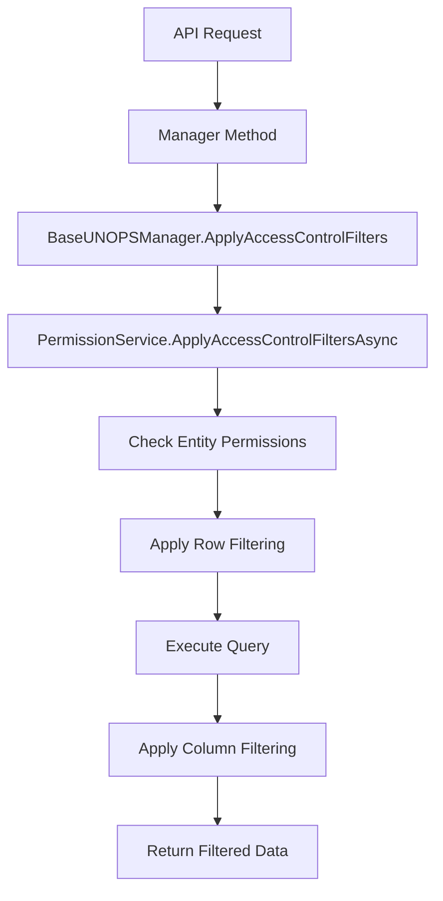

# RBAC (Role-Based Access Control) Implementation

## Overview

This document describes the comprehensive Role-Based Access Control (RBAC) system implemented in the UNOPS PAO application. The RBAC system provides fine-grained access control at multiple levels: entity-level permissions, instance-level access control, and column-level filtering.

## Architecture Components

### 1. Core Components

- **PermissionService** (`UNOPS.PAO.UNOPSBusiness/Services/PermissionService.cs`)
  - Central service for all permission-related operations
  - Handles entity permissions, row filtering, and column filtering
  - Integrates with Entity Framework for database queries

- **BaseUNOPSManager** (`UNOPS.PAO.UNOPSBusiness/Managers/BaseUNOPSManager.cs`)
  - Base class for all entity managers
  - Provides `MapEntityToModelWithPermissionsAsync` method
  - Automatically applies access control filters

- **EntityPermissions Table** (Database)
  - Stores role-based permissions for each entity
  - Contains PropertyFilter and RowFilter configurations

### 2. Permission Levels

#### Entity-Level Permissions
Basic CRUD permissions for each entity type:
- **CanRead**: Permission to view entities
- **CanCreate**: Permission to create new entities
- **CanUpdate**: Permission to modify existing entities
- **CanDelete**: Permission to delete entities

#### Instance-Level Access Control (Row Filtering)
Dynamic filtering based on user context and entity properties:
- Uses Dynamic LINQ expressions
- Supports parameter substitution (`@currentUserId`, `@userOrgUnit`)
- Applied at query execution time

#### Column-Level Filtering (PropertyFilter)
Whitelist-based column filtering:
- Only specified columns are returned in API responses
- Supports both PascalCase and camelCase property names
- Essential fields (`Id`, `permissions`) are always included

## Database Schema

### EntityPermissions Table Structure
```sql
CREATE TABLE "EntityPermissions" (
    "Id" integer PRIMARY KEY,
    "Entity" text NOT NULL,           -- Entity name (e.g., 'Contact', 'Partner')
    "Role" text NOT NULL,             -- User role (e.g., 'UNOPS_GEN_USER')
    "CanRead" boolean NOT NULL,       -- Read permission
    "CanCreate" boolean NOT NULL,     -- Create permission
    "CanUpdate" boolean NOT NULL,     -- Update permission
    "CanDelete" boolean NOT NULL,     -- Delete permission
    "RowFilter" text,                 -- JSON string for row filtering
    "PropertyFilter" text             -- JSON string for column filtering
);
```

### PropertyFilter JSON Format
```json
{
  "CanRead": ["Id", "Name", "Email", "Phone"],
  "CanCreate": [],
  "CanUpdate": ["Name", "Email"],
  "CanDelete": []
}
```

### RowFilter JSON Format
```json
{
  "CanRead": "",
  "CanCreate": "",
  "CanUpdate": "PartnerOffice != null && PartnerOffice.Code == @userOrgUnit",
  "CanDelete": ""
}
```

## Implementation Details

### 1. Permission Checking Flow



### 2. Key Methods

#### PermissionService.ApplyAccessControlFiltersAsync<T>
- Main entry point for applying all access control filters
- Combines entity permissions, row filtering, and column filtering
- Returns filtered data maintaining original type

#### BaseUNOPSManager.MapEntityToModelWithPermissionsAsync<T>
- Maps entities to models with embedded permission information
- Applies instance-level permission checking
- Adds `permissions` object to each entity

### 3. Column Filtering Implementation

The column filtering uses a whitelist approach:

```csharp
// Always include essential fields
permittedColumns.Add("Id");
permittedColumns.Add("permissions");

// Apply JSON serialization filtering
var filteredData = await ApplyColumnFilteringToDataGeneric(data, permittedColumns);
```

#### Case-Insensitive Property Matching
The system handles both PascalCase (C# properties) and camelCase (JSON serialization):

```csharp
if (permittedColumns.Contains(property.Name) || 
    permittedColumns.Any(col => string.Equals(col, property.Name, StringComparison.OrdinalIgnoreCase)))
{
    // Include property in filtered result
}
```

### 4. Row Filtering with Dynamic LINQ

Row filtering supports complex expressions:

```csharp
// Example: User can only update partners in their office
"PartnerOffice != null && PartnerOffice.Code == @userOrgUnit"

// Parameter substitution
var processedFilter = rowFilterConditions
    .Replace("@currentUserId", currentUserId.ToString())
    .Replace("@userOrgUnit", $"\"{userOrgUnit}\"");

// Apply to query
query = query.Where(processedFilter);
```

## Configuration Examples

### 1. UNOPS_GEN_USER Role Configuration

#### Contact Entity
```json
{
  "Entity": "Contact",
  "Role": "UNOPS_GEN_USER",
  "CanRead": true,
  "CanCreate": true,
  "CanUpdate": false,
  "CanDelete": false,
  "PropertyFilter": {
    "CanRead": ["Id", "FirstName", "LastName", "Email", "Phone", "Title", "Department"]
  }
}
```

#### Partner Entity
```json
{
  "Entity": "Partner",
  "Role": "UNOPS_GEN_USER",
  "CanRead": true,
  "CanCreate": false,
  "CanUpdate": false,
  "CanDelete": false,
  "PropertyFilter": {
    "CanRead": ["Id", "Name", "PartnerCode", "Phone"]
  }
}
```

### 2. PARTNER_GLOBAL_ADMIN Role Configuration

```json
{
  "Entity": "Contact",
  "Role": "PARTNER_GLOBAL_ADMIN",
  "CanRead": true,
  "CanCreate": true,
  "CanUpdate": true,
  "CanDelete": true,
  "RowFilter": {
    "CanUpdate": "PartnerOffice != null && PartnerOffice.Code == @userOrgUnit"
  }
}
```

## Security Features

### 1. Fail-Safe Defaults
- No permissions granted by default
- Missing configurations result in access denial
- Essential fields always included to prevent system breakage

### 2. Circular Reference Protection
JSON serialization configured to handle circular references:

```csharp
var options = new JsonSerializerOptions
{
    ReferenceHandler = ReferenceHandler.IgnoreCycles,
    DefaultIgnoreCondition = JsonIgnoreCondition.WhenWritingNull
};
```

### 3. Error Handling
- Invalid JSON configurations are gracefully handled
- Failed row filtering defaults to no access for security
- Comprehensive logging for debugging

## Usage Examples

### 1. Manager Implementation
```csharp
public class UNOPSContactManager : BaseUNOPSManager
{
    public async Task<List<ContactModel>> GetContactsAsync()
    {
        var query = _context.Contacts.Include(c => c.Partner);
        
        // Apply RBAC filters automatically
        var filteredData = await ApplyAccessControlFilters(query, "read", "Contact");
        
        return filteredData.Cast<ContactModel>().ToList();
    }
}
```

### 2. API Response with Permissions
```json
{
  "id": 7153,
  "firstName": "John",
  "lastName": "Doe",
  "email": "john.doe@example.com",
  "phone": "555-0101",
  "permissions": {
    "canRead": true,
    "canCreate": true,
    "canUpdate": false,
    "canDelete": false
  }
}
```

## Maintenance and Updates

### 1. Adding New Roles
1. Insert new EntityPermissions records for each entity
2. Configure PropertyFilter and RowFilter as needed
3. Test with appropriate user accounts

### 2. Modifying Permissions
1. Update EntityPermissions table directly
2. Or use migration scripts for version control
3. Restart application to clear any caches

### 3. Database Scripts
Permission updates should be managed through SQL scripts in:
`UNOPS.PAO.UNOPSDataAccess/Scripts/`

Example: `fix-gmail-propertyfilter.sql`

## Troubleshooting

### Common Issues

1. **Properties not filtered correctly**
   - Check PropertyFilter JSON syntax
   - Verify property names match entity properties
   - Consider PascalCase vs camelCase differences

2. **Row filtering not working**
   - Validate Dynamic LINQ expressions
   - Check parameter substitution (@currentUserId, @userOrgUnit)
   - Ensure navigation properties are properly loaded

3. **Circular reference errors**
   - Review entity relationships
   - Check JsonIgnore attributes on navigation properties
   - Verify JsonSerializerOptions configuration

### Debug Information
Enable debug logging to see:
- Permission evaluation results
- Applied row filters
- Column filtering operations
- JSON serialization issues

## Performance Considerations

1. **Database Queries**
   - Row filtering applied at database level
   - Use appropriate indexes on filtered columns
   - Monitor query performance with complex filters

2. **JSON Processing**
   - Column filtering requires JSON serialization/deserialization
   - Consider caching for frequently accessed data
   - Profile memory usage with large datasets

3. **Permission Caching**
   - EntityPermissions are queried for each request
   - Consider implementing permission caching for high-traffic scenarios

## Future Enhancements

1. **Permission Caching**: Implement Redis-based permission caching
2. **Audit Logging**: Track permission-based access attempts
3. **Dynamic Permissions**: Support for user-specific permissions beyond roles
4. **Performance Optimization**: Optimize JSON processing for large datasets
5. **Admin Interface**: Web-based interface for managing permissions

## Related Files

- `UNOPS.PAO.UNOPSBusiness/Services/PermissionService.cs`
- `UNOPS.PAO.UNOPSBusiness/Managers/BaseUNOPSManager.cs`
- `UNOPS.PAO.UNOPSBusiness/Interfaces/IPermissionService.cs`
- `UNOPS.PAO.UNOPSDomain/Authorization/EntityPermission.cs`
- `UNOPS.PAO.UNOPSDataAccess/Scripts/fix-gmail-propertyfilter.sql` 