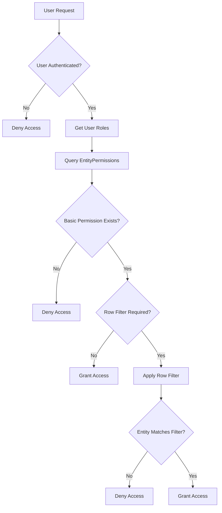

# Role-Based Access Control (RBAC) Implementation Guide

## Overview

This document provides a comprehensive guide to the Role-Based Access Control (RBAC) system implemented in the UNOPS PAO application. The system combines traditional role-based permissions with dynamic row-level filtering to provide fine-grained access control.

## Architecture Overview

The RBAC system consists of multiple layers:

1. **Role Management** - ASP.NET Core Identity roles
2. **Entity Permissions** - Database-driven permission matrix
3. **Row-Level Filtering** - Dynamic expression-based filtering
4. **Security Services** - Business logic and validation
5. **User Context** - Dynamic parameter resolution

---

## Core Components

### 1. Database Tables

#### AspNetRoles (Identity Framework)
```sql
CREATE TABLE "AspNetRoles" (
    "Id" integer PRIMARY KEY,
    "Name" varchar(256) NOT NULL,
    "NormalizedName" varchar(256),
    "Description" text
);
```

**Example Data:**
```sql
INSERT INTO "AspNetRoles" ("Name", "NormalizedName", "Description") VALUES
('UNOPS_GEN_USER', 'UNOPS_GEN_USER', 'General User'),
('PARTNER_GLOB_ADMIN', 'PARTNER_GLOB_ADMIN', 'Partnership Global Admin'),
('PARTNER_USER', 'PARTNER_USER', 'Partnership User'),
('ORG_UNIT_ADMIN', 'ORG_UNIT_ADMIN', 'Org Unit Admin');
```

#### AspNetUserRoles (Identity Framework)
```sql
CREATE TABLE "AspNetUserRoles" (
    "UserId" integer NOT NULL,
    "RoleId" integer NOT NULL,
    PRIMARY KEY ("UserId", "RoleId")
);
```

#### EntityPermissions (Custom)
```sql
CREATE TABLE "EntityPermissions" (
    "Id" integer PRIMARY KEY,
    "Entity" text NOT NULL,
    "Role" text NOT NULL,
    "CanRead" boolean NOT NULL,
    "CanCreate" boolean NOT NULL,
    "CanUpdate" boolean NOT NULL,
    "CanDelete" boolean NOT NULL,
    "PropertyFilter" text NULL,
    "RowFilter" text NULL
);
```

**Example Data:**
```sql
INSERT INTO "EntityPermissions" VALUES
(1, 'Interaction', 'PARTNER_USER', true, true, true, true, null, 
 '{"CanRead": "", "CanCreate": "", "CanUpdate": "(OrgUnit != null && OrgUnit.Code == @userOrgUnit) || InteractionUsers.Any(iu => iu.UserId == @currentUserId)", "CanDelete": "OrgUnit != null && OrgUnit.Code == @userOrgUnit"}');
```

#### UserInfos (User Context)
```sql
CREATE TABLE "UserInfos" (
    "Id" integer PRIMARY KEY,
    "UserId" integer NOT NULL,
    "UserEmail" text NOT NULL,
    "Name" text,
    "OrgUnit" text,
    "IsDeleted" boolean DEFAULT false
);
```

### 2. Domain Models

#### EntityPermission Model
**File:** `UNOPS.PAO.UNOPSDomain/Authorization/EntityPermission.cs`
```csharp
namespace UNOPS.PAO.UNOPSDomain.Authorization;

public class EntityPermission
{
    public int Id { get; set; }
    public string Entity { get; set; } = string.Empty;
    public string Role { get; set; } = string.Empty;
    public bool CanRead { get; set; }
    public bool CanCreate { get; set; }
    public bool CanUpdate { get; set; }
    public bool CanDelete { get; set; }
    public string? PropertyFilter { get; set; }
    public string? RowFilter { get; set; }
}
```

#### RowFilterConditions Model
**File:** `UNOPS.PAO.UNOPSDomain/Authorization/RowFilterConditions.cs`
```csharp
namespace UNOPS.PAO.UNOPSDomain.Authorization;

public class RowFilterConditions
{
    public string? CanRead { get; set; }
    public string? CanCreate { get; set; }
    public string? CanUpdate { get; set; }
    public string? CanDelete { get; set; }
}
```

#### EntityPermissionsModel (API Response)
**File:** `UNOPS.PAO.Models/EntityPermissionsModel.cs`
```csharp
namespace UNOPS.PAO.Models;

public class EntityPermissionsModel
{
    public bool CanRead { get; set; }
    public bool CanCreate { get; set; }
    public bool CanUpdate { get; set; }
    public bool CanDelete { get; set; }
}
```

### 3. Service Layer

#### IGenericRowFilterService Interface
**File:** `UNOPS.PAO.UNOPSBusiness/Services/GenericRowFilterService.cs`
```csharp
public interface IGenericRowFilterService
{
    Task<IQueryable<T>> ApplyRowFiltersAsync<T>(IQueryable<T> query, ClaimsPrincipal user, string action = "read") where T : class;
    Task<bool> CanUserAccessEntityAsync<T>(T entity, ClaimsPrincipal user, string action = "read") where T : class;
}
```

#### IBusinessSecurityService Interface
**File:** `UNOPS.PAO.UNOPSBusiness/Services/BusinessSecurityService.cs`
```csharp
public interface IBusinessSecurityService
{
    Task<string?> GetUserOrgUnitAsync(ClaimsPrincipal user);
    Task<IQueryable<T>> ApplyRowFiltersAsync<T>(IQueryable<T> query, ClaimsPrincipal user, string action = "read") where T : class;
    Task<bool> CanUserAccessEntityAsync<T>(T entity, ClaimsPrincipal user, string action = "read") where T : class;
    Task<object> GetEntityPermissionsAsync<T>(T entity, ClaimsPrincipal user) where T : class;
    Task<bool> CanUserAccessEntityAsync(ClaimsPrincipal user, string entityName, int entityId, string action = "read");
    Task<EntityPermissionsModel> GetEntityPermissionsAsync(ClaimsPrincipal user, string entityName);
}
```

---

## How RBAC Works

### 1. Permission Check Flow



### 2. Multi-Layer Security

#### Layer 1: Role-Based Basic Permissions
```csharp
// Check if user has basic permission for action
var hasBasicPermission = permissions.Any(p => action.ToLower() switch
{
    "read" => p.CanRead,
    "create" => p.CanCreate,
    "update" => p.CanUpdate,
    "delete" => p.CanDelete,
    _ => false
});
```

#### Layer 2: Row-Level Filtering
```csharp
// Apply dynamic row filters if defined
var filterExpression = action.ToLower() switch
{
    "read" => rowFilterConditions.CanRead,
    "create" => rowFilterConditions.CanCreate,
    "update" => rowFilterConditions.CanUpdate,
    "delete" => rowFilterConditions.CanDelete,
    _ => null
};
```

#### Layer 3: Parameter Resolution
```csharp
// Replace user context parameters
var userContext = new Dictionary<string, object>
{
    ["@currentUserId"] = GetCurrentUserId(user),
    ["@userOrgUnit"] = await GetUserOrgUnitAsync(user),
    ["@userEmail"] = GetUserEmail(user)
};
```

### 3. Expression Processing

#### Security Validation
**File:** `UNOPS.PAO.UNOPSBusiness/Services/GenericRowFilterService.cs`
```csharp
private bool IsExpressionSafe(string expression)
{
    // 1. Check for dangerous patterns
    var dangerousPatterns = new[] {
        "SYSTEM.", "PROCESS.", "FILE.", "DIRECTORY.",
        "DROP ", "DELETE ", "INSERT ", "UPDATE ",
        "JAVASCRIPT:", "VBSCRIPT:", "<SCRIPT"
    };
    
    // 2. Whitelist allowed patterns
    var allowedPatterns = new[] {
        "PARTNER", "CONTACT", "INTERACTION", "ORGUNIT",
        "ANY(", "ALL(", "COUNT(", "WHERE(",
        "==", "!=", "&&", "||", "NULL"
    };
    
    // 3. Validate remaining characters
    return ValidateRemainingCharacters(expression);
}
```

---

## Role Definitions and Examples

### 1. UNOPS_GEN_USER (General User)
**Purpose:** Basic read-only access for general UNOPS staff

**Interaction Permissions:**
```json
{
  "Entity": "Interaction",
  "Role": "UNOPS_GEN_USER",
  "CanRead": true,
  "CanCreate": false,
  "CanUpdate": true,
  "CanDelete": false,
  "RowFilter": {
    "CanRead": "",
    "CanUpdate": "(OrgUnit != null && OrgUnit.Code == @userOrgUnit) || InteractionUsers.Any(iu => iu.UserId == @currentUserId)"
  }
}
```

**Real-world behavior:**
- ✅ Can read ALL interactions (collaboration)
- ❌ Cannot create interactions
- ✅ Can update interactions in their org unit OR where they're assigned
- ❌ Cannot delete interactions

### 2. PARTNER_USER (Partnership User)
**Purpose:** Standard partnership staff with org-unit restrictions

**Contact Permissions:**
```json
{
  "Entity": "Contact",
  "Role": "PARTNER_USER",
  "CanRead": true,
  "CanCreate": true,
  "CanUpdate": true,
  "CanDelete": true,
  "RowFilter": {
    "CanRead": "",
    "CanCreate": "Partner != null && Partner.PartnerOffice != null && Partner.PartnerOffice.Code == @userOrgUnit",
    "CanUpdate": "Partner != null && Partner.PartnerOffice != null && Partner.PartnerOffice.Code == @userOrgUnit",
    "CanDelete": "Partner != null && Partner.PartnerOffice != null && Partner.PartnerOffice.Code == @userOrgUnit"
  }
}
```

**Real-world behavior:**
- ✅ Can read ALL contacts (visibility)
- ✅ Can create contacts for partners in their org unit only
- ✅ Can update contacts for partners in their org unit only
- ✅ Can delete contacts for partners in their org unit only

### 3. PARTNER_GLOB_ADMIN (Global Admin)
**Purpose:** Full administrative access across all entities

**All Entity Permissions:**
```json
{
  "Entity": "*",
  "Role": "PARTNER_GLOB_ADMIN", 
  "CanRead": true,
  "CanCreate": true,
  "CanUpdate": true,
  "CanDelete": true,
  "RowFilter": {
    "CanRead": "",
    "CanCreate": "",
    "CanUpdate": "",
    "CanDelete": ""
  }
}
```

**Real-world behavior:**
- ✅ Full access to everything (no restrictions)

### 4. ORG_UNIT_ADMIN (Organizational Unit Admin)
**Purpose:** Administrative access within their organizational unit

**UserManagement Permissions:**
```json
{
  "Entity": "UserManagement",
  "Role": "ORG_UNIT_ADMIN",
  "CanRead": true,
  "CanCreate": true,
  "CanUpdate": true,
  "CanDelete": true,
  "RowFilter": {
    "CanRead": "OrgUnit == @userOrgUnit",
    "CanCreate": "OrgUnit == @userOrgUnit",
    "CanUpdate": "OrgUnit == @userOrgUnit",
    "CanDelete": "OrgUnit == @userOrgUnit"
  }
}
```

---

## Implementation Examples

### 1. Applying Row Filters in Controllers
**File:** `UNOPS.PAO.UNOPSBusiness/Managers/UNOPSPartnerManager.cs`
```csharp
public async Task<PaginationResponse<PartnerModel>> GetPartnersAsync(ClaimsPrincipal user, PaginationRequest request)
{
    var query = PartnerRepository
        .GetAll(["PartnerOffice", "PartnerCategory"])
        .Where(x => !x.IsDeleted)
        .AsQueryable();

    // Apply row-level filters based on user permissions
    var filteredQuery = await _securityService.ApplyRowFiltersAsync(query, user, "read");
    
    // Continue with pagination and mapping...
}
```

### 2. Single Entity Access Check
**File:** `UNOPS.PAO.UNOPSBusiness/Services/BusinessSecurityService.cs`
```csharp
private async Task<bool> CanUserAccessInteractionByIdAsync(ClaimsPrincipal user, int interactionId, string action)
{
    var interaction = await _context.Interactions.OfType<UNOPSInteraction>()
        .Include(i => i.Contact)
            .ThenInclude(c => c.Partner)
                .ThenInclude(p => p.PartnerOffice)
        .Include(i => i.InteractionUsers)
        .Include(i => i.OrgUnit)
        .FirstOrDefaultAsync(i => i.Id == interactionId);

    if (interaction == null) return false;

    return await _genericRowFilterService.CanUserAccessEntityAsync(interaction, user, action);
}
```

### 3. Permission API Response
**File:** `UNOPS.PAO.UNOPSPresentation/Controllers/PermissionsController.cs`
```csharp
[HttpGet("entity/{entityName}")]
public async Task<ActionResult<EntityPermissionsModel>> GetEntityPermissions(string entityName)
{
    var user = HttpContext.User;
    var permissions = await _securityService.GetEntityPermissionsAsync(user, entityName);
    
    return Ok(permissions);
}
```

**Example Response:**
```json
{
  "canRead": true,
  "canCreate": false,
  "canUpdate": true,
  "canDelete": false
}
```

---

## Configuration Files

### 1. Database Seeding
**File:** `UNOPS.PAO.Scripts/seed-roles.sql`
```sql
-- Insert roles
INSERT INTO "AspNetRoles" ("Name", "NormalizedName", "Description") VALUES 
('UNOPS_GEN_USER', 'UNOPS_GEN_USER', 'General User'),
('PARTNER_GLOB_ADMIN', 'PARTNER_GLOB_ADMIN', 'Partnership Global Admin');

-- Insert permissions
INSERT INTO "EntityPermissions" (
    "Entity", "Role", "CanRead", "CanCreate", "CanUpdate", "CanDelete", "RowFilter"
) VALUES (
    'Interaction', 'PARTNER_USER', true, true, true, true,
    '{"CanRead": "", "CanCreate": "", "CanUpdate": "(OrgUnit != null && OrgUnit.Code == @userOrgUnit) || InteractionUsers.Any(iu => iu.UserId == @currentUserId)", "CanDelete": "OrgUnit != null && OrgUnit.Code == @userOrgUnit"}'
);
```

### 2. Service Registration
**File:** `UNOPS.PAO.UNOPSBusiness/Startup.cs` or `Program.cs`
```csharp
public void ConfigureServices(IServiceCollection services)
{
    // Register security services
    services.AddScoped<IBusinessSecurityService, BusinessSecurityService>();
    services.AddScoped<IGenericRowFilterService, GenericRowFilterService>();
    
    // Configure Identity
    services.AddIdentity<PAOIdentityUser, PAOIdentityRole>()
        .AddEntityFrameworkStores<IdentityDbContext>()
        .AddDefaultTokenProviders();
}
```

---

## Security Measures

### 1. Expression Validation
- **Length limits:** Max 1000 characters
- **Nesting limits:** Max 10 levels deep
- **Character validation:** Balanced quotes/parentheses
- **Pattern blacklisting:** SQL injection, XSS, file access
- **Pattern whitelisting:** Entity properties, LINQ methods

### 2. Parameter Security
- **Type validation:** Only safe types (string, int, bool, etc.)
- **String escaping:** Quotes and special characters escaped
- **Parameterized replacement:** Secure variable substitution

### 3. Fail-Safe Behavior
- **Default deny:** No permissions = no access
- **Error handling:** Security violations return empty results
- **Logging:** All security events logged for monitoring

---

## Testing Examples

### 1. Unit Test - Basic Permissions
```csharp
[Test]
public async Task PARTNER_USER_CanRead_AllInteractions()
{
    // Arrange
    var user = CreateUserWithRole("PARTNER_USER");
    var interactions = CreateTestInteractions();
    
    // Act
    var result = await _securityService.ApplyRowFiltersAsync(interactions, user, "read");
    
    // Assert
    Assert.AreEqual(interactions.Count(), result.Count());
}
```

### 2. Integration Test - Row Filter
```csharp
[Test]
public async Task PARTNER_USER_CanUpdate_OnlyOrgUnitInteractions()
{
    // Arrange
    var user = CreateUserWithOrgUnit("B0009");
    var interaction = CreateInteractionInOrgUnit("B0010");
    
    // Act
    var canUpdate = await _securityService.CanUserAccessEntityAsync(interaction, user, "update");
    
    // Assert
    Assert.IsFalse(canUpdate);
}
```

---

## Monitoring and Maintenance

### 1. Key Metrics to Monitor
- Permission check performance
- Security violation frequency
- Expression parsing errors
- Role assignment changes

### 2. Regular Maintenance
- Review and audit role definitions
- Update security patterns as needed
- Monitor for new attack vectors
- Performance optimization

### 3. Troubleshooting
- Enable debug logging in `GenericRowFilterService`
- Check `EntityPermissions` table for missing entries
- Validate user role assignments
- Test expressions in development environment

---

## Best Practices

### 1. Role Design
- ✅ Use principle of least privilege
- ✅ Create specific roles for specific functions
- ✅ Avoid role explosion - consolidate similar permissions
- ✅ Document role purposes and use cases

### 2. Expression Writing
- ✅ Keep expressions simple and readable
- ✅ Use meaningful property names
- ✅ Test thoroughly in development
- ✅ Document complex logic

### 3. Security
- ✅ Regular security reviews
- ✅ Monitor for suspicious patterns
- ✅ Keep security libraries updated
- ✅ Implement comprehensive logging

This RBAC implementation provides a flexible, secure, and maintainable access control system that scales with organizational needs while maintaining strong security boundaries. 