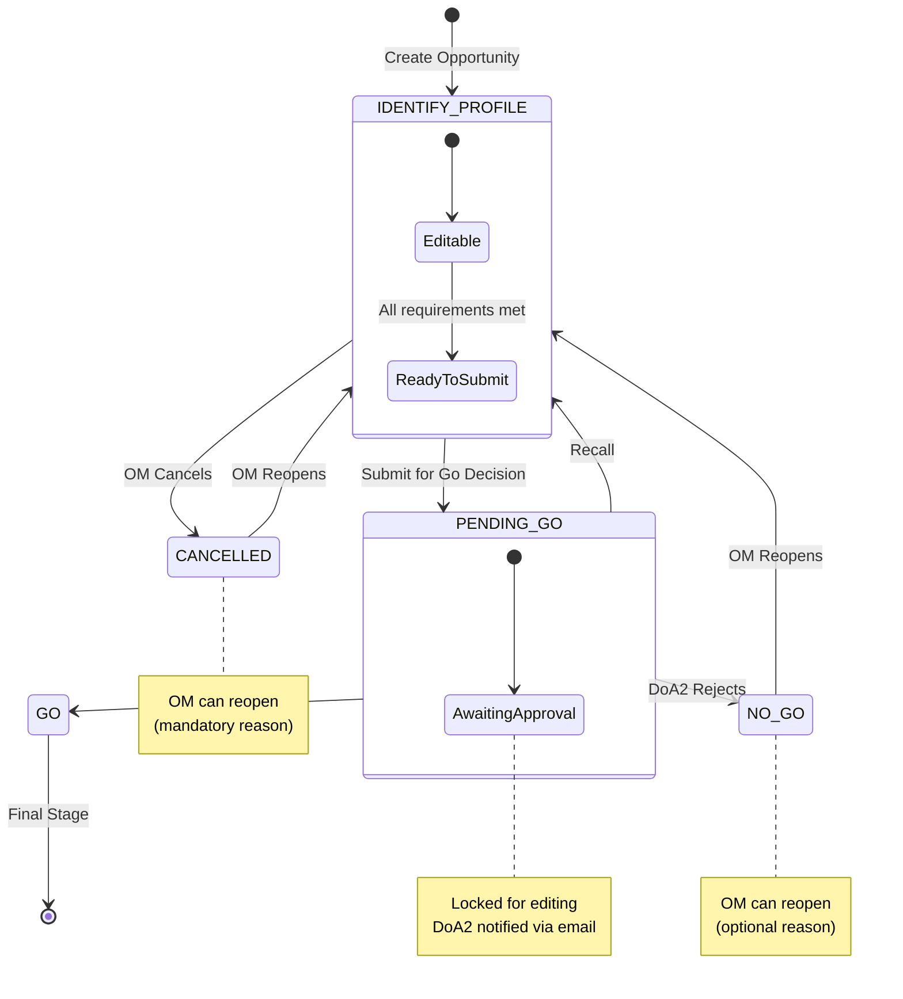
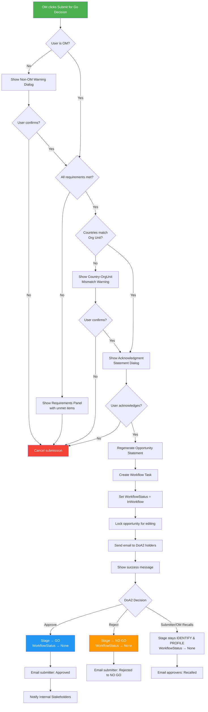

# Product Requirements Document: Send Opportunity for Go Decision

## Initial Requirement

Implement the "Send Opportunity for Go Decision" feature that allows Opportunity Managers to submit opportunities for approval by DoA Level 2 holders. The feature includes:
- Role-based submission permissions (Opportunity Manager can initiate)
- DoA Level 2 holder approval workflow
- Mandatory field validation before submission
- Opportunity Statement regeneration on submission
- Email notifications to decision makers
- Country-to-Org Unit relationship warnings
- OM recall capability

---

## Executive Summary

### Business Context

The Partnerships and Opportunities (PAO) application needs a formal approval process for opportunities to transition from the "Identify & Profile" stage to the "Go" decision. This ensures proper oversight by DoA (Delegation of Authority) Level 2 holders before UNOPS commits resources to opportunity development.

### Goal

Enable Opportunity Managers to submit opportunities for Go decision approval, with comprehensive validation, notifications, and workflow controls that ensure compliance with UNOPS governance requirements.

---

## PRD

### 1. Introduction/Overview

The "Send Opportunity for Go Decision" feature extends the existing workflow infrastructure to provide a complete approval process for opportunities. When an Opportunity Manager initiates the submission:

1. The system validates all mandatory fields are populated
2. The Opportunity Statement is regenerated to reflect current data
3. DoA Level 2 holders for the responsible org unit are identified and notified
4. The opportunity is locked for editing until the decision is made
5. Decision makers can approve (Go) or reject the request

**Problem Statement:** Currently, the workflow approval process is configured with placeholder approver roles ("Partnership Lead"). The system needs to:
- Use the correct DoA Level 2 holders as approvers
- Validate mandatory data before submission
- Provide appropriate warnings and acknowledgments
- Send proper email notifications to decision makers

**Solution:** Implement `OpportunityStageRequirements` for validation, update the approver provider to look up DoA2 holders from the responsible org unit, create email templates, and add country-org unit relationship warnings.

---

### 2. Clarifying Questions and Responses

**Q1: DoA Holder Identification**
- Decision Makers are DoA Level 2 holders assigned to the Opportunity's Responsible Org Unit via `EntityUserRole`
- Block submission if no DoA2 found (display as missing field requirement)
- Show approvers list when opportunity is in workflow (like GMS pattern)

**Q2: OIC (Officer-in-Charge)**
- Out of scope for this PRD

**Q3: Collaborator Role**
- Out of scope for this PRD

**Q4: Opportunity Statement**
- Trigger generation/regeneration on submit
- Email link redirects to the statement section of the opportunity
- No PDF generation required

**Q5: Analysis Section & Validation**
- Use GMS pattern with `OpportunityStageRequirements` class
- Validation runs continuously (real-time)
- Use workflow submodule's requirement-validation pattern

**Q6: Country → Org Unit Mapping**
- Use `OrganizationUnitRelationship` where `EntityType = "Country"` to check relationships
- Show warning if implementation countries don't have relationship with opportunity's org unit

**Q7: Recall Permissions**
- OM can always recall, even if they didn't submit
- Justification/reason is mandatory

**Q8: Internal Stakeholder Notifications**
- Notify only on Go decision (approval complete)

**Q9: Email Notifications**
- Match exact wording provided in requirements
- Create email templates as part of this PRD
- Use GMS pattern for URL generation (`Configuration["AppConfig:BaseUrl"]`)

**Q10: Technical Scope**
- Full feature implementation (validation, notifications, workflow changes)
- Builds on existing workflow infrastructure (already implemented)

---

### 3. Goals

1. **Implement DoA Level 2 approver lookup** - Replace "Partnership Lead" with DoA2 holders from responsible org unit
2. **Create OpportunityStageRequirements** - Define mandatory field validation for Go decision submission
3. **Trigger Opportunity Statement regeneration** - Automatically regenerate on submission
4. **Implement email notifications** - Send proper notifications to DoA holders with exact wording
5. **Add country-org unit relationship warning** - Warn if org unit is not normally responsible for implementation countries
6. **Enable OM recall** - Allow OM to recall even if they didn't submit
7. **Add non-OM submitter warning** - Warn when someone other than OM initiates submission

---

### 4. Architecture

#### 4.0 Workflow Diagrams

##### 4.0.1 Workflow State Transitions



**Stage Descriptions:**
| Stage | Code | Description |
|-------|------|-------------|
| IDENTIFY & PROFILE | `IDENTIFY & PROFILE` | Initial stage - opportunity being developed |
| GO | `GO` | Approved - proceed with development |
| NO GO | `NO GO` | Rejected - org unit will not proceed |
| CANCELLED | `CANCELLED` | Cancelled by OM (Status = Closed) |

##### 4.0.2 Submission Flow



**Flow Legend:**
- 🟢 **Green**: Entry point
- 🔵 **Blue**: Success (GO)
- 🟠 **Orange**: Rejection (NO GO)
- 🔴 **Red**: Cancelled/Aborted

#### 4.1 Current Architecture (Before)

```
UNOPS.PAO.Business/Workflow/
├── Adapters/
│   ├── PaoWorkflowApproverProvider.cs  ← Uses OpportunityStakeholder with "Partnership Lead" role
│   ├── PaoWorkflowNotificationService.cs  ← Only logs, no email templates
│   └── ...
├── Seeders/
│   └── StateMachineStageChangeRoleSeeder.cs  ← Uses "Partnership Lead" as approver
└── OpportunityWorkflow.cs  ← 3 stages defined

UNOPS.PAO.Presentation/Controllers/
└── WorkflowController.cs  ← Existing workflow endpoints (no stage requirements)
```

**Limitations:**
- Uses wrong approver role ("Partnership Lead" instead of DoA Level 2)
- No mandatory field validation before submission
- Email notifications only logged (no templates)
- No country-org unit relationship check
- Only submitter can recall

#### 4.2 Target Architecture (After)

**Note on File Status:**
- `EXISTS` = File already exists in codebase
- `EXISTS - MODIFY` = File exists and needs modification
- `NEW` = File needs to be created
- `EXISTS - DELETE` = File exists but should be deleted (unused)

```
UNOPS.PAO.Business/Workflow/
├── Adapters/
│   ├── PaoWorkflowApproverProvider.cs     ← EXISTS - MODIFY: Lookup DoA2 from ResponsibleOrgUnit
│   ├── PaoWorkflowNotificationService.cs  ← EXISTS - MODIFY: Send actual emails
│   └── ...
├── Seeders/
│   ├── StateMachineStageChangeRoleSeeder.cs  ← EXISTS - MODIFY: Use DoA2 role
│   └── StateMachineStageChangeSeeder.cs      ← EXISTS - MODIFY: Add CANCELLED transitions
├── StageRequirements/
│   ├── OpportunityStageRequirements.cs       ← EXISTS - DELETE: Unused placeholder (not integrated)
│   └── OpportunityStageRequirementsProvider.cs  ← NEW: Implements IStageRequirementsProvider
├── OpportunityWorkflow.cs  ← EXISTS - MODIFY: Add CANCELLED stage constant

UNOPS.PAO.Business/EmailTemplates/
├── WorkflowApprovalRequest.html  ← EXISTS - MODIFY: Update wording if needed
├── WorkflowCompleted.html        ← EXISTS - MODIFY: Update wording if needed
├── WorkflowRejected.html         ← EXISTS - MODIFY: Update wording if needed
└── WorkflowRecalled.html         ← EXISTS - MODIFY: Update wording if needed

UNOPS.PAO.Presentation/Controllers/
└── WorkflowController.cs  ← EXISTS - MODIFY: Add requirements validation endpoint

UNOPS.Workflow/ (Submodule - DO NOT MODIFY)
├── UNOPS.Workflow.Business/
│   ├── Managers/RequirementsValidationManager.cs  ← EXISTS (in submodule)
│   └── Interfaces/IStageRequirementsProvider.cs   ← EXISTS (in submodule)
└── UNOPS.Workflow.Models/Requirements/
    └── StageRequirement.cs  ← EXISTS (in submodule)
```

#### 4.3 Key Architecture Changes

1. **Approver Lookup**:
   - FROM: Find `OpportunityStakeholder` with role "Partnership Lead"
   - TO: Find DoA Level 2 holders for the Opportunity's `ResponsibleOrgUnitId` via `EntityUserRole`

2. **Validation**:
   - NEW: `OpportunityStageRequirementsProvider` implementing `IStageRequirementsProvider` from submodule
   - EXISTS: `RequirementsValidationManager` in submodule - register the provider with it
   - NEW: API endpoint `GET /api/workflow/{entityName}/{id}/requirements` in `WorkflowController.cs`

3. **Notifications**:
   - FROM: Log notifications only
   - TO: Send actual emails using EXISTING templates (verify/update wording)

4. **Recall**:
   - FROM: Only submitter can recall
   - TO: Submitter OR Opportunity Manager can recall

5. **Stages**:
   - EXISTING: "IDENTIFY & PROFILE", "GO", "NO GO"
   - NEW: "CANCELLED" stage (requires seeder and OpportunityWorkflow.cs update)

#### 4.4 API Endpoint Consolidation (Align with GMS Pattern)

**Current PAO Implementation (Inconsistent):**
```
POST /api/workflow/submit     ← Separate endpoint
POST /api/workflow/approve    ← Separate endpoint
POST /api/workflow/reject     ← Separate endpoint
POST /api/workflow/recall     ← Separate endpoint
```

**GMS Pattern (Recommended):**
```
POST /api/workflow            ← Single endpoint, action in request body
GET  /api/workflow/{entityName}
GET  /api/workflow/{entityName}/{id}
GET  /api/workflow/{entityName}/{id}/details
GET  /api/workflow/{entityName}/{id}/history
GET  /api/workflow/{entityName}/{id}/requirements
```

**Recommendation:** Update `WorkflowController.cs` to use a single POST endpoint like GMS:

```csharp
[HttpPost(APIDictionary.Workflow)]
public async Task<IActionResult> DoWorkflowAction([FromBody] WorkflowActionModel model)
{
    // Validate entity exists
    var entity = await GetEntityAsync(model.EntityName, model.Id);
    if (entity == null)
        return BadRequest("Entity not found");
    
    var isInWorkflow = await IsEntityInWorkflowAsync(model.EntityName, model.Id);
    
    // Route based on action
    if (isInWorkflow)
    {
        return model.Action.ToLowerInvariant() switch
        {
            "recall" => await Recall(model),
            "reject" => await Reject(model),
            "approve" => await Approve(model),
            _ => BadRequest("Invalid action for entity in workflow")
        };
    }
    
    // Not in workflow - handle submit, cancel, reopen
    return model.Action.ToLowerInvariant() switch
    {
        "submit" => await Submit(model),
        "cancel" => await Cancel(model),
        "reopen" => await Reopen(model),
        _ => BadRequest("Invalid action")
    };
}
```

**WorkflowActionModel (Unified Request):**
```csharp
public class WorkflowActionModel
{
    public string EntityName { get; set; }      // e.g., "opportunity"
    public int Id { get; set; }                 // Entity ID
    public string Action { get; set; }          // "submit", "approve", "reject", "recall", "cancel", "reopen"
    public string? NewStage { get; set; }       // Target stage (for submit)
    public string? Comment { get; set; }        // Comment/justification
    
    // Confirmation flags (for warnings)
    public bool ConfirmedNonOMSubmission { get; set; }
    public bool ConfirmedOrgUnitMismatch { get; set; }
    public bool AcknowledgedStatement { get; set; }
}
```

**Benefits of Consolidation:**
1. Consistent with GMS and workflow submodule design
2. Easier to add new actions (no new endpoints needed)
3. Centralized validation and requirements checking
4. Simplified frontend service (single method for all actions)
5. Reduced code duplication

**Implementation Path:**
1. Create new unified `DoWorkflowAction` endpoint
2. Keep old endpoints temporarily for backward compatibility
3. Update frontend to use new endpoint
4. Deprecate and remove old endpoints

---

### 5. User Stories

#### US-1: Opportunity Manager Submits for Go Decision
**As an** Opportunity Manager  
**I want to** submit an opportunity for Go decision  
**So that** DoA holders can approve resource allocation for further development

**Acceptance Criteria:**
- Can click "Send Opportunity for Go Decision" button
- System validates all mandatory fields are populated
- System regenerates Opportunity Statement on submission
- System identifies DoA Level 2 holder(s) for responsible org unit
- Submission is blocked if no DoA2 found (with clear error message)
- DoA holders receive email notification with link to opportunity
- Opportunity becomes read-only while in workflow
- Workflow history shows submission details

---

#### US-2: Non-OM User Receives Warning Before Submission
**As a** team member (non-OM) with trigger permissions  
**I want to** see a warning when initiating submission  
**So that** I understand this action is normally performed by the OM

**Acceptance Criteria:**
- Warning dialog appears when non-OM initiates submission
- Warning text: "You currently hold a [Role] role for this Opportunity. It is normally expected that the UNOPS personnel listed as the Opportunity Manager will perform the action of sending the Opportunity for a Go decision. Please confirm that you wish to proceed."
- User can cancel or proceed
- No warning shown if user IS the Opportunity Manager

---

#### US-3: System Validates Mandatory Fields
**As a** user submitting an opportunity  
**I want to** see which mandatory fields are missing  
**So that** I can complete them before submission

**Acceptance Criteria:**
- System displays list of missing mandatory fields in real-time
- Missing fields include:
  - Opportunity Name
  - Description
  - Proposed Budget for Initiative
  - Context & Challenges
  - Alignment to UNOPS Strategic Mission(s) (at least one)
  - Expected Impact
  - Expected Outcomes
  - Beneficiaries (either checkbox "to be determined" OR both direct and indirect counts)
  - SDG Alignment (at least one SDG or acknowledgement)
  - At least one funding partner with amount and currency
  - At least one Client Partner
  - At least one Product and Service
  - At least one Country of Implementation
  - Target Signing Date
  - Implementation start date
  - Implementation end date
  - Opportunity Manager
  - Org Unit Responsible (Development and Partnerships related)
  - Proposed Initiative Type (Project, Program, or Portfolio)
  - DoA Level 2 holder exists for responsible org unit
  - Opportunity Statement has been generated
- List disappears as user populates fields
- Submission blocked until all requirements met

---

#### US-4: Country-Org Unit Relationship Warning
**As a** user submitting an opportunity  
**I want to** be warned if the org unit is not normally responsible for implementation countries  
**So that** I can verify the correct org unit is selected

**Acceptance Criteria:**
- System checks `OrganizationUnitRelationship` for each implementation country
- If any country is not related to the responsible org unit:
  - Warning message displayed: "The org unit selected is not normally responsible for one/all of the country/ies of implementation. Please confirm that you wish to proceed. The normally responsible org units will be listed as internal stakeholders and notified in the event of a Go decision."
- User can cancel or proceed
- Warning is shown at submission time (not continuously)

---

#### US-5: DoA Holder Receives Approval Request Notification
**As a** DoA Level 2 holder  
**I want to** receive email notification when an opportunity requires my approval  
**So that** I can review and make a Go decision

**Acceptance Criteria:**
- Email sent to all DoA Level 2 holders for the responsible org unit
- Email contains:
  - Recipient name
  - DoA level and org unit information
  - Opportunity name
  - Submitter name
  - Link to opportunity (scrolls to statement section)
  - Note about Internal Stakeholder notifications on Go decision
- Email subject: "PAO: Opportunity [Name] - Action Required"

---

#### US-6: Decision Maker Approves Opportunity
**As a** DoA Level 2 holder  
**I want to** approve an opportunity for Go  
**So that** the org unit can proceed with further development

**Acceptance Criteria:**
- Can view Opportunity Statement section
- Can click "Approve" button
- Optional comment field available
- On approval:
  - Stage changes to "GO"
  - Opportunity unlocked for editing
  - Submitter notified of approval
  - Internal stakeholders for other responsible countries notified
- Workflow history updated with approval details

---

#### US-7: Decision Maker Rejects Opportunity (Sets to NO GO)
**As a** DoA Level 2 holder  
**I want to** reject an opportunity request  
**So that** the opportunity is marked as NO GO and the submitter is informed

**Acceptance Criteria:**
- Can click "Reject" button
- Mandatory comment field for rejection reason
- On rejection:
  - Stage changes to "NO GO" (not back to IDENTIFY & PROFILE)
  - Opportunity unlocked for editing
  - Submitter notified that opportunity has been set to NO GO with reason
  - Email clearly states the opportunity can be reopened if circumstances change
- Workflow history updated with rejection details showing NO GO outcome

**Note:** This is custom behavior - standard workflow rejection returns to the previous stage. For opportunities, rejection means the DoA holder has decided not to proceed, hence NO GO.

---

#### US-8: Opportunity Manager Reopens NO GO Opportunity
**As an** Opportunity Manager  
**I want to** reopen an opportunity that was set to NO GO  
**So that** it can be reconsidered for a Go decision

**Acceptance Criteria:**
- Reopen action available on opportunities in NO GO stage
- OM can initiate reopen without approval requirement
- On reopen:
  - Stage changes back to "IDENTIFY & PROFILE"
  - Opportunity fully editable
  - OM can make updates and re-submit for Go decision
- Workflow history shows reopen action

---

#### US-9: Opportunity Manager Recalls Submission
**As an** Opportunity Manager  
**I want to** recall a submitted opportunity  
**So that** I can make corrections before decision

**Acceptance Criteria:**
- OM can recall even if they didn't submit
- Mandatory justification field for recall
- On recall:
  - Workflow cancelled
  - Stage remains at "IDENTIFY & PROFILE"
  - Opportunity unlocked for editing
  - DoA holders notified of recall
- Workflow history shows recall with justification

---

#### US-10: User Views Opportunity in Workflow
**As a** user viewing an opportunity in workflow  
**I want to** see the workflow status clearly  
**So that** I understand the opportunity is pending decision

**Acceptance Criteria:**
- "Approval Pending" tag visible
- Current stage and pending stage displayed
- Approvers tab shows DoA holder(s) with roles
- All content is read-only
- Workflow history accessible

---

#### US-11: Opportunity Manager Cancels Opportunity
**As an** Opportunity Manager  
**I want to** cancel an opportunity that is no longer being pursued  
**So that** it is clearly marked as not proceeding

**Acceptance Criteria:**
- Cancel action available on opportunities in "IDENTIFY & PROFILE" stage
- Only OM can trigger the cancel action
- Mandatory justification field for cancellation reason
- On cancel:
  - Stage changes to "CANCELLED"
  - Status changes to "Closed"
  - Opportunity becomes read-only
- Workflow history shows cancellation with justification
- No approval required for cancellation

---

#### US-12: Opportunity Manager Reopens Cancelled Opportunity
**As an** Opportunity Manager  
**I want to** reopen a cancelled opportunity  
**So that** it can be reconsidered for development

**Acceptance Criteria:**
- Reopen action available on opportunities in "CANCELLED" stage
- Only OM can initiate reopen
- Mandatory reason field for reopening
- On reopen:
  - Stage changes back to "IDENTIFY & PROFILE"
  - Status changes back to "Active"
  - Opportunity fully editable
- Workflow history shows reopen action with reason

---

### 6. Functional Requirements

#### FR-1: Update Approver Lookup for DoA Level 2

1. Modify `PaoWorkflowApproverProvider.GetOpportunityApproversAsync()`:
   ```csharp
   // Instead of looking up OpportunityStakeholder with "Partnership Lead" role:
   // Look up EntityUserRole where:
   //   - EntityType = "OrganizationHierarchy"
   //   - EntityId = Opportunity.ResponsibleOrgUnitId
   //   - EntityRole.Code = "DoA2_Engagement_Acceptance"
   ```

2. Update `StateMachineStageChangeRoleSeeder`:
   - Change approver role from "Partnership Lead" to "DoA2"
   - Role lookup should find `EntityRole` with `Code = "DoA2_Engagement_Acceptance"`

3. Update `OpportunityWorkflow.cs` to add the new CANCELLED stage constant:
   - Add `Cancelled = "CANCELLED"` to `Stages` class
   - Add CANCELLED State to `StateMachine.States` array with Sequence = 4
   - Update `AllStages` array to include the new stage

4. Update `StateMachineStageChangeSeeder.cs` to add CANCELLED transitions:
   - Add IDENTIFY & PROFILE → CANCELLED transition (Cancel action, no approval required)
   - Add CANCELLED → IDENTIFY & PROFILE transition (Reopen action, no approval required)

4. Block submission if no DoA2 holders found:
   - Return empty approvers list → triggers validation error
   - Add to `OpportunityStageRequirements` as server-side validation

#### FR-2: Create OpportunityStageRequirements Class

1. Create `UNOPS.PAO.Business/Workflow/StageRequirements/OpportunityStageRequirements.cs`:
   ```csharp
   public static class OpportunityStageRequirements
   {
       public static List<object> GetRequirementsForStageChange(string currentStage, string nextStage)
       {
           List<object> requirements = new();
           
           if (currentStage == "IDENTIFY & PROFILE" && nextStage == "GO")
           {
               // Add all mandatory field requirements
               // See detailed list in FR-2.1
           }
           
           return requirements;
       }
   }
   ```

##### FR-2.1: Mandatory Field Requirements for GO Transition

| Field | Description Key | Field Name | Field Type | Validation |
|-------|----------------|------------|------------|------------|
| Opportunity Name | message.requirements.opportunity.nameRequired | name | text | required |
| Description | message.requirements.opportunity.descriptionRequired | description | text | required |
| Proposed Budget | message.requirements.opportunity.budgetRequired | initiativeBudgetUSD | number | required |
| Context & Challenges | message.requirements.opportunity.challengesRequired | challenges | text | required |
| Strategic Missions | message.requirements.opportunity.missionsRequired | unopsMissions | array | minLength = 1 |
| Expected Impact | message.requirements.opportunity.impactRequired | expectedImpact | text | required |
| Expected Outcomes | message.requirements.opportunity.outcomesRequired | expectedOutcomes | text | required |
| Beneficiaries | message.requirements.opportunity.beneficiariesRequired | beneficiaries | conditional | BeneficiariesToBeDetermined OR (EstimatedDirectBeneficiaries AND EstimatedIndirectBeneficiaries) |
| SDG Alignment | message.requirements.opportunity.sdgRequired | sdgs | array | minLength = 1 |
| Funding Partners | message.requirements.opportunity.fundingPartnerRequired | fundingPartners | array | minLength = 1 |
| Client Partners | message.requirements.opportunity.clientPartnerRequired | clientPartners | array | minLength = 1 |
| Products & Services | message.requirements.opportunity.productsRequired | deliverables | array | minLength = 1 |
| Countries | message.requirements.opportunity.countriesRequired | countries | array | minLength = 1 |
| Target Signing Date | message.requirements.opportunity.signingDateRequired | targetSigningDate | date | required |
| Implementation Start | message.requirements.opportunity.startDateRequired | implementationStartDate | date | required |
| Implementation End | message.requirements.opportunity.endDateRequired | targetDeliveryDate | date | required |
| Opportunity Manager | message.requirements.opportunity.managerRequired | stakeholders | roles | required, role = "Opportunity Manager" |
| Responsible Org Unit | message.requirements.opportunity.orgUnitRequired | responsibleOrgUnitId | select | required |
| Initiative Type | message.requirements.opportunity.initiativeTypeRequired | proposedInitiativeTypeId | select | required |
| DoA2 Holder | message.requirements.opportunity.doaHolderRequired | doaHolders | doaValidation | required, onlyServerSideEvaluation |
| Opportunity Statement | message.requirements.opportunity.statementRequired | opportunityStatementMarkdown | text | required |

##### FR-2.2: Server-Side Validation for DoA2

```csharp
// In RequirementsValidationManager, add:
if (fieldType == "doaValidation")
{
    var opportunity = entity as OpportunityModel;
    var doaHolders = await GetDoA2HoldersForOrgUnitAsync(opportunity.ResponsibleOrgUnitId);
    if (!doaHolders.Any())
    {
        var description = "No DoA Level 2 holder found for the responsible org unit";
        result.AddError("doaHolders", description);
    }
}
```

##### FR-2.3: Custom Validator for Beneficiaries

```csharp
// In RequirementsValidationManager, add:
if (fieldType == "conditional" && customValidator == "BeneficiariesValidator")
{
    var opportunity = entity as OpportunityModel;
    
    // Validation: Either BeneficiariesToBeDetermined is true 
    // OR both EstimatedDirectBeneficiaries AND EstimatedIndirectBeneficiaries are provided
    var isToBeDetermined = opportunity.BeneficiariesToBeDetermined;
    var hasDirectCount = opportunity.EstimatedDirectBeneficiaries.HasValue && opportunity.EstimatedDirectBeneficiaries > 0;
    var hasIndirectCount = opportunity.EstimatedIndirectBeneficiaries.HasValue && opportunity.EstimatedIndirectBeneficiaries >= 0;
    
    if (!isToBeDetermined && !(hasDirectCount && hasIndirectCount))
    {
        var description = "Beneficiaries information is required - either check 'to be determined' or provide both direct and indirect counts";
        result.AddError("beneficiaries", description);
    }
}
```

#### FR-3: Create RequirementsValidationManager

1. Create `UNOPS.PAO.Business/Managers/RequirementsValidationManager.cs` following GMS pattern
2. Implement `GetRequirementsForEntityAsync()` method
3. Implement `ValidateRequirementsAsync()` method
4. Register in DI container

#### FR-4: Add Requirements Validation API Endpoint

1. Add to `WorkflowController`:
   ```csharp
   [HttpGet(APIDictionary.Workflow + "/{entityName}/{id}/requirements/{nextStage?}")]
   public async Task<ActionResult<List<object>>> GetRequirementsForStageChange(
       string entityName, 
       int id, 
       string? nextStage)
   ```

2. Return requirements list that frontend can use for real-time validation

#### FR-5: Trigger Opportunity Statement Regeneration

1. In `WorkflowController.Submit()`, before creating workflow log:
   ```csharp
   // Regenerate Opportunity Statement
   await _opportunityManager.GenerateOpportunityStatementAsync(request.EntityId);
   ```

2. No PDF generation - link in email should include anchor: `/opportunity/{id}#statement`

#### FR-6: Implement Non-OM Submitter Warning

1. Add to `WorkflowController.Submit()`:
   ```csharp
   // Check if current user is the Opportunity Manager
   var isOM = await IsUserOpportunityManagerAsync(entityId, CurrentUserId);
   if (!isOM && !request.ConfirmedNonOMSubmission)
   {
       return Ok(new WorkflowSubmitResponse
       {
           Success = false,
           RequiresConfirmation = true,
           ConfirmationType = "NonOMSubmitter",
           ConfirmationMessage = "You currently hold a [Role] role..."
       });
   }
   ```

2. Frontend handles `RequiresConfirmation` by showing dialog and re-submitting with `ConfirmedNonOMSubmission = true`

#### FR-7: Implement Country-Org Unit Relationship Warning

1. Add to `WorkflowController.Submit()`:
   ```csharp
   // Check country-org unit relationships
   var unrelatedCountries = await GetUnrelatedCountriesAsync(entityId);
   if (unrelatedCountries.Any() && !request.ConfirmedOrgUnitWarning)
   {
       return Ok(new WorkflowSubmitResponse
       {
           Success = false,
           RequiresConfirmation = true,
           ConfirmationType = "OrgUnitCountryMismatch",
           ConfirmationMessage = "The org unit selected is not normally responsible...",
           UnrelatedCountries = unrelatedCountries
       });
   }
   ```

2. Query method:
   ```csharp
   private async Task<List<string>> GetUnrelatedCountriesAsync(int opportunityId)
   {
       var opportunity = await _context.Opportunities
           .Include(o => o.Countries).ThenInclude(c => c.Country)
           .FirstOrDefaultAsync(o => o.Id == opportunityId);
       
       var orgUnitRelationships = await _context.OrganizationUnitRelationships
           .Where(r => r.OrganizationHierarchyId == opportunity.ResponsibleOrgUnitId &&
                      r.EntityType == "Country")
           .Select(r => r.EntityId)
           .ToListAsync();
       
       return opportunity.Countries
           .Where(c => !orgUnitRelationships.Contains(c.CountryId))
           .Select(c => c.Country.Name)
           .ToList();
   }
   ```

#### FR-8: Enable OM Recall

1. Modify `WorkflowController.Recall()`:
   ```csharp
   // Check if user is the one who initiated OR is the Opportunity Manager
   var isInitiator = pendingTask.UserId == CurrentUserId;
   var isOM = await IsUserOpportunityManagerAsync(entityId, CurrentUserId);
   
   if (!isInitiator && !isOM)
   {
       return StatusCode(403, new { error = "Only the submitter or Opportunity Manager can recall" });
   }
   
   // Require mandatory justification
   if (string.IsNullOrWhiteSpace(request.Comment))
   {
       return BadRequest(new { error = "Justification is required when recalling" });
   }
   ```

2. Update frontend to show Recall button for OM (not just submitter)

#### FR-9: Create Email Templates

1. Create `UNOPS.PAO.Business/EmailTemplates/WorkflowApprovalRequest.html`:
   - Subject: "PAO: [Opportunity Name] - Action Required"
   - Body includes:
     - Greeting with names
     - DoA level and org unit info
     - Opportunity name with link
     - Submitter name
     - Link to statement section
     - Note about Internal Stakeholder notifications

2. Create `UNOPS.PAO.Business/EmailTemplates/WorkflowCompleted.html`:
   - Subject: "PAO: [Opportunity Name] - Go Decision Approved"
   - Notify submitter and triggers

3. Create `UNOPS.PAO.Business/EmailTemplates/WorkflowRejected.html`:
   - Subject: "PAO: [Opportunity Name] - Set to NO GO"
   - Body includes:
     - Notification that opportunity has been set to NO GO
     - Rejection reason from DoA holder
     - Explanation that this means the org unit will not proceed with development
     - Note that OM can reopen the opportunity if circumstances change
     - Link to opportunity

4. Create `UNOPS.PAO.Business/EmailTemplates/WorkflowRecalled.html`:
   - Subject: "PAO: [Opportunity Name] - Submission Recalled"
   - Include recall justification

#### FR-10: Update PaoWorkflowNotificationService

1. Implement actual email sending:
   ```csharp
   public async Task NotifyNewApprovalRequestAsync(WorkflowNotification notification)
   {
       var recipients = await GetRecipientEmailsAsync(notification.RecipientUserIds);
       var baseUrl = _configuration["AppConfig:BaseUrl"] ?? "https://pao.unops.org";
       var opportunityUrl = $"{baseUrl}/opportunity/{notification.EntityId}#statement";
       
       foreach (var email in recipients)
       {
           await _emailSender.SendEmailAsync(
               email,
               "PAO: " + notification.EntityDisplayName + " - Action Required",
               "WorkflowApprovalRequest.html",
               new { ... }
           );
       }
   }
   ```

#### FR-11: Notify Internal Stakeholders on Go Decision

1. In `WorkflowController.Approve()`, after stage change to GO:
   ```csharp
   // Get org units normally responsible for implementation countries
   var responsibleOrgUnits = await GetResponsibleOrgUnitsForCountriesAsync(entityId);
   
   // Exclude the opportunity's own org unit
   responsibleOrgUnits = responsibleOrgUnits
       .Where(ou => ou.Id != opportunity.ResponsibleOrgUnitId)
       .ToList();
   
   // Notify internal stakeholders from those org units
   foreach (var orgUnit in responsibleOrgUnits)
   {
       await NotifyInternalStakeholdersAsync(orgUnit.Id, opportunity);
   }
   ```

#### FR-12: Mandatory Acknowledgment Statement

1. Add acknowledgment requirement to submission:
   ```csharp
   // Before submission
   if (!request.AcknowledgedStatement)
   {
       return Ok(new WorkflowSubmitResponse
       {
           Success = false,
           RequiresAcknowledgment = true,
           AcknowledgmentText = "All known information and materials relevant to this Opportunity have been provided and are summarized in the Opportunity Statement for your review. Please confirm whether UNOPS org unit [Responsible Org Unit ID & Name] is authorised to assign resources to continue development based on this information"
       });
   }
   ```

2. Allow optional "Additional remarks" free text field

#### FR-14: Custom Rejection Handling (Rejection → NO GO)

**Note:** This is custom behavior that differs from standard workflow rejection. Standard rejection returns to the previous stage; for opportunities, rejection sets the stage to NO GO.

1. Handle rejection in unified `DoWorkflowAction` endpoint (using GMS pattern):
   ```csharp
   // In DoWorkflowAction, when Action = "reject"
   private async Task<IActionResult> Reject(WorkflowActionModel model)
   {
       // ... existing validation ...
       
       if (model.EntityName.Equals("opportunity", StringComparison.OrdinalIgnoreCase))
       {
           // Custom rejection: Move to NO GO instead of returning to previous stage
           var opportunity = await _context.Opportunities.FindAsync(model.Id);
           
           // Change stage to NO GO
           opportunity.Stage = "NO GO";
           
           // Clear workflow status
           opportunity.WorkflowStatus = WorkflowStatus.None;
           
           // Record the rejection in workflow history
           await _workflowManager.Reject(
               pendingTask, 
               model.EntityName, 
               model.Id, 
               opportunity.Name, 
               model.Comment, 
               entityUrl);
           
           await _context.SaveChangesAsync();
           
           // Send NO GO notification
           await _notificationService.NotifyRejectionToNoGoAsync(
               opportunity, 
               model.Comment, 
               CurrentUserId);
           
           return Ok(new WorkflowActionResponse 
           { 
               Success = true, 
               NewStage = "NO GO",
               Message = "Opportunity has been set to NO GO"
           });
       }
       
       // ... standard rejection for other entities ...
   }
   ```

2. Workflow history should clearly indicate:
   - Action: "Rejected → NO GO"
   - From Stage: "IDENTIFY & PROFILE"
   - To Stage: "NO GO"
   - Reason: [DoA holder's comment]
   - User: [DoA holder name]

3. Frontend should display confirmation dialog before rejection:
   - "Rejecting this opportunity will set its stage to NO GO. The Opportunity Manager can reopen it later if circumstances change. Are you sure you want to proceed?"

#### FR-15: Reopen from NO GO Stage

1. Add reopen action for opportunities in NO GO stage:
   ```csharp
   [HttpPost(APIDictionary.Workflow + "/{entityName}/{id}/reopen")]
   public async Task<IActionResult> Reopen(
       string entityName, 
       int id, 
       [FromBody] WorkflowActionRequest request)
   {
       if (!entityName.Equals("opportunity", StringComparison.OrdinalIgnoreCase))
       {
           return BadRequest("Reopen is only available for opportunities");
       }
       
       var opportunity = await _context.Opportunities.FindAsync(id);
       
       if (opportunity.Stage != "NO GO")
       {
           return BadRequest("Only NO GO opportunities can be reopened");
       }
       
       // Verify user is OM or has permission
       var isOM = await IsUserOpportunityManagerAsync(id, CurrentUserId);
       if (!isOM)
       {
           return StatusCode(403, "Only the Opportunity Manager can reopen");
       }
       
       // Change stage back to IDENTIFY & PROFILE
       opportunity.Stage = "IDENTIFY & PROFILE";
       
       // Log the reopen action
       await _workflowManager.LogStageChange(
           entityName, 
           id, 
           "NO GO", 
           "IDENTIFY & PROFILE", 
           "Reopen", 
           request.Comment);
       
       await _context.SaveChangesAsync();
       
       return Ok(new WorkflowActionResponse 
       { 
           Success = true, 
           NewStage = "IDENTIFY & PROFILE",
           Message = "Opportunity has been reopened"
       });
   }
   ```

2. No approval required for reopen (per existing seed data)

3. Frontend should show "Reopen" button on NO GO opportunities for OM

#### FR-16: Stage Stepper Display Logic (Happy Path Only)

The workflow stepper component should display only the "happy path" stages by default, with NO GO appearing only when the opportunity is in that stage.

1. **Default Display (IDENTIFY & PROFILE or GO stages):**
   - Show only: `IDENTIFY & PROFILE` → `GO`
   - Do NOT show NO GO in the stepper

2. **NO GO Stage Display (only when record is in NO GO):**
   - Show: `IDENTIFY & PROFILE` → `NO GO`
   - Hide GO from the stepper (it was skipped via rejection)

3. **Implementation in StageWorkflowComponent:**
   ```typescript
   // Filter stages for display based on current stage
   getDisplayStages(allStages: Stage[], currentStage: string): Stage[] {
     const happyPath = ['IDENTIFY & PROFILE', 'GO'];
     const noGoPath = ['IDENTIFY & PROFILE', 'NO GO'];
     
     if (currentStage === 'NO GO') {
       return allStages.filter(s => noGoPath.includes(s.name));
     }
     return allStages.filter(s => happyPath.includes(s.name));
   }
   ```

4. **CANCELLED Stage Display (only when record is in CANCELLED):**
   - Show: `IDENTIFY & PROFILE` → `CANCELLED`
   - Hide GO from the stepper

5. **Implementation in StageWorkflowComponent:**
   ```typescript
   // Filter stages for display based on current stage
   getDisplayStages(allStages: Stage[], currentStage: string): Stage[] {
     const happyPath = ['IDENTIFY & PROFILE', 'GO'];
     const noGoPath = ['IDENTIFY & PROFILE', 'NO GO'];
     const cancelledPath = ['IDENTIFY & PROFILE', 'CANCELLED'];
     
     switch (currentStage) {
       case 'NO GO':
         return allStages.filter(s => noGoPath.includes(s.name));
       case 'CANCELLED':
         return allStages.filter(s => cancelledPath.includes(s.name));
       default:
         return allStages.filter(s => happyPath.includes(s.name));
     }
   }
   ```

6. **Rationale:**
   - Users should see the expected progression (happy path) by default
   - NO GO and CANCELLED are exceptional outcomes, not target stages
   - Displaying these prematurely may create negative perception
   - When in NO GO or CANCELLED, the stepper accurately reflects what happened

#### FR-17: Cancel Opportunity (IDENTIFY & PROFILE → CANCELLED)

1. Handle cancel in unified `DoWorkflowAction` endpoint (Action = "cancel"):
   ```csharp
   // In DoWorkflowAction, when Action = "cancel"
   private async Task<IActionResult> Cancel(WorkflowActionModel model)
   {
       if (!model.EntityName.Equals("opportunity", StringComparison.OrdinalIgnoreCase))
       {
           return BadRequest("Cancel action only supported for opportunities");
       }
       
       // Verify user is the Opportunity Manager
       var isOM = await IsUserOpportunityManagerAsync(model.Id, CurrentUserId);
       if (!isOM)
       {
           return Forbid("Only the Opportunity Manager can cancel an opportunity");
       }
       
       // Verify opportunity is in IDENTIFY & PROFILE stage
       var opportunity = await _context.Opportunities.FindAsync(model.Id);
       if (opportunity.Stage != "IDENTIFY & PROFILE")
       {
           return BadRequest("Can only cancel opportunities in IDENTIFY & PROFILE stage");
       }
       
       // Validate justification is provided
       if (string.IsNullOrWhiteSpace(model.Comment))
       {
           return BadRequest("Justification is required for cancellation");
       }
       
       // Change stage to CANCELLED
       opportunity.Stage = "CANCELLED";
       
       // Change status to Closed
       opportunity.Status = EntityStatus.Closed;
       
       // Mark as not in workflow (no WorkflowStatus.Completed exists - only None and InWorkflow)
       opportunity.WorkflowStatus = WorkflowStatus.None;
       
       // Record in workflow history
       await _workflowManager.AddLog(new WorkflowLogModel
       {
           EntityName = model.EntityName,
           EntityId = model.Id.ToString(),
           Stage = "IDENTIFY & PROFILE",
           NewStage = "CANCELLED",
           Action = "Cancel",
           Comment = model.Comment,
           UserId = CurrentUserId,
           CompletedOn = DateTime.UtcNow
       });
       
       await _context.SaveChangesAsync();
       
       return Ok(new WorkflowActionResponse
       {
           Success = true,
           NewStage = "CANCELLED",
           Message = "Opportunity has been cancelled"
       });
   }
   ```

2. Frontend calls unified endpoint:
   ```typescript
   // WorkflowService
   cancelOpportunity(entityId: number, comment: string): Observable<WorkflowActionResponse> {
     return this.http.post<WorkflowActionResponse>(`${this.apiUrl}/workflow`, {
       entityName: 'opportunity',
       id: entityId,
       action: 'cancel',
       comment: comment
     });
   }
   ```

3. Add Cancel button to frontend for opportunities in IDENTIFY & PROFILE:
   - Only visible to Opportunity Manager
   - Shows confirmation dialog with mandatory justification field

4. Workflow history should clearly indicate:
   - Action: "Cancel"
   - From Stage: "IDENTIFY & PROFILE"
   - To Stage: "CANCELLED"
   - Reason: [OM's justification]
   - User: [OM name]

#### FR-18: Reopen from CANCELLED Stage

1. Handle reopen in unified `DoWorkflowAction` endpoint (Action = "reopen"):
   ```csharp
   // In DoWorkflowAction, when Action = "reopen"
   private async Task<IActionResult> Reopen(WorkflowActionModel model)
   {
       if (!model.EntityName.Equals("opportunity", StringComparison.OrdinalIgnoreCase))
       {
           return BadRequest("Reopen action only supported for opportunities");
       }
       
       // Verify user is the Opportunity Manager
       var isOM = await IsUserOpportunityManagerAsync(model.Id, CurrentUserId);
       if (!isOM)
       {
           return Forbid("Only the Opportunity Manager can reopen an opportunity");
       }
       
       var opportunity = await _context.Opportunities.FindAsync(model.Id);
       
       // Allow reopen from NO GO or CANCELLED
       if (opportunity.Stage != "NO GO" && opportunity.Stage != "CANCELLED")
       {
           return BadRequest("Only NO GO or CANCELLED opportunities can be reopened");
       }
       
       // For CANCELLED, require justification
       if (opportunity.Stage == "CANCELLED" && string.IsNullOrWhiteSpace(model.Comment))
       {
           return BadRequest("Reason is required when reopening a cancelled opportunity");
       }
       
       var previousStage = opportunity.Stage;
       
       // Change stage back to IDENTIFY & PROFILE
       opportunity.Stage = "IDENTIFY & PROFILE";
       
       // Change status back to Active
       opportunity.Status = EntityStatus.Active;
       
       // Unlock the opportunity
       opportunity.WorkflowStatus = WorkflowStatus.None;
       
       // Record in workflow history
       await _workflowManager.AddLog(new WorkflowLogModel
       {
           EntityName = model.EntityName,
           EntityId = model.Id.ToString(),
           Stage = previousStage,  // NO GO or CANCELLED
           NewStage = "IDENTIFY & PROFILE",
           Action = "Reopen",
           Comment = model.Comment ?? "",
           UserId = CurrentUserId,
           CompletedOn = DateTime.UtcNow
       });
       
       await _context.SaveChangesAsync();
       
       return Ok(new WorkflowActionResponse
       {
           Success = true,
           NewStage = "IDENTIFY & PROFILE",
           Message = "Opportunity has been reopened"
       });
   }
   ```

2. Frontend calls unified endpoint:
   ```typescript
   // WorkflowService
   reopenOpportunity(entityId: number, comment: string): Observable<WorkflowActionResponse> {
     return this.http.post<WorkflowActionResponse>(`${this.apiUrl}/workflow`, {
       entityName: 'opportunity',
       id: entityId,
       action: 'reopen',
       comment: comment
     });
   }
   ```

3. Frontend should show "Reopen" button on CANCELLED opportunities for OM
   - Requires mandatory reason field

4. No approval required for reopen from CANCELLED

---

### 7. Non-Goals (Out of Scope)

1. ❌ **OIC (Officer-in-Charge) notifications** - Not yet defined in the system
2. ❌ **Collaborator role** - Does not exist in the system
3. ❌ **PDF generation** - Use existing markdown with scroll-to-section link
4. ❌ **Multi-level DoA escalation** - Only DoA2 for this release
5. ❌ **Inactive OM handling** - To be addressed separately

---

### 8. Design Considerations

#### 8.1 UI/UX Flow

```
┌─────────────────────────────────────────────────────────────────────────────┐
│                        OPPORTUNITY VIEW PAGE                                 │
├─────────────────────────────────────────────────────────────────────────────┤
│                                                                             │
│  [← Back]                                                                   │
│                                                                             │
│  South Sudan Water Infrastructure Development                               │
│  ═══════════════════════════════════════════════════════════════════════   │
│  ID: 123 | Manager: Jane Smith | Org Unit: AFRO | IDENTIFY & PROFILE       │
│                                                                             │
├─────────────────────────────────────────────────────────────────────────────┤
│                                                                             │
│  ┌─ Stage Requirements ──────────────────────────────────────────────────┐  │
│  │                                                                       │  │
│  │  The following requirements must be met before submission:            │  │
│  │                                                                       │  │
│  │  ✓ Opportunity Name                                                   │  │
│  │  ✓ Description                                                        │  │
│  │  ✗ Proposed Budget for Initiative (missing)                          │  │
│  │  ✓ Context & Challenges                                               │  │
│  │  ✗ SDG Alignment (at least one required)                             │  │
│  │  ✓ At least one Funding Partner                                       │  │
│  │  ...                                                                  │  │
│  │                                                                       │  │
│  └───────────────────────────────────────────────────────────────────────┘  │
│                                                                             │
│  ┌─ Stage ────────────────────────────────────────────────┬──────────────┐  │
│  │                                                        │              │  │
│  │  Stage                                                 │[Submit for  ▼]│ │
│  │                                                        │ Go Decision  │  │
│  ├────────────────────────────────────────────────────────┴──────────────┤  │
│  │                                                                       │  │
│  │  ┌─ Overview ───────┬─ Stage Change History ─┐                       │  │
│  │  └──────────────────┴────────────────────────┘                       │  │
│  │                                                                       │  │
│  │      ●───────────────────────────○                                   │  │
│  │   IDENTIFY &                     GO                                  │  │
│  │   PROFILE                                                            │  │
│  │                                                                       │  │
│  └───────────────────────────────────────────────────────────────────────┘  │
│                                                                             │
└─────────────────────────────────────────────────────────────────────────────┘
```

#### 8.2 Workflow State Transitions

**Important:** The opportunity workflow has custom behavior that differs from standard workflow patterns.

```
                                         ┌─────────────────────┐
                                         │                     │
                                   ┌─────│   IDENTIFY &        │◄─────────────────────────┐
                                   │     │   PROFILE           │                          │
                                   │     │   (Initial Stage)   │◄──────────┐              │
                                   │     │   Status: Active    │           │              │
                                   │     └──────────┬──────────┘           │              │
                                   │                │                      │              │
                        Cancel     │      ┌─────────┼──────────┐           │              │
                        (OM only,  │      │         │          │           │              │
                        with       │      │         │ Submit   │           │              │
                        reason)    │      ▼         │ for Go   │           │              │
                                   │  ┌────────┐    │ Decision │           │              │
                                   │  │        │    │          │           │              │ Reopen
                                   │  │CANCEL- │    │          │           │              │ (OM only,
                                   │  │  LED   │    │          │           │              │  with reason)
                                   │  │        │    │          │           │              │
                                   │  │Status: │    │          │           │              │
                                   │  │Closed  │    │          │           │ Reopen       │
                                   │  └────┬───┘    │          │           │ (OM only)    │
                                   │       │        │          │           │              │
                                   │       │        ▼          │           │              │
                                   │       │ ┌─────────────────┐           │              │
                                   │       │ │                 │           │              │
                            Recall │       │ │   IN WORKFLOW   │           │              │
                                   │       │ │   (Pending DoA2 │           │              │
                                   │       │ │    Approval)    │           │              │
                                   │       │ │                 │           │              │
                                   │       │ └────────┬────────┘           │              │
                                   │       │          │                    │              │
                                   │       │   ┌──────┴──────┐             │              │
                                   │       │   │             │             │              │
                                   │       │   ▼             ▼             │              │
                                   │       │ ┌───────┐  ┌─────────┐        │              │
                                   │       │ │       │  │         │        │              │
                                   └───────┼─│APPROVE│  │ REJECT  │────────┼──────────────┤
                                           │ │       │  │         │        │              │
                                           │ └───┬───┘  └────┬────┘        │              │
                                           │     │           │             │              │
                                           │     ▼           ▼             │              │
                                           │ ┌───────┐   ┌─────────┐       │              │
                                           │ │       │   │         │       │              │
                                           │ │  GO   │   │  NO GO  │───────┘              │
                                           │ │       │   │ (Custom │                      │
                                           │ │Status:│   │behavior)│                      │
                                           │ │Active │   │         │                      │
                                           │ └───────┘   │Status:  │                      │
                                           │             │Active   │                      │
                                           │             └─────────┘                      │
                                           │                                              │
                                           └──────────────────────────────────────────────┘
                                                      Reopen (OM only, with reason)
```

**Key Differences from Standard Workflow:**

| Action | Standard Behavior | Opportunity Behavior |
|--------|-------------------|----------------------|
| Reject | Returns to previous stage (IDENTIFY & PROFILE) | **Moves to NO GO stage** |
| Recall | Returns to previous stage | Returns to IDENTIFY & PROFILE |
| Reopen from NO GO | N/A | Back to IDENTIFY & PROFILE (OM only, no approval) |
| Cancel | N/A | From IDENTIFY & PROFILE to CANCELLED (OM only, status → Closed) |
| Reopen from CANCELLED | N/A | Back to IDENTIFY & PROFILE (OM only, status → Active) |

**Important: Actions vs Stages Terminology**

| Concept | Description | UI Representation |
|---------|-------------|-------------------|
| **Stages** | States the opportunity can be in | Shown in stepper/timeline, status badges |
| **Actions** | Operations that trigger transitions | Button labels |

| Stage Name | Related Action(s) | Button Label |
|------------|-------------------|--------------|
| `IDENTIFY & PROFILE` | Initial stage | - |
| `GO` | Approve | `[Approve]` |
| `NO GO` | Reject | `[Reject]` (opens dialog with `[Reject → NO GO]`) |
| `CANCELLED` | Cancel | `[Cancel]` (opens dialog with `[Confirm Cancel]`) |
| - | Submit for Go Decision | `[Submit for Go Decision]` |
| - | Recall | `[Recall]` |
| - | Reopen | `[Reopen]` |

**Button labels should describe the ACTION, not the resulting STAGE.** The stage change is communicated in confirmation dialogs and success messages.

#### 8.3 Submission Flow

```
┌──────────────┐     ┌──────────────────┐     ┌────────────────────┐
│              │     │                  │     │                    │
│  User clicks │────▶│  Validate        │────▶│  All requirements  │
│  "Submit     │     │  requirements    │     │  met?              │
│   for Go"    │     │                  │     │                    │
│              │     │                  │     │                    │
└──────────────┘     └──────────────────┘     └─────────┬──────────┘
                                                        │
                                           ┌────────────┴────────────┐
                                           │                         │
                                           ▼                         ▼
                                    ┌──────────────┐         ┌──────────────┐
                                    │              │         │              │
                                    │     NO       │         │     YES      │
                                    │  Show errors │         │              │
                                    │              │         │              │
                                    └──────────────┘         └──────┬───────┘
                                                                    │
                                                                    ▼
                                                      ┌──────────────────────┐
                                                      │                      │
                                                      │  Is user the OM?     │
                                                      │                      │
                                                      └──────────┬───────────┘
                                                                 │
                                                    ┌────────────┴────────────┐
                                                    │                         │
                                                    ▼                         ▼
                                             ┌──────────────┐         ┌──────────────┐
                                             │              │         │              │
                                             │     NO       │         │     YES      │
                                             │  Show warning│         │  Continue    │
                                             │  "Non-OM..." │         │              │
                                             └──────┬───────┘         └──────┬───────┘
                                                    │                        │
                                                    ▼                        │
                                             ┌──────────────┐                │
                                             │              │                │
                                             │  User        │                │
                                             │  confirms    │────────────────┤
                                             │              │                │
                                             └──────────────┘                │
                                                                             │
                                                                             ▼
                                                               ┌──────────────────────┐
                                                               │                      │
                                                               │  Check country-org   │
                                                               │  unit relationships  │
                                                               │                      │
                                                               └──────────┬───────────┘
                                                                          │
                                                             ┌────────────┴────────────┐
                                                             │                         │
                                                             ▼                         ▼
                                                      ┌──────────────┐         ┌──────────────┐
                                                      │              │         │              │
                                                      │  Mismatch    │         │  All match   │
                                                      │  Show warning│         │  Continue    │
                                                      │              │         │              │
                                                      └──────┬───────┘         └──────┬───────┘
                                                             │                        │
                                                             ▼                        │
                                                      ┌──────────────┐                │
                                                      │              │                │
                                                      │  User        │────────────────┤
                                                      │  confirms    │                │
                                                      │              │                │
                                                      └──────────────┘                │
                                                                                      │
                                                                                      ▼
                                                                        ┌──────────────────────┐
                                                                        │                      │
                                                                        │  Show acknowledgment │
                                                                        │  statement + remarks │
                                                                        │                      │
                                                                        └──────────┬───────────┘
                                                                                   │
                                                                                   ▼
                                                                        ┌──────────────────────┐
                                                                        │                      │
                                                                        │  Regenerate          │
                                                                        │  Opportunity         │
                                                                        │  Statement           │
                                                                        │                      │
                                                                        └──────────┬───────────┘
                                                                                   │
                                                                                   ▼
                                                                        ┌──────────────────────┐
                                                                        │                      │
                                                                        │  Create workflow     │
                                                                        │  Send notifications  │
                                                                        │  Lock opportunity    │
                                                                        │                      │
                                                                        └──────────────────────┘
```

#### 8.3 Approval Request Email Template

```html
Dear [Decision Maker Names],

You are the current DoA Level 2 holder(s) for [Org Unit ID & Description].

Opportunity "[Opportunity Name]" has been submitted by [Submitter Name] for your 
review and to request confirmation that [Org Unit ID & Description] may proceed 
with further development.

Please review the Opportunity Statement carefully and indicate your decision:

[View Opportunity Statement]

[Additional Remarks from Submitter (if any)]

Please note that, where applicable, Internal Stakeholders from any other UNOPS 
Org Units normally responsible for any of the countries of Implementation will 
be notified of any decision to continue development of this Opportunity.

---
This is an automated message from the UNOPS PAO system.
```

---

### 9. Technical Considerations

#### 9.1 Database Queries

**DoA2 Holder Lookup:**
```sql
SELECT u.Id, u.Email, up.Name
FROM EntityUserRoles eur
INNER JOIN EntityRoles er ON eur.EntityRoleId = er.Id
INNER JOIN PAOUsers u ON eur.UserId = u.Id
LEFT JOIN UserProfiles up ON u.Id = up.UserId
WHERE eur.EntityType = 'OrganizationHierarchy'
  AND eur.EntityId = @ResponsibleOrgUnitId
  AND er.Code = 'DoA2_Engagement_Acceptance'
  AND eur.IsDeleted = false
  AND er.IsDeleted = false
```

**Country-Org Unit Relationship Check:**
```sql
SELECT c.Name
FROM OpportunityCountries oc
INNER JOIN Countries c ON oc.CountryId = c.Id
WHERE oc.OpportunityId = @OpportunityId
  AND c.Id NOT IN (
    SELECT EntityId 
    FROM OrganizationUnitRelationships 
    WHERE OrganizationHierarchyId = @ResponsibleOrgUnitId
      AND EntityType = 'Country'
      AND IsDeleted = false
  )
```

#### 9.2 Performance Considerations

- Cache DoA holder lookups (short TTL as these can change)
- Index `EntityUserRoles` on `(EntityType, EntityId, EntityRoleId)`
- Index `OrganizationUnitRelationships` on `(OrganizationHierarchyId, EntityType)`

#### 9.3 Error Handling

- Clear error messages for missing DoA holders
- Graceful handling of email delivery failures (log but don't block workflow)
- Transaction rollback if workflow creation fails after statement regeneration

#### 9.4 Security Considerations

- Verify user permissions before allowing submission
- Prevent self-approval (unless in Development environment)
- Audit trail for all workflow actions
- Email links should not expose sensitive data

#### 9.5 Validation Architecture (Requirements Hook-up)

The mandatory field validation follows a two-phase approach: client-side for immediate UX feedback, and server-side for security validation before submission.

**Architecture Flow:**

```
┌─────────────────────────────────────────────────────────────────────────────────┐
│                              FRONTEND (Angular)                                  │
├─────────────────────────────────────────────────────────────────────────────────┤
│                                                                                 │
│  1. Component loads → Calls GET /api/workflow/opportunity/{id}/requirements/GO  │
│                                        │                                        │
│                                        ▼                                        │
│  2. Receives requirements list:  [{fieldName: "name", validation: {required}}]  │
│                                        │                                        │
│                                        ▼                                        │
│  3. Validates opportunity[fieldName] against validation rules (real-time)       │
│                                        │                                        │
│                                        ▼                                        │
│  4. Displays ✓/✗ for each requirement │ Enables/disables Submit button         │
│                                                                                 │
└─────────────────────────────────────────────────────────────────────────────────┘
                                         │
                                         │ On Submit
                                         ▼
┌─────────────────────────────────────────────────────────────────────────────────┐
│                              BACKEND (ASP.NET Core)                              │
├─────────────────────────────────────────────────────────────────────────────────┤
│                                                                                 │
│  5. POST /api/workflow/opportunity/{id}/submit                                  │
│                                        │                                        │
│                                        ▼                                        │
│  6. RequirementsValidationManager.ValidateRequirementsAsync()                   │
│     - Validates ALL requirements including onlyServerSideEvaluation             │
│     - Returns ValidationResult with errors if any fail                          │
│                                        │                                        │
│                                        ▼                                        │
│  7. If valid → Create workflow │ If invalid → Return 400 with errors            │
│                                                                                 │
└─────────────────────────────────────────────────────────────────────────────────┘
```

**StageRequirement Model (from Workflow Submodule):**

The workflow submodule defines the `StageRequirement` model in `UNOPS.Workflow.Models.Requirements`. Each requirement returned by `IStageRequirementsProvider.GetRequirementsForStageChange()` conforms to this interface:

```typescript
// TypeScript (Frontend): unops-workflow-angular/src/lib/models/requirement.models.ts
interface StageRequirement {
  name: string;                          // Unique identifier (e.g., "opportunityName")
  description: string;                   // Translation key or display text
  fieldName?: string;                    // Entity property name (e.g., "Name")
  fieldType?: string;                    // Validator type (see Built-in Field Types)
  form?: string;                         // Form section name (e.g., "WHAT", "WHY")
  validation?: RequirementValidation;    // Validation rules
  entityReference?: string;              // For cross-entity validation
  stepName?: string;                     // For process-based validation
  onlyServerSideEvaluation?: boolean;    // Skip client-side validation
  customValidatorConfig?: Record<string, unknown>;  // Config for custom validators
  isMet?: boolean;                       // Runtime state (set by component)
  errorMessage?: string;                 // Runtime error message
}

interface RequirementValidation {
  required?: boolean;                    // Value must be non-null, non-empty
  minLength?: number;                    // Minimum string length or array count
  maxLength?: number;                    // Maximum string length or array count
  greaterThan?: number;                  // Numeric: value > X (exclusive)
  lessThan?: number;                     // Numeric: value < X (exclusive)
  min?: number;                          // Numeric: value >= X (inclusive)
  max?: number;                          // Numeric: value <= X (inclusive)
  equalTo?: number;                      // Numeric: value === X
  isPast?: boolean;                      // Date: must be before today
  value?: unknown;                       // Boolean: must equal this value
  pattern?: string;                      // Regex pattern for string validation
  fields?: string[];                     // Multi-field validation field list
  operator?: 'OR' | 'AND';               // Multi-field: any vs all required
  conditional?: {                        // Conditional validation
    field: string;                       // Field to check
    value: unknown;                      // Value that triggers requirement
  };
  message?: string;                      // Custom error message
}
```

**Built-in Field Types (RequirementsValidationManager):**

| Field Type | Validation Logic |
|------------|------------------|
| `string`, `text` | `required`, `minLength`, `maxLength`, `pattern` |
| `number`, `decimal` | `required`, `greaterThan`, `lessThan`, `min`, `max`, `equalTo` |
| `boolean` | `required`, `value` (must equal true/false) |
| `date` | `required`, `isPast` |
| `array`, `multiselect` | `required`, `minLength`, `maxLength` (item count) |
| `select` | `required` only |
| Custom types | Requires `ICustomFieldValidator` registration |

**Field Name to Entity Property Mapping:**

| fieldName | Entity Property | Type | Validation |
|-----------|-----------------|------|------------|
| `name` | `Opportunity.Name` | string | required |
| `description` | `Opportunity.Description` | string | required |
| `initiativeBudgetUSD` | `Opportunity.InitiativeBudgetUSD` | decimal | required |
| `challenges` | `Opportunity.Challenges` | string | required |
| `unopsMissions` | `Opportunity.UNOPSMissions` | ICollection | minLength=1 |
| `expectedImpact` | `Opportunity.ExpectedImpact` | string | required |
| `expectedOutcomes` | `Opportunity.ExpectedOutcomes` | string | required |
| `sdgs` | `Opportunity.Sdgs` | ICollection | minLength=1 |
| `fundingPartners` | `Opportunity.FundingPartners` | ICollection | minLength=1 |
| `clientPartners` | `Opportunity.ClientPartners` | ICollection | minLength=1 |
| `deliverables` | `Opportunity.Deliverables` | ICollection | minLength=1 |
| `countries` | `Opportunity.Countries` | ICollection | minLength=1 |
| `targetSigningDate` | `Opportunity.TargetSigningDate` | DateTime? | required |
| `implementationStartDate` | `Opportunity.ImplementationStartDate` | DateTime? | required |
| `targetDeliveryDate` | `Opportunity.TargetDeliveryDate` | DateTime? | required |
| `responsibleOrgUnitId` | `Opportunity.ResponsibleOrgUnitId` | int? | required |
| `proposedInitiativeTypeId` | `Opportunity.ProposedInitiativeTypeId` | int? | required |
| `stakeholders` | `Opportunity.Stakeholders` | ICollection | role="Opportunity Manager" |
| `opportunityStatementMarkdown` | `Opportunity.OpportunityStatementMarkdown` | string | required |
| `doaHolders` | (Server lookup) | N/A | onlyServerSideEvaluation |

**Client-Side Validation (Using RequirementsValidationComponent from Submodule):**

The workflow submodule's `RequirementsValidationComponent` handles all client-side validation automatically:

```typescript
// The component handles validation internally via these computed signals:
// From: unops-workflow-angular/src/lib/components/requirements-validation/requirements-validation.component.ts

// Key signals exposed by the component:
readonly requirements = signal<StageRequirement[]>([]);  // Loaded from API
readonly isLoading = signal(false);                       // Loading state
readonly error = signal<string | null>(null);             // Error message

// Computed validation state:
readonly allRequirementsMet = computed(() => {
  const reqs = this.requirements();
  if (reqs.length === 0) return true;
  return reqs.every((req) => req.isMet === true);
});

readonly metCount = computed(() => {
  return this.requirements().filter((req) => req.isMet === true).length;
});

readonly totalCount = computed(() => {
  return this.requirements().length;
});

// Validation flow:
// 1. loadRequirements() → GET /api/workflow/{entityName}/{entityId}/requirements
// 2. setupFormValueChanges() → Listen to formGroup.valueChanges with debounce
// 3. validateAllRequirements() → For each requirement, validate using:
//    a. Custom validator if fieldType in customValidators map
//    b. Built-in validator for standard field types
//    c. Skip if onlyServerSideEvaluation === true
// 4. Emit validationChanged(allRequirementsMet()) on each validation cycle
```

**Form-Based Validation Pattern:**

The component validates fields by reading from the provided `FormGroup`:

```typescript
// Consuming component must provide a FormGroup that maps to entity fields
opportunityForm = new FormGroup({
  name: new FormControl(''),
  description: new FormControl(''),
  initiativeBudgetUSD: new FormControl(null),
  challenges: new FormControl(''),
  // ... other fields
});

// Template: lib-requirements-validation validates this form
<lib-requirements-validation
  [entityName]="'opportunity'"
  [entityId]="opportunity().id.toString()"
  [formGroup]="opportunityForm"
  [currentStage]="opportunity().stage"
  [entityData]="opportunity()"  <!-- Optional: for complex validation -->
  [customValidators]="customValidatorsMap"
  (validationChanged)="canSubmit.set($event)"
/>
```
```

**Server-Side Validation (C#):**

```csharp
// RequirementsValidationManager.cs
public async Task<ValidationResult> ValidateRequirementsAsync<T>(
    T entity, 
    List<object> requirements)
{
    var result = new ValidationResult();
    var entityType = entity?.GetType();

    foreach (var requirement in requirements)
    {
        var reqDict = ToDictionary(requirement);
        var fieldName = reqDict["fieldName"]?.ToString();
        var fieldType = reqDict["fieldType"]?.ToString();
        var validation = ToDictionary(reqDict["validation"]);

        // Special handling for server-side only validations
        if (fieldType == "doaValidation")
        {
            var opportunity = entity as OpportunityModel;
            var doaHolders = await GetDoA2HoldersForOrgUnitAsync(
                opportunity.ResponsibleOrgUnitId);
            
            if (!doaHolders.Any())
            {
                result.AddError("doaHolders", 
                    reqDict["description"]?.ToString() ?? 
                    "No DoA Level 2 holder found");
            }
            continue;
        }

        if (fieldType == "roles")
        {
            if (!await HasRequiredRolesAsync(entity, reqDict))
            {
                result.AddError(fieldName, 
                    reqDict["description"]?.ToString() ?? 
                    "Required role not assigned");
            }
            continue;
        }

        // Standard field validation
        if (string.IsNullOrEmpty(fieldName)) continue;
        
        var property = entityType.GetProperty(fieldName, 
            BindingFlags.IgnoreCase | BindingFlags.Public | BindingFlags.Instance);
        var value = property?.GetValue(entity);
        
        var isValid = ValidateValue(value, fieldType, validation);
        
        if (!isValid)
        {
            result.AddError(fieldName, 
                reqDict["description"]?.ToString() ?? 
                $"Validation failed for {fieldName}");
        }
    }

    return result;
}
```

**Key Design Decisions:**

1. **Two-phase validation**: Client-side provides instant feedback; server-side ensures security
2. **`onlyServerSideEvaluation` flag**: For validations requiring database access (DoA holder lookup)
3. **Translation keys in `description`**: Enables localized error messages
4. **Real-time updates**: Angular signals/computed properties revalidate when opportunity data changes
5. **Reflection-based validation**: Server uses reflection to validate any entity property by name

---

### 10. Success Metrics

**Functional Metrics:**
- [ ] DoA Level 2 holders correctly identified from responsible org unit
- [ ] All mandatory fields validated before submission
- [ ] Opportunity Statement regenerated on submission
- [ ] Email notifications sent to correct recipients
- [ ] Country-org unit warnings displayed when appropriate
- [ ] OM can recall submissions
- [ ] Opportunity locked during workflow
- [ ] Workflow history accurately reflects all actions

**Technical Metrics:**
- [ ] API response time < 500ms for validation
- [ ] Email delivery success rate > 99%
- [ ] Zero data inconsistencies between workflow status and stage
- [ ] Unit test coverage > 80% for new code

---

### 11. User Interface Mockups

#### Mockup 1: Stage Requirements Panel (Continuous Validation)

```
┌─ Stage Requirements ─────────────────────────────────────────────────────────┐
│                                                                              │
│  Complete the following to enable "Send Opportunity for Go Decision":        │
│                                                                              │
│  ✓ Opportunity Name                                                          │
│  ✓ Description                                                               │
│  ✗ Proposed Budget for Initiative - Please enter budget amount              │
│  ✓ Context & Challenges                                                      │
│  ✗ UNOPS Strategic Mission(s) - At least one required                       │
│  ✗ Expected Impact - Please describe expected impact                        │
│  ✓ Expected Outcomes                                                         │
│  ✗ SDG Alignment - At least one SDG required                                │
│  ✗ Funding Partner - At least one with amount and currency required         │
│  ✓ Client Partner                                                            │
│  ✗ Products & Services - At least one required                              │
│  ✓ Countries of Implementation                                               │
│  ✓ Target Signing Date                                                       │
│  ✓ Implementation Start Date                                                 │
│  ✓ Implementation End Date                                                   │
│  ✓ Opportunity Manager                                                       │
│  ✓ Responsible Org Unit                                                      │
│  ✓ Proposed Initiative Type                                                  │
│  ✓ DoA Level 2 Holder assigned                                              │
│  ✗ Opportunity Statement - Please generate statement                        │
│                                                                              │
│  [8 of 20 requirements incomplete]                                           │
│                                                                              │
└──────────────────────────────────────────────────────────────────────────────┘
```

#### Mockup 2: Non-OM Submission Warning Dialog

```
┌─────────────────────────────────────────────────────────────────────────────┐
│                                                                             │
│  ⚠ Confirmation Required                                            [  × ] │
│                                                                             │
├─────────────────────────────────────────────────────────────────────────────┤
│                                                                             │
│  You currently hold a [Internal Stakeholder] role for this Opportunity.     │
│                                                                             │
│  It is normally expected that the UNOPS personnel listed as the             │
│  Opportunity Manager will perform the action of sending the Opportunity     │
│  for a Go decision.                                                         │
│                                                                             │
│  Please confirm that you wish to proceed.                                   │
│                                                                             │
├─────────────────────────────────────────────────────────────────────────────┤
│                                                                             │
│                                    ┌──────────┐  ┌────────────────────┐     │
│                                    │  Cancel  │  │      Proceed       │     │
│                                    └──────────┘  └────────────────────┘     │
│                                    (secondary)    (primary)                 │
│                                                                             │
└─────────────────────────────────────────────────────────────────────────────┘
```

#### Mockup 3: Country-Org Unit Mismatch Warning

```
┌─────────────────────────────────────────────────────────────────────────────┐
│                                                                             │
│  ⚠ Org Unit Responsibility Warning                                  [  × ] │
│                                                                             │
├─────────────────────────────────────────────────────────────────────────────┤
│                                                                             │
│  The org unit selected (AFRO - Africa Regional Office) is not normally      │
│  responsible for the following countries of implementation:                 │
│                                                                             │
│    • Nepal                                                                  │
│    • Bangladesh                                                             │
│                                                                             │
│  The normally responsible org units will be listed as internal              │
│  stakeholders and notified in the event of a Go decision.                   │
│                                                                             │
│  Please confirm that you wish to proceed.                                   │
│                                                                             │
├─────────────────────────────────────────────────────────────────────────────┤
│                                                                             │
│                                    ┌──────────┐  ┌────────────────────┐     │
│                                    │  Cancel  │  │      Proceed       │     │
│                                    └──────────┘  └────────────────────┘     │
│                                    (secondary)    (primary)                 │
│                                                                             │
└─────────────────────────────────────────────────────────────────────────────┘
```

#### Mockup 4: Acknowledgment & Remarks Dialog

```
┌─────────────────────────────────────────────────────────────────────────────┐
│                                                                             │
│  Send Opportunity for Go Decision                                   [  × ] │
│                                                                             │
├─────────────────────────────────────────────────────────────────────────────┤
│                                                                             │
│  ☐ All known information and materials relevant to this Opportunity have   │
│    been provided and are summarized in the Opportunity Statement for your  │
│    review. Please confirm whether UNOPS org unit [AFRO - Africa Regional   │
│    Office] is authorised to assign resources to continue development       │
│    based on this information.                                              │
│                                                                             │
│  ─────────────────────────────────────────────────────────────────────────  │
│                                                                             │
│  Additional remarks for the attention of the decision maker (optional):    │
│                                                                             │
│  ┌─────────────────────────────────────────────────────────────────────┐   │
│  │                                                                     │   │
│  │                                                                     │   │
│  │                                                                     │   │
│  └─────────────────────────────────────────────────────────────────────┘   │
│                                                                             │
├─────────────────────────────────────────────────────────────────────────────┤
│                                                                             │
│                                    ┌──────────┐  ┌────────────────────┐     │
│                                    │  Cancel  │  │       Submit       │     │
│                                    └──────────┘  └────────────────────┘     │
│                                    (secondary)    (primary, disabled       │
│                                                   until acknowledged)       │
│                                                                             │
└─────────────────────────────────────────────────────────────────────────────┘
```

#### Mockup 5: Workflow In Progress (Read-Only)

```
┌─ Stage ─────────────────────────────────────────────────────────────┬─────────────┐
│                                                                     │             │
│  Stage    ┌──────────────────────┐   Current Stage: IDENTIFY &      │  [Recall]   │
│           │ ⚠ Approval Pending   │   PROFILE                        │             │
│           └──────────────────────┘   Next Stage: GO                 │             │
│                                                                     │             │
├─────────────────────────────────────────────────────────────────────┴─────────────┤
│                                                                                   │
│  ┌─ Overview ─────────┬─ Approvers ──────────────┬─ Stage Change History ─┐      │
│                       └──────────────────────────┘                               │
│                                                                                   │
│  ┌───────────────────────────────────────────────────────────────────────────┐   │
│  │ User                                         │ Role                       │   │
│  ├──────────────────────────────────────────────┼────────────────────────────┤   │
│  │ Sarah Johnson (sarah.johnson@unops.org)      │ DoA Level 2                │   │
│  ├──────────────────────────────────────────────┼────────────────────────────┤   │
│  │ Michael Chen (michael.chen@unops.org)        │ DoA Level 2                │   │
│  └──────────────────────────────────────────────┴────────────────────────────┘   │
│                                                                                   │
└───────────────────────────────────────────────────────────────────────────────────┘
```

#### Mockup 6: Rejection Confirmation Dialog (DoA Holder View)

```
┌─────────────────────────────────────────────────────────────────────────────┐
│                                                                             │
│  ⚠ Reject Opportunity                                               [  × ] │
│                                                                             │
├─────────────────────────────────────────────────────────────────────────────┤
│                                                                             │
│  Rejecting this opportunity will set its stage to NO GO.                    │
│                                                                             │
│  This means UNOPS will not proceed with further development of this         │
│  opportunity at this time. The Opportunity Manager can reopen it later      │
│  if circumstances change.                                                   │
│                                                                             │
│  ─────────────────────────────────────────────────────────────────────────  │
│                                                                             │
│  Reason for rejection (required):                                          │
│                                                                             │
│  ┌─────────────────────────────────────────────────────────────────────┐   │
│  │                                                                     │   │
│  │                                                                     │   │
│  │                                                                     │   │
│  └─────────────────────────────────────────────────────────────────────┘   │
│                                                                             │
├─────────────────────────────────────────────────────────────────────────────┤
│                                                                             │
│                                    ┌──────────┐  ┌────────────────────┐     │
│                                    │  Cancel  │  │  Reject → NO GO    │     │
│                                    └──────────┘  └────────────────────┘     │
│                                    (secondary)    (danger, disabled         │
│                                                   until reason provided)    │
│                                                                             │
└─────────────────────────────────────────────────────────────────────────────┘
```

#### Mockup 7: NO GO Stage with Reopen Option (OM View)

```
┌─ Stage ─────────────────────────────────────────────────────────────┬─────────────┐
│                                                                     │             │
│  Stage    ┌──────────────────────┐   Current Stage: NO GO           │  [Reopen]   │
│           │ 🔴 NO GO             │                                  │             │
│           └──────────────────────┘                                  │             │
│                                                                     │             │
├─────────────────────────────────────────────────────────────────────┴─────────────┤
│                                                                                   │
│  ┌─ Overview ─────────┬─ Stage Change History ──────────────────────────────┐    │
│                       └─────────────────────────────────────────────────────┘    │
│                                                                                   │
│      ○───────────────────────────────────●                                       │
│   IDENTIFY &                            NO GO                                    │
│   PROFILE                               (current)                                │
│                                                                                   │
│  ┌───────────────────────────────────────────────────────────────────────────┐   │
│  │ From Stage       │ To Stage   │ Action           │ Date       │ User     │   │
│  ├──────────────────┼────────────┼──────────────────┼────────────┼──────────┤   │
│  │ IDENTIFY &       │ NO GO      │ Rejected → NO GO │ 22-Jan-26  │ S.Johnson│   │
│  │ PROFILE          │            │                  │            │          │   │
│  └──────────────────┴────────────┴──────────────────┴────────────┴──────────┘   │
│                                                                                   │
│  Rejection Reason: "Budget constraints and strategic priorities have changed.   │
│  Recommend revisiting in Q3 2026 when new funding becomes available."           │
│                                                                                   │
└───────────────────────────────────────────────────────────────────────────────────┘
```

#### Mockup 8: Cancel Confirmation Dialog

```
┌─────────────────────────────────────────────────────────────────────────────┐
│                                                                             │
│  ⚠ Cancel Opportunity                                                [  × ] │
│                                                                             │
├─────────────────────────────────────────────────────────────────────────────┤
│                                                                             │
│  Are you sure you want to cancel this opportunity?                          │
│                                                                             │
│  This will:                                                                 │
│  • Set the stage to CANCELLED                                               │
│  • Change the status to Closed                                              │
│  • Make the opportunity read-only                                           │
│                                                                             │
│  You can reopen the opportunity later if circumstances change.              │
│                                                                             │
│  ┌─────────────────────────────────────────────────────────────────────┐   │
│  │ Reason for cancellation (required)                                  │   │
│  │                                                                     │   │
│  │ ┌─────────────────────────────────────────────────────────────────┐ │   │
│  │ │                                                                 │ │   │
│  │ │                                                                 │ │   │
│  │ │                                                                 │ │   │
│  │ └─────────────────────────────────────────────────────────────────┘ │   │
│  └─────────────────────────────────────────────────────────────────────┘   │
│                                                                             │
│                                    ┌──────────┐  ┌────────────────────┐     │
│                                    │  Cancel  │  │  Confirm Cancel    │     │
│                                    └──────────┘  └────────────────────┘     │
│                                    (secondary)    (warning, disabled         │
│                                                   until reason entered)      │
│                                                                             │
└─────────────────────────────────────────────────────────────────────────────┘
```

#### Mockup 9: CANCELLED Stage with Reopen Option (OM View)

```
┌─ Stage ─────────────────────────────────────────────────────────────┬─────────────┐
│                                                                     │             │
│  Stage    ┌──────────────────────┐   Current Stage: CANCELLED       │  [Reopen]   │
│           │ ⚫ CANCELLED         │   Status: Closed                 │             │
│           └──────────────────────┘                                  │             │
│                                                                     │             │
├─────────────────────────────────────────────────────────────────────┴─────────────┤
│                                                                                   │
│  ┌─ Overview ─────────┬─ Stage Change History ──────────────────────────────┐    │
│                       └─────────────────────────────────────────────────────┘    │
│                                                                                   │
│      ○───────────────────────────────────●                                       │
│   IDENTIFY &                          CANCELLED                                  │
│   PROFILE                             (current)                                  │
│                                                                                   │
│  ┌───────────────────────────────────────────────────────────────────────────┐   │
│  │ From Stage       │ To Stage   │ Action      │ Date       │ User         │   │
│  ├──────────────────┼────────────┼─────────────┼────────────┼──────────────┤   │
│  │ IDENTIFY &       │ CANCELLED  │ Cancelled   │ 23-Jan-26  │ J.Smith (OM) │   │
│  │ PROFILE          │            │             │            │              │   │
│  └──────────────────┴────────────┴─────────────┴────────────┴──────────────┘   │
│                                                                                   │
│  Cancellation Reason: "Partner organization withdrew from the initiative.        │
│  May revisit if new partners are identified."                                    │
│                                                                                   │
└───────────────────────────────────────────────────────────────────────────────────┘
```

#### Mockup 10: Reopen from CANCELLED Confirmation Dialog

```
┌─────────────────────────────────────────────────────────────────────────────┐
│                                                                             │
│  ↩ Reopen Opportunity                                                [  × ] │
│                                                                             │
├─────────────────────────────────────────────────────────────────────────────┤
│                                                                             │
│  This will reopen the cancelled opportunity.                                │
│                                                                             │
│  The opportunity will:                                                      │
│  • Return to IDENTIFY & PROFILE stage                                       │
│  • Status will change back to Active                                        │
│  • Become fully editable                                                    │
│                                                                             │
│  ┌─────────────────────────────────────────────────────────────────────┐   │
│  │ Reason for reopening (required)                                     │   │
│  │                                                                     │   │
│  │ ┌─────────────────────────────────────────────────────────────────┐ │   │
│  │ │                                                                 │ │   │
│  │ │                                                                 │ │   │
│  │ │                                                                 │ │   │
│  │ └─────────────────────────────────────────────────────────────────┘ │   │
│  └─────────────────────────────────────────────────────────────────────┘   │
│                                                                             │
│                                    ┌──────────┐  ┌────────────────────┐     │
│                                    │  Cancel  │  │  Reopen            │     │
│                                    └──────────┘  └────────────────────┘     │
│                                    (secondary)    (primary, disabled         │
│                                                   until reason entered)      │
│                                                                             │
└─────────────────────────────────────────────────────────────────────────────┘
```

---

### 12. Open Questions

1. **Funding Partner Validation Details**
   - Q: Should funding partner amount and currency both be required, or just one?
   - Assumption: Both amount AND currency are required

2. **SDG "Acknowledgement" Option**
   - Q: What is the exact acknowledgement text for SDG if not known yet?
   - Assumption: A flag or text field indicating "SDG alignment to be determined during development"

3. **Email Sender Address**
   - Q: What email address should notifications come from?
   - Assumption: Use system default configured in mail service

4. **Internal Stakeholder Role for Country Notification**
   - Q: Which specific role(s) should receive notifications for responsible org units?
   - Assumption: Users with any role on the org unit receive notification

5. **Statement Section Anchor**
   - Q: Is `#statement` the correct anchor for the Opportunity Statement section?
   - Action: Verify frontend route anchor naming

---

## Appendix

### A. Files to Create/Modify

**Legend:**
- `EXISTS` = File exists, no changes needed
- `EXISTS - MODIFY` = File exists and needs modification  
- `NEW` = File needs to be created
- `EXISTS - DELETE` = File exists but should be deleted (unused)

```
UNOPS.PAO.Business/
├── Workflow/
│   ├── StageRequirements/
│   │   ├── OpportunityStageRequirements.cs          ← EXISTS - DELETE (unused placeholder, not integrated)
│   │   └── OpportunityStageRequirementsProvider.cs  ← NEW (implements IStageRequirementsProvider)
│   ├── Adapters/
│   │   ├── PaoWorkflowApproverProvider.cs           ← EXISTS - MODIFY (DoA2 lookup)
│   │   └── PaoWorkflowNotificationService.cs        ← EXISTS - MODIFY (email sending logic)
│   ├── Seeders/
│   │   ├── StateMachineStageChangeRoleSeeder.cs     ← EXISTS - MODIFY (DoA2 role)
│   │   └── StateMachineStageChangeSeeder.cs         ← EXISTS - MODIFY (add CANCELLED transitions)
│   └── OpportunityWorkflow.cs                       ← EXISTS - MODIFY (add CANCELLED stage constant)
└── EmailTemplates/
    ├── WorkflowApprovalRequest.html                 ← EXISTS - MODIFY (add statement link, 
    │                                                            update placeholders per PRD)
    ├── WorkflowCompleted.html                       ← EXISTS - MODIFY (Go decision template)
    ├── WorkflowRejected.html                        ← EXISTS - MODIFY (No Go notification)
    └── WorkflowRecalled.html                        ← EXISTS - MODIFY (recall notification)

UNOPS.Workflow/ (Shared Submodule - already contains infrastructure)
├── UNOPS.Workflow.Business/
│   ├── Managers/
│   │   └── RequirementsValidationManager.cs         ← EXISTS - no changes needed (generic)
│   └── Interfaces/
│       └── IRequirementsValidationManager.cs        ← EXISTS - no changes needed (generic)
└── unops-workflow-angular/src/lib/components/
    └── requirements-validation/                      ← EXISTS - review for integration
        ├── requirements-validation.component.ts
        ├── requirements-validation.component.html
        └── requirements-validation.component.scss

UNOPS.PAO.Presentation/
└── Controllers/
    └── WorkflowController.cs                        ← EXISTS - MODIFY (custom rejection → NO GO, 
                                                               reopen endpoint, warnings)

UNOPS.PAO.Models/
└── Workflow/
    └── WorkflowModels.cs                            ← EXISTS - MODIFY if needed (add confirmation flags
                                                                to WorkflowSubmitRequest, warning types
                                                                to WorkflowSubmitResponse)

UNOPS.PAO.ClientApp/
└── src/app/
    ├── shared/reusables/components/workflow/
    │   ├── components/
    │   │   └── stage-workflow/                      ← EXISTS - MODIFY (integrate with requirements)
    │   └── services/
    │       └── workflow.service.ts                  ← EXISTS - MODIFY (add getRequirementsForStageChange)
    └── features/partnerships/opportunities/components/opportunity/view/
        ├── opportunity-view.component.ts            ← EXISTS - MODIFY (add requirements validation)
        └── opportunity-view.component.html          ← EXISTS - MODIFY (add requirements template)
```

### B. Translation Keys to Add

```json
{
  "message.requirements.opportunity.nameRequired": "Opportunity Name is required",
  "message.requirements.opportunity.descriptionRequired": "Description is required",
  "message.requirements.opportunity.budgetRequired": "Proposed Budget for Initiative is required",
  "message.requirements.opportunity.challengesRequired": "Context & Challenges is required",
  "message.requirements.opportunity.missionsRequired": "At least one UNOPS Strategic Mission alignment is required",
  "message.requirements.opportunity.impactRequired": "Expected Impact is required",
  "message.requirements.opportunity.outcomesRequired": "Expected Outcomes is required",
  "message.requirements.opportunity.beneficiariesRequired": "Beneficiaries information is required - either check 'to be determined' or provide both direct and indirect counts",
  "message.requirements.opportunity.sdgRequired": "At least one SDG alignment is required",
  "message.requirements.opportunity.fundingPartnerRequired": "At least one Funding Partner with amount and currency is required",
  "message.requirements.opportunity.clientPartnerRequired": "At least one Client Partner is required",
  "message.requirements.opportunity.productsRequired": "At least one Product and Service is required",
  "message.requirements.opportunity.countriesRequired": "At least one Country of Implementation is required",
  "message.requirements.opportunity.signingDateRequired": "Target Signing Date is required",
  "message.requirements.opportunity.startDateRequired": "Implementation Start Date is required",
  "message.requirements.opportunity.endDateRequired": "Implementation End Date is required",
  "message.requirements.opportunity.managerRequired": "Opportunity Manager is required",
  "message.requirements.opportunity.orgUnitRequired": "Responsible Org Unit is required",
  "message.requirements.opportunity.initiativeTypeRequired": "Proposed Initiative Type is required",
  "message.requirements.opportunity.doaHolderRequired": "No DoA Level 2 holder found for the responsible org unit",
  "message.requirements.opportunity.statementRequired": "Opportunity Statement must be generated",
  "message.workflow.nonOMSubmitterWarning": "You currently hold a {role} role for this Opportunity. It is normally expected that the UNOPS personnel listed as the Opportunity Manager will perform the action of sending the Opportunity for a Go decision. Please confirm that you wish to proceed.",
  "message.workflow.orgUnitCountryMismatchWarning": "The org unit selected is not normally responsible for one/all of the country/ies of implementation. Please confirm that you wish to proceed. The normally responsible org units will be listed as internal stakeholders and notified in the event of a Go decision.",
  "message.workflow.acknowledgmentStatement": "All known information and materials relevant to this Opportunity have been provided and are summarized in the Opportunity Statement for your review. Please confirm whether UNOPS org unit {orgUnitName} is authorised to assign resources to continue development based on this information.",
  "message.workflow.rejectToNoGoTitle": "Reject Opportunity",
  "message.workflow.rejectToNoGoWarning": "Rejecting this opportunity will set its stage to NO GO. This means UNOPS will not proceed with further development of this opportunity at this time. The Opportunity Manager can reopen it later if circumstances change.",
  "message.workflow.rejectToNoGoReason": "Reason for rejection (required)",
  "message.workflow.rejectToNoGoButton": "Reject → NO GO",
  "message.workflow.rejectedToNoGoSuccess": "Opportunity has been set to NO GO",
  "message.workflow.reopenTitle": "Reopen Opportunity",
  "message.workflow.reopenConfirmation": "This will return the opportunity to IDENTIFY & PROFILE stage. You can then make updates and re-submit for Go decision.",
  "message.workflow.reopenSuccess": "Opportunity has been reopened",
  "label.workflow.reopen": "Reopen",
  "message.workflow.cancelTitle": "Cancel Opportunity",
  "message.workflow.cancelWarning": "Are you sure you want to cancel this opportunity? This will set the stage to CANCELLED and change the status to Closed. You can reopen the opportunity later if circumstances change.",
  "message.workflow.cancelReason": "Reason for cancellation (required)",
  "message.workflow.cancelButton": "Confirm Cancel",
  "message.workflow.cancelSuccess": "Opportunity has been cancelled",
  "message.workflow.reopenFromCancelledConfirmation": "This will reopen the cancelled opportunity. The opportunity will return to IDENTIFY & PROFILE stage and the status will change back to Active.",
  "message.workflow.reopenFromCancelledReason": "Reason for reopening (required)",
  "label.workflow.cancel": "Cancel Opportunity",
  "label.stage.cancelled": "CANCELLED"
}
```

### C. RequirementsValidationComponent - Using Existing Workflow Submodule Component

#### C.1 Component Location (Already Exists)

The `RequirementsValidationComponent` **already exists** in the shared workflow submodule:

```
UNOPS.Workflow/unops-workflow-angular/src/lib/components/requirements-validation/
├── requirements-validation.component.ts    ← EXISTS
├── requirements-validation.component.html  ← EXISTS
└── requirements-validation.component.scss  ← EXISTS
```

**Important:** No copying from GMS is needed. The component is part of the `unops-workflow-angular` library that PAO already uses.

#### C.2 Component API (From Submodule)

The existing component has the following interface:

```typescript
// Selector: 'lib-requirements-validation'
// From: unops-workflow-angular library

// Required Inputs
entityName = input.required<string>();      // e.g., 'opportunity'
entityId = input.required<string>();        // Opportunity ID
formGroup = input.required<FormGroup>();    // Form for field validation

// Optional Inputs
currentStage = input<string>('');           // Current workflow stage
nestedForms = input<Record<string, FormGroup>>({});  // Additional forms
entityData = input<unknown>();              // Entity data for validation
customValidators = input<Map<string, ICustomFieldValidatorService>>(new Map());
showTitle = input<boolean>(true);
title = input<string>('Requirements');
debounceMs = input<number>(300);

// Outputs
requirementsLoaded = output<StageRequirement[]>();
validationChanged = output<boolean>();      // Emits when all requirements met status changes
```

#### C.3 Custom Validator for DoA Validation

Since DoA validation requires server-side lookup, implement a custom validator:

```typescript
// custom-validators/doa-validator.service.ts (NEW FILE)
import { Injectable } from '@angular/core';
import { FormGroup } from '@angular/forms';
import { ICustomFieldValidatorService } from 'unops-workflow-angular';
import { StageRequirement } from 'unops-workflow-angular';
import { WorkflowService } from '../services/workflow.service';
import { firstValueFrom } from 'rxjs';

@Injectable({ providedIn: 'root' })
export class DoaValidatorService implements ICustomFieldValidatorService {
  constructor(private workflowService: WorkflowService) {}

  async validate(
    requirement: StageRequirement,
    formGroup: FormGroup,
    context?: { entityId: string }
  ): Promise<boolean> {
    if (!context?.entityId) return false;
    
    // Server-side validation - check if DoA2 holder exists
    const result = await firstValueFrom(
      this.workflowService.validateDoaHolder(context.entityId)
    );
    return result.hasDoaHolder;
  }
}
```

#### C.4 Integration with OpportunityViewComponent

**Step 1: Import the library component**

```typescript
// opportunity-view.component.ts
import { RequirementsValidationComponent, CUSTOM_FIELD_VALIDATORS, ICustomFieldValidatorService } from 'unops-workflow-angular';
import { DoaValidatorService } from './custom-validators/doa-validator.service';

@Component({
  imports: [
    // ... existing imports
    StageWorkflowComponent,
    RequirementsValidationComponent,  // FROM LIBRARY
  ],
  providers: [
    {
      provide: CUSTOM_FIELD_VALIDATORS,
      useFactory: (doaValidator: DoaValidatorService) => {
        const map = new Map<string, ICustomFieldValidatorService>();
        map.set('doaValidation', doaValidator);
        return map;
      },
      deps: [DoaValidatorService]
    }
  ]
})
export class OpportunityViewComponent {
  @ViewChild('stageWorkflowComponent') stageWorkflowComponent?: StageWorkflowComponent;
  @ViewChild('requirementsValidationComponent') requirementsValidationComponent?: RequirementsValidationComponent;
  
  // Form group for requirements validation
  opportunityForm = new FormGroup({});  // Or use existing form
  
  // Custom validators map
  customValidators = inject(CUSTOM_FIELD_VALIDATORS, { optional: true }) ?? new Map();
  
  /**
   * Handle validation state changes
   */
  onValidationChanged(allMet: boolean): void {
    // Can be used to enable/disable submit button
    this.canSubmitForGoDecision.set(allMet);
  }
  
  /**
   * Handle requirements loaded
   */
  onRequirementsLoaded(requirements: StageRequirement[]): void {
    // Optional: Log or process loaded requirements
    console.log('Requirements loaded:', requirements);
  }
  
  /**
   * Handle successful stage change - refresh data
   */
  handleStageChangeSuccess(): void {
    this.loadOpportunity();  // Existing refresh method
  }
}
```

**Step 2: Update the template (GMS Pattern)**

The GMS `app-requirements-validation` component has key UI behaviors:
- **Only visible when requirements are NOT all met** - automatically hidden when all pass
- **Shows ONLY unmet requirements** - no checkmarks, just a list of what's missing
- **Blue info panel design** - not a card, but a collapsible info message
- **Auto-generated header**: "The {entity} cannot proceed to the {nextStage} stage until the following conditions are met"

```html
<!-- opportunity-view.component.html -->

<!-- Requirements Validation (only shows when NOT all met) -->
@if (!isPageLoading() && recordPermissions().canTriggerWorkflow) {
  <app-requirements-validation
    [entityName]="'opportunity'"
    [entityId]="opportunity()?.id?.toString() ?? ''"
    [formGroup]="opportunityForm"
    [currentStage]="opportunity()?.stage ?? ''"
    [nestedForms]="nestedFormsMap()"
    [entityData]="entityDataWithComponents()"
    [customValidators]="customValidatorsMap()"
  />
}

<!-- Stage Workflow (separate component) -->
@if (!isPageLoading()) {
  <app-stage-workflow
    #stageWorkflowComponent
    [entityName]="'opportunity'"
    [entityId]="opportunity()?.id?.toString() ?? ''"
    [canChangeStage]="recordPermissions()?.canTriggerWorkflow"
    (onStageChangeSuccess)="handleStageChangeSuccess($event)"
    [beforeStageChange]="validateAndSaveBeforeStageChange"
  />
}
```

**GMS Usage Example (from FundingOpportunityItemComponent):**

```html
@if (!isPageLoading() && recordPermissions().canTriggerWorkflow) {
  <app-requirements-validation
    [entityName]="'funding-opportunity'"
    [entityId]="recordId"
    [formGroup]="formGroup"
    [currentStage]="recordData()?.stage || ''"
    [nestedForms]="nestedFormsMap()"
    [entityData]="entityDataWithComponents()"
    [customValidators]="customValidatorsMap()"
  ></app-requirements-validation>
}
@if (!isPageLoading()) {
  <app-stage-workflow
    #stageWorkflowComponent
    [entityName]="'funding-opportunity'"
    [entityId]="recordId"
    [canChangeStage]="recordPermissions()?.canTriggerWorkflow"
    (onStageChangeSuccess)="handleStageChangeSuccess($event)"
      (requirementsLoaded)="onRequirementsLoaded($event)"
    />
  </div>
}

<!-- Existing Workflow Component -->
<div class="px-unops-md md:px-unops-2xl py-4 border-t border-unops-neutral-300 bg-unops-surface-secondary">
  <app-stage-workflow
    #stageWorkflowComponent
    [entityName]="'opportunity'"
    [entityId]="opportunity()?.id?.toString() ?? ''"
    [canChangeStage]="canChangeStage() && canSubmitForGoDecision()"
    [feedbackDialogService]="feedbackDialogService"
    (onStageChangeSuccess)="handleStageChangeSuccess()"
  />
</div>
```

#### C.5 Backend: Implementing IStageRequirementsProvider (from Submodule)

The workflow submodule provides the `IStageRequirementsProvider` interface that must be implemented for each entity type.

**Note on Existing Code**

The file `OpportunityStageRequirements.cs` exists in the codebase but is **not used anywhere**. It was created as a placeholder but never integrated. This implementation creates a **new provider** following the GMS pattern. The existing unused file can be deleted.

**GMS Pattern: FundingOpportunityStageRequirementsProvider**

```csharp
// How GMS implements requirements (from FundingOpportunityStageRequirementsProvider.cs)
public class FundingOpportunityStageRequirementsProvider : IStageRequirementsProvider
{
    public IEnumerable<string> EntityNames => new[] { "funding-opportunity" };

    public List<StageRequirement> GetRequirementsForStageChange(string currentStage, string nextStage)
    {
        var requirements = new List<StageRequirement>();

        // Requirements are defined per TRANSITION (from → to), not just target stage
        if (currentStage == "Not yet open" && nextStage == "Open")
        {
            requirements.Add(new StageRequirement
            {
                Name = "name",
                Description = "message.requirements.fundingOpportunity.titleRequired", // Translation key
                FieldName = "name",
                FieldType = "text",
                Validation = new RequirementValidation { Required = true }
            });
            // ... more requirements
        }
        else if (currentStage == "Open" && nextStage == "Evaluation")
        {
            // Different requirements for this transition
        }

        return requirements;
    }
}
```

**Implementation Steps**

1. **Create new provider class** implementing `IStageRequirementsProvider`
2. **Delete the unused `OpportunityStageRequirements.cs`** file
3. **Register provider** with the workflow submodule

**Step 1: Create the provider class**

```csharp
// UNOPS.PAO.Business/Workflow/StageRequirements/OpportunityStageRequirementsProvider.cs (NEW)
using UNOPS.Workflow.Business.Interfaces;
using UNOPS.Workflow.Models.Requirements;

namespace UNOPS.PAO.Business.Workflow.StageRequirements;

/// <summary>
/// Provides stage requirements for Opportunity entities.
/// Implements IStageRequirementsProvider from the workflow submodule.
/// Follows the same pattern as GMS FundingOpportunityStageRequirementsProvider.
/// </summary>
public class OpportunityStageRequirementsProvider : IStageRequirementsProvider
{
    /// <summary>
    /// Identifies which entities this provider handles.
    /// Must match the entityName used in API calls and frontend components.
    /// </summary>
    public IEnumerable<string> EntityNames => new[] { "opportunity" };

    /// <summary>
    /// Returns requirements for a specific stage TRANSITION.
    /// Requirements are defined per transition (currentStage → nextStage).
    /// </summary>
    public List<StageRequirement> GetRequirementsForStageChange(string currentStage, string nextStage)
    {
        // Requirements are per TRANSITION
        if (currentStage == OpportunityWorkflow.Stages.IdentifyAndProfile &&
            nextStage == OpportunityWorkflow.Stages.Go)
        {
            return GetIdentifyAndProfileToGoRequirements();
        }

        // Add other transitions as needed:
        // if (currentStage == "CANCELLED" && nextStage == "IDENTIFY & PROFILE") { return GetReopenRequirements(); }

        return new List<StageRequirement>();
    }

    /// <summary>
    /// Requirements for IDENTIFY & PROFILE → GO transition.
    /// </summary>
    private List<StageRequirement> GetIdentifyAndProfileToGoRequirements()
    {
        return new List<StageRequirement>
        {
            // WHAT Section
            new StageRequirement
            {
                Name = "opportunityName",
                Description = "Opportunity name is required",  // Or use translation key: "message.requirements.opportunity.nameRequired"
                FieldName = "name",  // Note: GMS uses camelCase field names
                FieldType = "text",
                Form = "WHAT",
                Validation = new RequirementValidation { Required = true }
            },
            new StageRequirement
            {
                Name = "description",
                Description = "Description is required",
                FieldName = "Description",
                FieldType = "text",
                Form = "WHAT",
                Validation = new RequirementValidation { Required = true }
            },
            new StageRequirement
            {
                Name = "initiativeBudget",
                Description = "Proposed Budget for Initiative is required",
                FieldName = "InitiativeBudgetUSD",
                FieldType = "number",
                Form = "WHAT",
                Validation = new RequirementValidation { Required = true, GreaterThan = 0 }
            },
            new StageRequirement
            {
                Name = "challenges",
                Description = "Context & Challenges is required",
                FieldName = "Challenges",
                FieldType = "text",
                Form = "WHAT",
                Validation = new RequirementValidation { Required = true }
            },

            // WHY Section
            new StageRequirement
            {
                Name = "unopsMissions",
                Description = "At least one UNOPS Strategic Mission alignment is required",
                FieldName = "UNOPSMissions",
                FieldType = "array",
                Form = "WHY",
                Validation = new RequirementValidation { Required = true, MinLength = 1 }
            },
            new StageRequirement
            {
                Name = "expectedImpact",
                Description = "Expected Impact is required",
                FieldName = "ExpectedImpact",
                FieldType = "text",
                Form = "WHY",
                Validation = new RequirementValidation { Required = true }
            },
            new StageRequirement
            {
                Name = "expectedOutcomes",
                Description = "At least one Expected Outcome is required",
                FieldName = "ExpectedOutcomes",
                FieldType = "text",
                Form = "WHY",
                Validation = new RequirementValidation { Required = true }
            },
            new StageRequirement
            {
                Name = "beneficiaries",
                Description = "Beneficiaries information is required - either check 'to be determined' or provide both direct and indirect counts",
                FieldName = "Beneficiaries",
                FieldType = "conditional",
                Form = "WHY",
                Validation = new RequirementValidation { Required = true, CustomValidator = "BeneficiariesValidator" }
            },
            new StageRequirement
            {
                Name = "sdgs",
                Description = "At least one SDG Alignment is required",
                FieldName = "Sdgs",
                FieldType = "array",
                Form = "WHY",
                Validation = new RequirementValidation { Required = true, MinLength = 1 }
            },

            // WHO Section
            new StageRequirement
            {
                Name = "fundingPartners",
                Description = "At least one Funding Partner is required",
                FieldName = "FundingPartners",
                FieldType = "array",
                Form = "WHO",
                Validation = new RequirementValidation { Required = true, MinLength = 1 }
            },
            new StageRequirement
            {
                Name = "clientPartners",
                Description = "At least one Client Partner is required",
                FieldName = "ClientPartners",
                FieldType = "array",
                Form = "WHO",
                Validation = new RequirementValidation { Required = true, MinLength = 1 }
            },

            // WHERE Section
            new StageRequirement
            {
                Name = "countries",
                Description = "At least one Country of Implementation is required",
                FieldName = "Countries",
                FieldType = "array",
                Form = "WHERE",
                Validation = new RequirementValidation { Required = true, MinLength = 1 }
            },

            // TEAM Section
            new StageRequirement
            {
                Name = "opportunityManager",
                Description = "Opportunity Manager must be assigned",
                FieldName = "Stakeholders",
                FieldType = "stakeholderRole", // Custom type
                Form = "TEAM",
                CustomValidatorConfig = new Dictionary<string, object>
                {
                    { "roleName", "Opportunity Manager" }
                }
            },

            // Server-side only validation (DoA holder check)
            new StageRequirement
            {
                Name = "doaHolder",
                Description = "DoA Level 2 holder must exist for responsible org unit",
                FieldType = "doaValidation", // Custom type
                Form = "SERVER",
                OnlyServerSideEvaluation = true
            }
        };
    }
}
```

**Step 2: Register the provider at startup**

```csharp
// Program.cs or Startup.cs
services.AddSingleton<IStageRequirementsProvider, OpportunityStageRequirementsProvider>();

// In ConfigureServices or where workflow is configured:
var validationManager = serviceProvider.GetRequiredService<IRequirementsValidationManager>();
validationManager.RegisterProvider(serviceProvider.GetRequiredService<OpportunityStageRequirementsProvider>());
```

**Step 3: Implement custom validators for special field types**

```csharp
// UNOPS.PAO.Business/Workflow/Validators/StakeholderRoleValidator.cs (NEW)
using UNOPS.Workflow.Business.Interfaces;
using UNOPS.Workflow.Models.Requirements;

public class StakeholderRoleValidator : ICustomFieldValidator
{
    public IEnumerable<string> FieldTypes => new[] { "stakeholderRole" };

    public Task<bool> ValidateAsync<T>(T entity, StageRequirement requirement, ValidationContext? context)
    {
        var roleName = requirement.CustomValidatorConfig?["roleName"]?.ToString();
        if (string.IsNullOrEmpty(roleName)) return Task.FromResult(true);

        var opportunity = entity as Opportunity;
        if (opportunity == null) return Task.FromResult(false);

        var hasRole = opportunity.Stakeholders?.Any(s => 
            s.EntityRole?.Name == roleName && s.UserId.HasValue) ?? false;

        return Task.FromResult(hasRole);
    }

    public string GetErrorMessage(StageRequirement requirement, ValidationContext? context)
    {
        var roleName = requirement.CustomValidatorConfig?["roleName"]?.ToString();
        return $"{roleName} must be assigned";
    }
}

// UNOPS.PAO.Business/Workflow/Validators/DoaValidator.cs (NEW)
public class DoaValidator : ICustomFieldValidator
{
    private readonly IEntityUserRoleRepository _entityUserRoleRepository;

    public DoaValidator(IEntityUserRoleRepository entityUserRoleRepository)
    {
        _entityUserRoleRepository = entityUserRoleRepository;
    }

    public IEnumerable<string> FieldTypes => new[] { "doaValidation" };

    public async Task<bool> ValidateAsync<T>(T entity, StageRequirement requirement, ValidationContext? context)
    {
        var opportunity = entity as Opportunity;
        if (opportunity?.ResponsibleOrgUnitId == null) return false;

        // Check if DoA Level 2 holder exists for the responsible org unit
        var doaHolders = await _entityUserRoleRepository.GetUsersWithRole(
            opportunity.ResponsibleOrgUnitId.Value,
            "Organization Unit",
            "DoA Level 2"
        );

        return doaHolders.Any();
    }

    public string GetErrorMessage(StageRequirement requirement, ValidationContext? context)
    {
        return "No DoA Level 2 holder found for the responsible organization unit";
    }
}
```

#### C.6 API Endpoint (from Workflow Submodule)

The workflow submodule's `WorkflowService` provides the requirements endpoint:

```
GET /api/workflow/{entityName}/{entityId}/requirements?currentStage={stage}
```

Response format:
```json
[
  {
    "name": "opportunityName",
    "description": "Opportunity name is required",
    "fieldName": "Name",
    "fieldType": "text",
    "form": "WHAT",
    "validation": { "required": true },
    "isMet": true
  },
  {
    "name": "doaHolder",
    "description": "DoA Level 2 holder must exist for responsible org unit",
    "fieldType": "doaValidation",
    "form": "SERVER",
    "onlyServerSideEvaluation": true,
    "isMet": null
  }
]
```

**Note:** The `isMet` field is set by:
- Backend for server-side requirements (`onlyServerSideEvaluation: true`)
- Frontend component for client-side requirements (based on form values)

#### C.7 Frontend WorkflowService Methods (Already in Submodule)

The submodule's `WorkflowService` already has the required method:

```typescript
// From: unops-workflow-angular/src/lib/services/workflow.service.ts
getRequirementsForStageChange(
  entityName: string,
  entityId: string,
  currentStage: string
): Observable<StageRequirement[]> {
  const params = currentStage ? `?currentStage=${encodeURIComponent(currentStage)}` : '';
  return this.http.get<StageRequirement[]>(
    `${this.apiBaseUrl}/workflow/${entityName}/${entityId}/requirements${params}`
  );
}
```

For custom DoA validation on the frontend:

```typescript
// Add to PAO's workflow.service.ts (extends submodule service)
validateDoaHolder(entityId: string): Observable<{ hasDoaHolder: boolean; holders: string[] }> {
  return this.http.get<{ hasDoaHolder: boolean; holders: string[] }>(
    `${this.apiUrl}/workflow/opportunity/${entityId}/validate-doa`
  );
}
```

#### C.8 Visual Integration

**Correct Architecture: Two Separate Components (GMS Pattern)**

**IMPORTANT:** The `RequirementsValidationComponent` is a SEPARATE component that:
- **Only shows when requirements are NOT all met** - hidden when all pass
- **Shows ONLY unmet requirements** - no checkmarks, just bullet list of what's missing
- **Blue info panel design** - collapsible with info icon

```
┌─────────────────────────────────────────────────────────────────────────────────┐
│                        OPPORTUNITY VIEW PAGE                                     │
├─────────────────────────────────────────────────────────────────────────────────┤
│  [Header: Opportunity Name, ID, OM, Stage]                                      │
├─────────────────────────────────────────────────────────────────────────────────┤
│                                                                                 │
│  ┌─ <app-requirements-validation> ─────────────────── BLUE INFO PANEL ────────┐ │
│  │  ℹ The Opportunity cannot proceed to the Go stage until the following      │ │
│  │    conditions are met                                              [▲]     │ │
│  │  ─────────────────────────────────────────────────────────────────────────│ │
│  │  • Proposed Budget for Initiative is required                             │ │
│  │  • At least one UNOPS Strategic Mission alignment is required             │ │
│  │  • Expected Impact is required                                            │ │
│  │  • At least one Expected Outcome is required                              │ │
│  │  • DoA Level 2 holder must exist for responsible org unit                 │ │
│  │                                                                            │ │
│  │  (Only shows UNMET requirements - disappears when all pass)               │ │
│  └────────────────────────────────────────────────────────────────────────────┘ │
│                                                                                 │
│  ┌─ <app-stage-workflow> ───────────────────────────────────── SEPARATE ──────┐ │
│  │  Stage                                    [Submit for Go Decision ▼]       │ │
│  │  ┌─────────────────────────────────────────────────────────────────┐       │ │
│  │  │ Overview │ Stage Change History                                │       │ │
│  │  └─────────────────────────────────────────────────────────────────┘       │ │
│  │  ●───────────────────────────○                                            │ │
│  │  IDENTIFY & PROFILE          GO                                            │ │
│  │  (Approvers tab only appears when record is in workflow)                   │ │
│  └────────────────────────────────────────────────────────────────────────────┘ │
└─────────────────────────────────────────────────────────────────────────────────┘
```

**Component Selectors:**
- `<lib-requirements-validation>` - From `unops-workflow-angular` library (standalone component)
- `<app-stage-workflow>` - Submodule component with stepper, action buttons, and 3 tabs

**Submodule Tabs (from stage-workflow.component.html):**
| Tab | Visibility | Content |
|-----|------------|---------|
| Overview | Always | `<p-steps>` stepper showing workflow stages |
| Approvers | Only when `isInWorkflow == true` | Table of current approvers (user, role) |
| Stage Change History | Always | Table of all stage changes (from, to, date, action, comment, user) |

**Key Signals (from lib-requirements-validation):**
- `allRequirementsMet()` - Computed signal: all requirements have `isMet: true`
- `metCount()` / `totalCount()` - For badge display (e.g., "8/13")
- `isLoading()` - Show skeleton/spinner during API call

---

**Document Version:** 1.14  
**Created:** 2026-01-22  
**Last Updated:** 2026-01-23  
**Author:** AI Assistant  
**Status:** Draft - Pending Review  
**Dependencies:** Workflow Submodule Integration (already implemented)

**Changelog:**
- v1.15: Fixed incorrect code references to match actual codebase
  - `OpportunityStatus.Closed` → `EntityStatus.Closed` (OpportunityStatus enum doesn't exist)
  - `OpportunityStatus.Active` → `EntityStatus.Active`
  - `WorkflowStatus.Completed` → `WorkflowStatus.None` (Completed value doesn't exist, only None/InWorkflow)
  - `StateMachineStageSeeder.cs` → Doesn't exist; stages defined in `OpportunityWorkflow.cs`, transitions in `StateMachineStageChangeSeeder.cs`
  - Updated FR-1.3 to correctly describe stage constants in OpportunityWorkflow.cs and transitions in StateMachineStageChangeSeeder.cs
- v1.14: Verified PRD against actual PAO codebase and corrected file statuses
  - Email templates ALREADY EXIST (marked as EXISTS - MODIFY, not NEW)
  - RequirementsValidationManager EXISTS in workflow submodule (not NEW)
  - OpportunityStageRequirements.cs EXISTS but is UNUSED - marked for DELETE
  - OpportunityStageRequirementsProvider.cs is NEW (implements IStageRequirementsProvider)
  - Added OpportunityWorkflow.cs to modify list (add CANCELLED constant)
  - Added clear legend for file status markers
  - Verified actual controller endpoints match PRD
- v1.13: Removed all refactoring/migration language - this is a new implementation
  - OpportunityStageRequirements.cs is unused placeholder code that can be deleted
  - Updated C.5 to clarify this is new code, not refactoring existing code
  - Changed "Refactor" to "Update" and "Migration Path" to "Implementation Path"
- v1.12: Clarified IStageRequirementsProvider is a new implementation (not refactoring)
  - Existing `OpportunityStageRequirements.cs` is unused and can be deleted
  - Added GMS example from FundingOpportunityStageRequirementsProvider.cs
  - Documented implementation steps for new OpportunityStageRequirementsProvider
- v1.11: Updated to match exact GMS requirements-validation pattern
  - Component only shows when NOT all requirements are met (hidden when all pass)
  - Shows ONLY unmet requirements as bullet list (no checkmarks for met items)
  - Blue info panel design (#2996f3 text, #eaf6ff bg, #b5dbff border)
  - Collapsible header with info icon and "The {entity} cannot proceed..." message
  - Updated Mockup 1 to show accurate GMS styling
  - Updated Appendix C.4 with GMS usage example from FundingOpportunityItemComponent
  - Updated Appendix C.8 visual integration diagram
- v1.10: Corrected architecture - Requirements is a SEPARATE component, not a tab
  - The submodule's `stage-workflow` component only has: Overview, Approvers (conditional), Stage Change History
  - `lib-requirements-validation` is a standalone component that should be placed ABOVE `app-stage-workflow`
  - Updated Mockup 1 to show correct two-component architecture
  - Updated Appendix C.8 to remove incorrect "Option B" that showed requirements as a tab
- v1.9: Deep dive into workflow submodule, updated PRD and mockups
  - Section 9.5: Updated StageRequirement model with full TypeScript interface from submodule
  - Section 9.5: Documented built-in field types and validation logic
  - Section 9.5: Updated client-side validation to show RequirementsValidationComponent usage
  - Appendix C.5: Complete IStageRequirementsProvider implementation example
  - Appendix C.5: Custom validator examples (StakeholderRoleValidator, DoaValidator)
  - Appendix C.6-C.7: Clarified API endpoint and WorkflowService methods
- v1.8: Removed Mockup 5b (invented content not in requirements)
  - Mockup 5b showed personalized approval view content that doesn't exist in submodule
  - Submodule Overview tab only shows the stepper, not approval request info
  - [Approve]/[Reject] buttons appear in header via existing `<app-workflow>` component
- v1.7: Clarified Actions vs Stages terminology
  - Updated button labels: "Submit for Go" → "Submit for Go Decision"
  - Added "Actions vs Stages Terminology" table in Section 8.2
  - Clarified that button labels should describe ACTIONS, not resulting STAGES
- v1.6: API endpoint consolidation to align with GMS pattern
  - Added Section 4.4: API Endpoint Consolidation recommendation
  - Recommend single `POST /api/workflow` endpoint with Action field (like GMS)
  - Updated FR-14, FR-17, FR-18 to use unified endpoint pattern
  - Added unified WorkflowActionModel with all action types
  - Added frontend service examples using unified endpoint
- v1.5: Added CANCELLED stage
  - Added US-11: Opportunity Manager Cancels Opportunity
  - Added US-12: Opportunity Manager Reopens Cancelled Opportunity
  - Added FR-17: Cancel Opportunity (IDENTIFY & PROFILE → CANCELLED)
  - Added FR-18: Reopen from CANCELLED Stage
  - Updated FR-16: Added CANCELLED stage to stepper display logic
  - Updated workflow state transition diagram (Section 8.2) to include CANCELLED
  - Added Mockup 8 (Cancel Confirmation Dialog)
  - Added Mockup 9 (CANCELLED Stage with Reopen Option)
  - Added Mockup 10 (Reopen from CANCELLED Confirmation Dialog)
  - Added translation keys for cancel/reopen from cancelled
  - Cancel: OM only, requires justification, status → Closed
  - Reopen from CANCELLED: OM only, requires reason, status → Active
- v1.4: Stage stepper display logic - happy path only
  - Added FR-16: Stage Stepper Display Logic (Happy Path Only)
  - Stepper shows only IDENTIFY & PROFILE → GO by default
  - NO GO stage only appears when record is actually in NO GO stage
  - Updated Mockup 1, Mockup 7, and visual integration diagram
- v1.3: Corrected file status - all files already exist
  - Updated Appendix A to show files as EXISTS/MODIFY (not NEW)
  - Rewrote Appendix C: RequirementsValidationComponent already exists in workflow submodule
    - Component located at `UNOPS.Workflow/unops-workflow-angular/src/lib/components/requirements-validation/`
    - Updated selector from `app-requirements-validation` to `lib-requirements-validation`
    - Documented custom validator pattern for DoA validation
    - Updated integration examples to use library component
  - Removed duplicate backend files (RequirementsValidationManager, IRequirementsValidationManager exist in submodule)
  - Confirmed OpportunityStageRequirements.cs and all email templates already exist
- v1.2: Added RequirementsValidationComponent documentation
  - Added Appendix C with integration instructions
  - Documented integration with StageWorkflowComponent and OpportunityViewComponent
  - Added WorkflowService update requirements
  - Added visual integration diagram
- v1.1: Added custom rejection behavior (Rejection → NO GO instead of returning to IDENTIFY & PROFILE)
  - Updated US-7, added US-8 (Reopen from NO GO)
  - Added FR-14 (Custom Rejection Handling) and FR-15 (Reopen from NO GO)
  - Added Mockup 6 (Rejection Confirmation) and Mockup 7 (NO GO with Reopen)
  - Added workflow state transition diagram (Section 8.2)
- v1.0: Initial PRD creation
