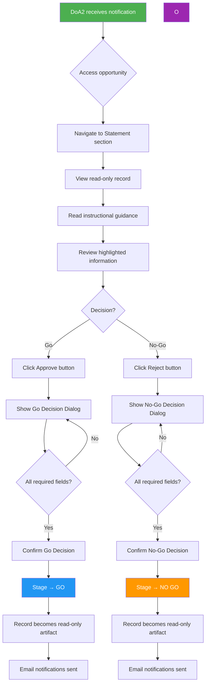

# Product Requirements Document: The Go Decision

## Initial Requirement

Implement "The Go Decision" feature that enables DoA Level 2 (EA DOA2) decision-makers to review submitted opportunities and record their approval ("Go") or rejection ("No-Go") decision. This feature focuses specifically on the decision-maker's experience after an opportunity has been submitted for Go decision.

Key capabilities include:
- In-system notifications via the Actions Required card and notification bell
- Decision-maker review interface with instructional guidance
- Highlighted information panel (initiative type, time to signing, DD status, high risks, sender remarks)
- Go Decision workflow with confirmation statement, decision rationale, and mandatory Executive assignment
- No-Go Decision workflow with confirmation statement and decision rationale
- Post-decision record immutability (read-only artifact)
- Email notifications with CC recipients (OM, initiator, Director/Manager)

---

## Executive Summary

### Business Context

When an Opportunity is submitted for a Go decision (covered by the "Send Opportunity for Go Decision" PRD), the designated decision-maker (EA DOA2 - Engagement Acceptance Delegation of Authority Level 2) needs a clear, guided interface to review the opportunity and make an informed decision. This PRD focuses on the decision-maker's experience from receiving the notification to finalizing their Go or No-Go decision.

### Goal

Provide decision-makers with a streamlined review experience that highlights key information relevant to their decision, requires appropriate acknowledgments and rationale capture, and ensures the decision is properly recorded and communicated to all stakeholders.

---

## Dependencies

### Prerequisite: "Send Opportunity for Go Decision" Feature

**This PRD depends on the completion of the "Send Opportunity for Go Decision" feature** (`tasks/send-opportunity-for-go-decision/`). That feature must be implemented first as it provides the foundational infrastructure this PRD extends.

#### Required Prerequisites (from Send Opportunity for Go Decision)

The following tasks from the prerequisite PRD MUST be completed before implementing this PRD:

| Task | Description | Why Required |
|------|-------------|--------------|
| **1.0** | CANCELLED Stage Infrastructure | Provides stage constant and transitions used for immutability checks |
| **2.0** | Requirements Validation Provider | Provides the validation framework the workflow uses |
| **3.0** | DoA Level 2 Approver Lookup | Provides the approver identification this PRD's notifications depend on |
| **4.0** | WorkflowController Endpoints | Provides the base Submit, Approve, Reject, Cancel, Reopen endpoints this PRD enhances |
| **5.0** | Email Notification Templates | Provides the base email templates this PRD extends with CC recipients |

#### What This PRD Extends vs. What Already Exists

| Functionality | Prerequisite PRD | This PRD Extends/Adds |
|--------------|------------------|----------------------|
| **Approve Endpoint** | Basic approve with optional comment (Task 4.0) | Structured confirmation statement, mandatory rationale, mandatory Executive assignment |
| **Reject Endpoint** | Basic reject → NO GO with optional comment (Task 4.8) | Structured confirmation statement, mandatory rationale |
| **Email Notifications** | Send to DoA2 holders only (Task 5.0) | Add CC recipients (OM, initiator, Director/Manager) |
| **In-System Notifications** | Not covered | **NEW**: Actions Required card + notification bell integration |
| **Decision-Maker UI** | Not covered | **NEW**: Instructional guidance, highlighted info panel |
| **Record Immutability** | Not covered | **NEW**: Post-decision read-only enforcement |

#### Implementation Sequence

```
┌─────────────────────────────────────────────────────────────────────────┐
│  PHASE 1: Send Opportunity for Go Decision (Prerequisite)               │
│  ─────────────────────────────────────────────────────────────────────  │
│  Tasks 1.0-8.0: Stage infrastructure, requirements validation,          │
│  DoA2 lookup, workflow endpoints, email templates, UI updates           │
└─────────────────────────────────────────────────────────────────────────┘
                                    │
                                    ▼
┌─────────────────────────────────────────────────────────────────────────┐
│  PHASE 2: The Go Decision (This PRD)                                    │
│  ─────────────────────────────────────────────────────────────────────  │
│  Enhances: Approve/Reject with structured decisions, email CC           │
│  Adds: Notifications integration, decision UI, immutability             │
└─────────────────────────────────────────────────────────────────────────┘
```

---

## PRD

### 1. Introduction/Overview

The "Go Decision" feature extends the existing workflow infrastructure to provide a comprehensive decision-making interface for DoA Level 2 holders. When a decision-maker receives a Go decision request:

1. They are notified via email (with OM/initiator/Director in CC), the notification bell, and the Actions Required card
2. They navigate to the Opportunity Statement section with clear instructional guidance
3. They review highlighted information (initiative type, timeline, DD status, high risks, sender remarks)
4. The opportunity record is read-only while in workflow status
5. They can approve (Go) with mandatory confirmation statement, decision rationale, and Executive assignment
6. They can reject (No-Go) with mandatory confirmation statement and decision rationale
7. Post-decision, the record becomes a permanent read-only artifact

**Problem Statement:** Currently, decision-makers lack:
- Clear notification integration with the Actions Required card on the homepage
- Instructional guidance on what to review and how to make their decision
- Highlighted key information that may influence their decision
- Structured confirmation statements and rationale capture
- Post-decision record immutability

**Solution:** Implement a comprehensive decision-maker interface that integrates with the existing notification system, provides clear guidance and highlighted information, captures structured decisions with rationale, and renders the record immutable after decision.

---

### 2. Clarifying Questions and Responses

**Q1: Director/Manager List from ERP**
- The `EntityUserRole` table already contains Director/Manager assignments per OrgUnit
- Query this data to retrieve the Director/Manager for CC notifications and Executive suggestions
- Same list used for Executive assignment suggestions

**Q2: Executive Assignment**
- **In scope**: Decision-maker must assign an Executive when approving (Go decision)
- New `ExecutiveId` field added to the Opportunity entity
- Dropdown populated from `EntityUserRole` table (Director/Manager/OiC of responsible Org Unit)
- System suggests the Director/Manager/OiC as the default selection
- Executive assignment is mandatory before finalizing Go decision
- Stored permanently on the Opportunity record for future reference

**Q3: PDF Generation Specifications**
- **Out of scope** for this PRD - PDF generation should be a separate feature
- The Opportunity Statement cannot be modified or regenerated after the Go decision (immutability is in scope)
- PDF download functionality will be addressed in a future PRD

**Q4: Partner Due Diligence Status**
- Uses existing `CalculateDDStatus()` method that returns: "Not Required", "Pending", "Approved", "Expired", "Expiring Soon", "Valid"
- Highlight any DD status that may impact timeline: "Pending", "Expired", "Expiring Soon"

**Q5: High Organizational Risks**
- Risks that are linked to a predefined high risk (`PreDefinedHighRiskId` is not null)
- Risks where `RiskImpactLevelEntity.Name` contains "High" (e.g., "High", "Very High")
- Query pattern: `risks.Where(r => r.PreDefinedHighRiskId != null || r.RiskImpactLevelEntity.Name.Contains("High"))`

**Q6: Sender Remarks**
- Same as the "Additional remarks" field from the submission acknowledgment dialog
- Stored in the workflow log comment field

**Q7: In-System Notifications**
- The Actions Required card already exists on the homepage
- The notification bell system already exists with polling
- Need to add workflow approval tasks to these existing systems

**Q8: Post-Decision Immutability Scope**
- Applies to ALL decisions: Go, No-Go, and Cancelled
- Record becomes completely read-only - no edits, no new documents, no comments
- Users can still download existing documents

**Q9: Email CC Recipients**
- CC recipients receive the exact same email content as DoA holders
- CC list: Opportunity Manager, workflow initiator (if different), Director/Manager of responsible org unit

**Q10: Integration Scope**
- This PRD focuses only on the decision-maker's experience (making the Go/No-Go decision)
- Submission process is covered by the "Send Opportunity for Go Decision" PRD

---

### 3. Goals

1. **Integrate with Actions Required Card** - Show pending Go decision tasks in the homepage Actions Required panel
2. **Integrate with Notification Bell** - Show pending Go decision notifications in the notification system
3. **Create Decision-Maker Review Interface** - Display instructional guidance and highlighted key information
4. **Implement Go Decision Workflow** - Require confirmation statement with Org Unit details, decision rationale, and Executive suggestion
5. **Implement No-Go Decision Workflow** - Require confirmation statement and decision rationale
6. **Enforce Post-Decision Immutability** - Lock the entire record after any decision is finalized
7. **Add CC Recipients to Email Notifications** - Include OM, initiator, and Director/Manager in CC

---

### 4. Architecture

#### 4.0 Decision Flow Diagram



#### 4.1 Current Architecture (After Prerequisite PRD Implementation)

**Assumes "Send Opportunity for Go Decision" (Tasks 1.0-8.0) is COMPLETE**

After the prerequisite PRD is implemented, the following will exist:

```
UNOPS.PAO.Business/Workflow/
├── OpportunityWorkflow.cs                    ← Has GO, NO GO, CANCELLED stages (Task 1.0)
├── Seeders/
│   ├── StateMachineStageChangeSeeder.cs      ← Has Cancel/Reopen transitions (Task 1.0)
│   └── StateMachineStageChangeRoleSeeder.cs  ← Has DoA2 and OM role permissions (Task 1.0)
├── StageRequirements/
│   └── OpportunityStageRequirementsProvider.cs  ← Requirements validation (Task 2.0)
└── Adapters/
    ├── PaoWorkflowApproverProvider.cs        ← DoA2 lookup from org unit (Task 3.0)
    └── PaoWorkflowNotificationService.cs     ← Basic email sending (Task 5.0)

UNOPS.PAO.Presentation/Controllers/
└── WorkflowController.cs                     ← Has Submit, Approve, Reject, Cancel, Reopen (Task 4.0)

UNOPS.PAO.ClientApp/src/app/
├── features/home/components/home-dashboard/  ← Actions Required card exists (but no workflow tasks)
├── layouts/components/topbar/                ← Notification bell exists (but no workflow tasks)
└── shared/reusables/components/workflow/
    └── components/stage-workflow/            ← Has happy-path stepper, action buttons (Task 7.0)
```

**What's Missing (This PRD Addresses):**
- Actions Required card doesn't show workflow approval tasks
- Notification bell doesn't show workflow approval tasks
- No instructional guidance for decision-makers when reviewing
- No highlighted information panel (DD status, risks, remarks)
- No structured confirmation statements with Org Unit ID/Name
- No mandatory decision rationale capture
- No Executive suggestion dropdown
- No post-decision record immutability enforcement
- Email notifications don't include CC recipients (OM, initiator, Director/Manager)

#### 4.2 Target Architecture (After)

**Note on File Status:**
- `EXISTS` = File already exists in codebase
- `EXISTS - MODIFY` = File exists and needs modification
- `NEW` = File needs to be created

```
UNOPS.PAO.ClientApp/src/app/
├── features/home/components/home-dashboard/
│   ├── home-dashboard.component.ts     ← EXISTS - MODIFY: Add workflow tasks to Actions Required
│   └── home-dashboard.component.html   ← EXISTS - MODIFY: Display workflow approval tasks
├── layouts/components/topbar/
│   ├── topbar.component.ts             ← EXISTS - MODIFY: Include workflow tasks in notifications
│   └── topbar.component.html           ← EXISTS - MODIFY: Style for workflow notifications
├── features/partnerships/opportunities/components/opportunity/
│   ├── view/
│   │   ├── opportunity-view.component.ts    ← EXISTS - MODIFY: Add decision-maker UI, immutability
│   │   ├── opportunity-view.component.html  ← EXISTS - MODIFY: Decision-maker panels, read-only
│   │   └── sections/
│   │       └── statement/
│   │           ├── opportunity-statement-section.component.ts   ← EXISTS (no changes needed for this PRD)
│   │           └── opportunity-statement-section.component.html ← EXISTS (no changes needed for this PRD)
│   ├── approve-opportunity-dialog/          ← NEW: Go decision dialog (entity-specific)
│   │   ├── approve-opportunity-dialog.component.ts
│   │   ├── approve-opportunity-dialog.component.html
│   │   └── approve-opportunity-dialog.component.scss
│   ├── reject-opportunity-dialog/           ← NEW: No-Go decision dialog (entity-specific)
│   │   ├── reject-opportunity-dialog.component.ts
│   │   ├── reject-opportunity-dialog.component.html
│   │   └── reject-opportunity-dialog.component.scss
│   └── opportunity-decision-info-panel/     ← NEW: Highlighted info panel (entity-specific)
│       ├── opportunity-decision-info-panel.component.ts
│       ├── opportunity-decision-info-panel.component.html
│       └── opportunity-decision-info-panel.component.scss
└── shared/
    └── reusables/
        └── components/
            └── workflow/
                └── components/
                    ├── stage-workflow/                 ← EXISTS (from prerequisite PRD)
                    └── requirements-validation/        ← EXISTS (from prerequisite PRD Task 6.0)

UNOPS.PAO.Business/
├── Managers/
│   ├── NotificationManager.cs               ← EXISTS - MODIFY: Add workflow notification methods
│   └── OpportunityManager.cs                ← EXISTS - MODIFY: Post-decision immutability
└── Workflow/Adapters/
    └── PaoWorkflowNotificationService.cs    ← EXISTS - MODIFY: Add CC recipients

UNOPS.PAO.Presentation/Controllers/
├── WorkflowController.cs                    ← EXISTS - MODIFY: Enhanced approve/reject with rationale
└── OpportunityController.cs                 ← EXISTS - MODIFY: Enforce immutability checks
```

#### 4.3 Key Architecture Changes

1. **Actions Required Integration**:
   - Add workflow approval tasks to the dashboard data model
   - Display pending Go decision tasks in Actions Required card
   - Navigate to opportunity on task click

2. **Notification Bell Integration**:
   - Create workflow notifications when approval is requested
   - Display in notification bell with appropriate styling
   - Link directly to opportunity statement section

3. **Decision-Maker Interface**:
   - Create `OpportunityDecisionInfoPanelComponent` to display highlighted information
   - Show instructional guidance message
   - Display initiative type, time to signing, DD status, high risks, sender remarks

4. **Go/No-Go Decision Dialogs (via `customStageChangeHandler`)**:
   - `ApproveOpportunityDialogComponent` with confirmation statement, rationale, Executive dropdown
   - `RejectOpportunityDialogComponent` with confirmation statement and rationale
   - **Integration Pattern**: These dialogs are triggered via the existing `<app-workflow>` component's `customStageChangeHandler` input
   - When user clicks Approve/Reject buttons in `<app-workflow>`, the `customStageChangeHandler` function is called
   - The handler shows the appropriate dialog (ApproveOpportunityDialogComponent or RejectOpportunityDialogComponent)
   - Dialog returns `CustomStageChangeResult` with `{ success: boolean, comment?: string }` to complete the workflow action
   - This approach reuses the existing workflow component infrastructure without modification

5. **Post-Decision Immutability**:
   - Check opportunity stage in all update/create endpoints
   - Return 403 Forbidden for any modifications after Go/No-Go/Cancelled
   - Frontend disables edit controls and AI regeneration for immutable records
   - No UI banner needed - immutability is enforced at backend level

6. **Email CC Recipients**:
   - Modify `PaoWorkflowNotificationService` to include CC recipients
   - Query Director/Manager from `EntityUserRole` table

#### 4.4 Data Model Additions

**Opportunity Entity Extension** (new field for Executive assignment):
```csharp
public class Opportunity : ModifiableDeletableEntity
{
    // ... existing fields ...
    
    /// <summary>
    /// The Executive assigned to direct Opportunity development after Go decision.
    /// Set by the decision-maker during Go approval. Nullable until Go decision is made.
    /// </summary>
    public int? ExecutiveId { get; set; }
    
    /// <summary>
    /// Navigation property to the assigned Executive user.
    /// </summary>
    [ForeignKey(nameof(ExecutiveId))]
    public virtual PAOUser? Executive { get; set; }
}
```

**WorkflowLog Extensions** (capture decision details):
```csharp
// Already exists - using Comment field for rationale
// Decision type inferred from NewStage (GO vs NO GO)
```

**Decision Metadata** (stored in workflow log):
- Confirmation statement acknowledged (implicit in successful submission)
- Decision rationale (stored in Comment field)
- Executive assignment stored on Opportunity.ExecutiveId (not in workflow log)

**Notification Model** (existing - actual structure):
```csharp
public class Notification
{
    public int Id { get; set; }
    public int UserId { get; set; }
    public string Message { get; set; } = string.Empty;
    public string Category { get; set; } = string.Empty;      // e.g., "workflow_approval"
    public string ResponseType { get; set; } = string.Empty;  // e.g., "approval_request"
    public string RecordData { get; set; } = string.Empty;    // JSON string of record data
    public string? Entity { get; set; }                       // e.g., "Opportunity"
    public int? EntityId { get; set; }                        // Entity ID for navigation
    public bool IsRead { get; set; }
    public NotificationStatus Status { get; set; } = NotificationStatus.Pending;  // Pending, Progress, Done, Error
    public DateTime CreatedAt { get; set; } = DateTime.UtcNow;
}
```

---

### 5. User Stories

#### US-1: Decision-Maker Sees Task in Actions Required Card
**As a** DoA Level 2 holder  
**I want to** see pending Go decision tasks in my Actions Required card on the homepage  
**So that** I can quickly identify opportunities awaiting my review

**Acceptance Criteria:**
- Pending Go decision tasks appear in the Actions Required card
- Task displays opportunity name, org unit, and submission date
- Clicking the task navigates to the opportunity record
- Task is removed from the card after decision is made
- Count of pending tasks is accurate

---

#### US-2: Decision-Maker Sees Notification in Bell
**As a** DoA Level 2 holder  
**I want to** receive an in-system notification when an opportunity requires my approval  
**So that** I am alerted even when not viewing the homepage

**Acceptance Criteria:**
- Notification bell shows unread count including workflow tasks
- Notification displays: "Go Decision Required: [Opportunity Name]"
- Clicking notification navigates to opportunity statement section
- Notification can be marked as read
- Notification remains until decision is made or task is recalled

---

#### US-3: Decision-Maker Views Instructional Guidance
**As a** DoA Level 2 holder reviewing an opportunity  
**I want to** see clear instructions on what to review and how to make my decision  
**So that** I understand my role and the decision process

**Acceptance Criteria:**
- Instructional message displayed at top of statement section:
  > "You have been requested to review this opportunity in order to determine whether it merits further development based on your professional judgment and understanding of the partner, context and UNOPS strategic priorities. Please review the Opportunity Statement and note the following details which may influence your decision or regarding which you may have remarks to add to your decision rationale statement. Once you have done so, please confirm your decision."
- Instruction panel is visually distinct (info message style)
- Instructions only appear for users who can approve the workflow

---

#### US-4: Decision-Maker Views Highlighted Information Panel
**As a** DoA Level 2 holder reviewing an opportunity  
**I want to** see key information highlighted that may influence my decision  
**So that** I can make an informed decision efficiently

**Acceptance Criteria:**
- Information panel displays:
  - **Proposed Initiative Type**: Project, Program, or Portfolio
  - **Time to Target Signing**: Calculated from target signing date
  - **Partner DD Status**: Any partners with "Pending", "Expired", or "Expiring Soon" status
  - **High Organizational Risks**: Risks linked to predefined high risks or with High/Very High impact
  - **Sender Remarks**: Comments/remarks from the submission
- Panel uses appropriate severity styling (warning for concerning items)
- Panel only visible when opportunity is in workflow for Go decision

---

#### US-5: Decision-Maker Views Read-Only Record
**As a** DoA Level 2 holder reviewing an opportunity  
**I want to** view the opportunity as a static snapshot  
**So that** I know the information hasn't changed since submission

**Acceptance Criteria:**
- All fields display as read-only (no edit buttons visible)
- Record reflects the state captured at submission time
- Statement section shows the generated statement
- No ability to add documents or comments while in workflow
- Clear visual indicator that record is in workflow status

---

#### US-6: Decision-Maker Approves with Go Decision
**As a** DoA Level 2 holder  
**I want to** approve an opportunity with a Go decision  
**So that** the org unit can proceed with development

**Acceptance Criteria:**
- Clicking "Approve" opens Go Decision dialog
- Dialog requires acknowledgment of confirmation statement:
  > "I confirm that, based on the information presented in the Opportunity Statement, I give approval for UNOPS Org Unit '[ORG UNIT ID] - [ORG UNIT NAME]' to continue development of this Opportunity as a '[PROPOSED INITIATIVE TYPE]'"
- Dialog requires decision rationale text field with helper text:
  > "Add the reason for your decision or state any conditions of your decision or comments regarding the sufficiency of information presented"
- Dialog shows mandatory Executive dropdown (Director/Manager/OiC of org unit)
- Executive selection is **required** - dropdown pre-populated with Director/Manager/OiC as suggested default
- Executive is stored on `Opportunity.ExecutiveId` upon successful Go decision
- Submit button disabled until confirmation acknowledged, rationale provided, **and Executive selected**
- On submit: Stage → GO, workflow completes, notifications sent

---

#### US-7: Decision-Maker Rejects with No-Go Decision
**As a** DoA Level 2 holder  
**I want to** reject an opportunity with a No-Go decision  
**So that** the org unit is informed not to proceed

**Acceptance Criteria:**
- Clicking "Reject" opens No-Go Decision dialog
- Dialog requires acknowledgment of confirmation statement:
  > "The information presented is insufficient or I do not consider this to be an initiative UNOPS should pursue."
- Dialog requires decision rationale text field with helper text:
  > "Add the reason for your decision or state any conditions of your decision or comments regarding the sufficiency of information presented"
- Submit button disabled until confirmation acknowledged and rationale provided
- On submit: Stage → NO GO, workflow completes, notifications sent

---

#### US-8: Record Becomes Immutable After Decision
**As a** stakeholder  
**I want** the opportunity record to be permanently locked after a decision  
**So that** it serves as an historic artifact for audit purposes

**Acceptance Criteria:**
- After Go decision: Record is completely read-only
- After No-Go decision: Record is completely read-only
- After Cancelled: Record is completely read-only
- No edits to any fields allowed
- No new documents can be uploaded
- No comments can be added
- Existing documents can still be downloaded
- Clear visual indicator that record is a "Historic Artifact"
- Audit trail shows decision date and decision-maker

---

#### US-9: Email Notifications Include CC Recipients
**As an** Opportunity Manager or stakeholder  
**I want to** be copied on the Go decision request email  
**So that** I am aware the request has been sent

**Acceptance Criteria:**
- Email To: All DoA Level 2 holders for the responsible org unit
- Email CC: Opportunity Manager, workflow initiator (if different), Director/Manager of org unit
- CC recipients receive identical email content
- Email subject: "PAO: [Opportunity Name] - Action Required"
- Email body includes link to opportunity statement section

---

### 6. Functional Requirements

> **Note:** These functional requirements assume the "Send Opportunity for Go Decision" feature (Tasks 1.0-8.0) is **already implemented**. Requirements marked with `[ENHANCE]` modify existing code from the prerequisite PRD. Requirements marked with `[NEW]` add entirely new functionality.

#### FR-1: Integrate Workflow Tasks with Actions Required Card [NEW]

1. Modify `home-dashboard.component.ts` to fetch pending workflow approvals:
   ```typescript
   // Add to dashboard data loading
   async loadPendingApprovals(): Promise<WorkflowTask[]> {
     return this.workflowService.getPendingApprovalsForUser(this.currentUserId);
   }
   ```

2. Create API endpoint in `WorkflowController`:
   ```csharp
   [HttpGet(APIDictionary.Workflow + "/pending-approvals")]
   public async Task<ActionResult<List<PendingApprovalResponse>>> GetPendingApprovalsForUser()
   {
       var userId = CurrentUserId;
       var pendingTasks = await _workflowManager.GetPendingTasksForApproverAsync(userId);
       
       var response = pendingTasks.Select(task => new PendingApprovalResponse
       {
           EntityName = task.EntityName,
           EntityId = task.EntityId,
           EntityDisplayName = task.EntityDisplayName,
           CurrentStage = task.Stage,
           PendingStage = task.NewStage,
           SubmittedBy = task.SubmitterName,
           SubmittedOn = task.CreatedDate,
           OrgUnitName = task.OrgUnitName
       }).ToList();
       
       return Ok(response);
   }
   ```

3. Display tasks in Actions Required card with "Workflow Approval" category

#### FR-2: Integrate Workflow Notifications with Notification Bell [NEW]

1. Add `NotificationManager` dependency to `PaoWorkflowNotificationService`:
   ```csharp
   // Add to constructor
   private readonly NotificationManager _notificationManager;
   
   public PaoWorkflowNotificationService(
       IEmailSender emailSender,
       AppDbContext context,
       NotificationManager notificationManager,  // NEW dependency
       ILogger<PaoWorkflowNotificationService> logger)
   {
       // ... existing assignments ...
       _notificationManager = notificationManager;
   }
   ```

2. Enhance `NotifyNewApprovalRequestAsync` to create in-system notifications:
   ```csharp
   public async Task NotifyNewApprovalRequestAsync(WorkflowNotification notification)
   {
       // Send email (implemented by prerequisite PRD Task 5.5)
       await SendApprovalRequestEmailAsync(notification);
       
       // Create in-system notification for each approver (NEW)
       foreach (var approverUserId in notification.RecipientUserIds)
       {
           // Use existing CreateNotification method signature:
           // CreateNotification(int userId, string message, string category, string responseType, object record)
           // 
           // Pattern: The `record` object is wrapped in List<object> and JSON serialized
           // Each notification type defines its own record structure
           // Existing examples: bulk import stores AI response, file analysis stores result
           await _notificationManager.CreateNotification(
               userId: approverUserId,
               message: $"Go Decision Required: {notification.EntityDisplayName}",
               category: "workflow_approval",
               responseType: "approval_request",
               record: notification  // Pass the WorkflowNotification object - contains all relevant context
           );
       }
   }
   ```

3. Mark notification as read when decision is made (follows existing notification pattern - no special cleanup):
   ```csharp
   // In NotifyWorkflowCompletedAsync and NotifyWorkflowRejectedAsync:
   // Find and update existing pending notifications for this entity
   // Note: Notifications remain in database, just marked as read/done (same as existing bulk import notifications)
   var pendingNotifications = await _context.Notifications
       .Where(n => n.Entity == notification.EntityName 
                && n.EntityId == int.Parse(notification.EntityId)
                && n.Category == "workflow_approval"
                && !n.IsRead)
       .ToListAsync();
   
   foreach (var pendingNotification in pendingNotifications)
   {
       pendingNotification.IsRead = true;
       pendingNotification.Status = NotificationStatus.Done;
   }
   await _context.SaveChangesAsync();
   ```

#### FR-3: Create Opportunity Decision Info Panel Component [NEW]

1. Create `opportunity-decision-info-panel.component.ts` in `features/partnerships/opportunities/components/opportunity/opportunity-decision-info-panel/`:
   ```typescript
   @Component({
     selector: 'app-opportunity-decision-info-panel',
     templateUrl: './opportunity-decision-info-panel.component.html',
     styleUrl: './opportunity-decision-info-panel.component.scss'
   })
   export class OpportunityDecisionInfoPanelComponent {
     readonly opportunity = input.required<Opportunity>();
     readonly workflowDetails = input.required<WorkflowDetails>();
     
     readonly proposedInitiativeType = computed(() => 
       this.opportunity().proposedInitiativeTypeName ?? 'Not specified'
     );
     
     readonly timeToSigning = computed(() => {
       const targetDate = this.opportunity().targetSigningDate;
       if (!targetDate) return 'Not specified';
       const days = differenceInDays(new Date(targetDate), new Date());
       return days > 0 ? `${days} days remaining` : 'Past due';
     });
     
     readonly concerningDDStatuses = computed(() => {
       const partners = [
         ...this.opportunity().fundingPartners ?? [],
         ...this.opportunity().clientPartners ?? []
       ];
       return partners.filter(p => 
         ['Pending', 'Expired', 'Expiring Soon'].includes(p.ddStatus ?? '')
       );
     });
     
     readonly highRisks = computed(() => {
       return this.opportunity().risks?.filter(r => 
         r.preDefinedHighRiskId != null || 
         r.riskImpactLevelName?.toLowerCase().includes('high')
       ) ?? [];
     });
     
     readonly senderRemarks = computed(() => 
       this.workflowDetails().submissionComment ?? ''
     );
   }
   ```

2. Template displays each item with appropriate styling (warnings for concerning items)

#### FR-4: Create Approve Opportunity Dialog Component [NEW]

**Integration with Workflow Component:**
This dialog is triggered via the `customStageChangeHandler` input on the existing `<app-workflow>` component. The integration pattern in `opportunity-view.component.ts`:

```typescript
// In opportunity-view.component.ts
showApproveDialog = signal(false);
showRejectDialog = signal(false);

// customStageChangeHandler implementation
customStageChangeHandler = async (nextStage: string, actionName: string): Promise<CustomStageChangeResult | undefined> => {
  if (actionName === 'Approve') {
    this.showApproveDialog.set(true);
    // Return undefined to let the dialog handle the workflow action
    return new Promise((resolve) => {
      this.approveDialogResultHandler = resolve;
    });
  } else if (actionName === 'Reject') {
    this.showRejectDialog.set(true);
    return new Promise((resolve) => {
      this.rejectDialogResultHandler = resolve;
    });
  }
  return undefined;
};

// Handle dialog completion
onApproveConfirmed(payload: GoDecisionPayload): void {
  this.approveDialogResultHandler?.({ success: true, comment: payload.rationale });
}
```

```html
<!-- In opportunity-view.component.html -->
<app-stage-workflow
  [entityName]="'opportunity'"
  [entityId]="opportunity()?.id?.toString()"
  [customStageChangeHandler]="customStageChangeHandler"
  ...
/>

<app-approve-opportunity-dialog
  [(visible)]="showApproveDialog"
  [opportunity]="opportunity()"
  (decisionConfirmed)="onApproveConfirmed($event)"
/>
```

1. Create `approve-opportunity-dialog.component.ts` in `features/partnerships/opportunities/components/opportunity/approve-opportunity-dialog/`:
   ```typescript
   @Component({
     selector: 'app-approve-opportunity-dialog',
     templateUrl: './approve-opportunity-dialog.component.html',
     styleUrl: './approve-opportunity-dialog.component.scss'
   })
   export class ApproveOpportunityDialogComponent {
     readonly visible = model<boolean>(false);
     readonly opportunity = input.required<Opportunity>();
     readonly decisionConfirmed = output<GoDecisionPayload>();
     
     private readonly executiveService = inject(ExecutiveService);
     
     confirmationAcknowledged = signal(false);
     decisionRationale = signal('');
     selectedExecutiveId = signal<string | null>(null);  // Required - string value from dropdown
     
     // TypeaheadInput uses Label/Value pattern (existing in UNOPS.PAO.Models/Filters/TypeaheadInput.cs)
     readonly executives = signal<{ label: string; value: string; isSuggested?: boolean }[]>([]);
     readonly suggestedExecutiveValue = signal<string | null>(null);  // Pre-selected suggestion
     
     readonly confirmationStatement = computed(() => {
       const opp = this.opportunity();
       // ResponsibleOrgUnit has Code and Name via navigation property
       const orgUnitCode = opp.responsibleOrgUnit?.code ?? '';
       const orgUnitName = opp.responsibleOrgUnit?.name ?? '';
       const initiativeType = opp.proposedInitiativeType?.name ?? '';
       return `I confirm that, based on the information presented in the Opportunity Statement, I give approval for UNOPS Org Unit '${orgUnitCode} - ${orgUnitName}' to continue development of this Opportunity as a '${initiativeType}'`;
     });
     
     // Executive selection is now REQUIRED
     readonly canSubmit = computed(() => 
       this.confirmationAcknowledged() && 
       this.decisionRationale().trim().length > 0 &&
       this.selectedExecutiveId() !== null  // Must select Executive
     );
     
     ngOnInit(): void {
       this.loadExecutives();
     }
     
     private loadExecutives(): void {
       // Load Director/Manager/OiC from EntityUserRole for the org unit
       const orgUnitId = this.opportunity().responsibleOrgUnitId;
       if (!orgUnitId) return;
       
       this.executiveService.getExecutivesForOrgUnit(orgUnitId).subscribe({
         next: (executives) => {
           this.executives.set(executives);
           
           // Pre-select the suggested Executive (Director/Manager/OiC)
           const suggested = executives.find(e => e.isSuggested);
           if (suggested) {
             this.selectedExecutiveId.set(suggested.value);
             this.suggestedExecutiveValue.set(suggested.value);
           }
         }
       });
     }
     
     onSubmit(): void {
       this.decisionConfirmed.emit({
         rationale: this.decisionRationale(),
         executiveId: parseInt(this.selectedExecutiveId()!, 10),  // Convert string value to int
         confirmationAcknowledged: true
       });
       this.visible.set(false);
     }
   }
   ```

2. Load executives (Director/Manager/OiC) from `EntityUserRole` table on dialog open
3. Pre-select the Director/Manager/OiC as the suggested default (user can change if needed)

#### FR-5: Create Reject Opportunity Dialog Component [NEW]

1. Create `reject-opportunity-dialog.component.ts` in `features/partnerships/opportunities/components/opportunity/reject-opportunity-dialog/`:
   ```typescript
   @Component({
     selector: 'app-reject-opportunity-dialog',
     templateUrl: './reject-opportunity-dialog.component.html',
     styleUrl: './reject-opportunity-dialog.component.scss'
   })
   export class RejectOpportunityDialogComponent {
     readonly visible = model<boolean>(false);
     readonly decisionConfirmed = output<NoGoDecisionPayload>();
     
     confirmationAcknowledged = signal(false);
     decisionRationale = signal('');
     
     readonly confirmationStatement = 
       'The information presented is insufficient or I do not consider this to be an initiative UNOPS should pursue.';
     
     readonly canSubmit = computed(() => 
       this.confirmationAcknowledged() && 
       this.decisionRationale().trim().length > 0
     );
     
     onSubmit(): void {
       this.decisionConfirmed.emit({
         rationale: this.decisionRationale(),
         confirmationAcknowledged: true
       });
       this.visible.set(false);
     }
   }
   ```

#### FR-6: Enhance Approve Endpoint with Rationale and Executive Assignment [ENHANCE]

**Note:** If multiple DoA2 holders exist for the responsible org unit, **one approval suffices** to complete the workflow. The first approver to act completes the decision.

1. Update `WorkflowController.Approve()` (existing route: `POST /api/workflow/approve`):
   ```csharp
   [HttpPost(APIDictionary.Workflow + "/approve")]
   public async Task<ActionResult> Approve([FromBody] ApproveWorkflowRequest request)
   {
       // Normalize entity name for workflow manager consistency
       var normalizedEntityName = NormalizeEntityNameForWorkflow(request.EntityName);
       
       // Validate rationale is provided (NEW)
       if (string.IsNullOrWhiteSpace(request.Rationale))
       {
           return BadRequest(new { error = "Decision rationale is required" });
       }
       
       // Validate confirmation acknowledged (NEW)
       if (!request.ConfirmationAcknowledged)
       {
           return BadRequest(new { error = "Confirmation statement must be acknowledged" });
       }
       
       // Validate Executive is assigned for opportunity approvals (NEW)
       if (normalizedEntityName == "Opportunity" && request.ExecutiveId <= 0)
       {
           return BadRequest(new { error = "Executive assignment is required" });
       }
       
       // Get pending task (EXISTING)
       var pendingTask = _workflowManager.PendingTask(normalizedEntityName, request.EntityId);
       if (pendingTask == null)
       {
           return BadRequest(new { error = "No pending workflow found for this entity" });
       }
       
       // ... existing permission and approval logic ...
       
       // Store rationale in workflow log comment (rationale goes to Comment field)
       var newStage = await _workflowManager.Approve(
           pendingTask,
           normalizedEntityName,
           request.EntityId,
           entityDisplayName,
           request.Rationale,  // Decision rationale stored as comment
           entityUrl);
       
       // Assign Executive to Opportunity record (NEW)
       if (normalizedEntityName == "Opportunity" && request.ExecutiveId > 0)
       {
           await _opportunityManager.AssignExecutiveAsync(request.EntityId, request.ExecutiveId);
       }
       
       // ... rest of existing approval logic ...
   }
   ```

2. Create `ApproveWorkflowRequest` model (extends existing `WorkflowActionRequest` pattern):
   ```csharp
   // Location: UNOPS.PAO.Models/Workflow/WorkflowModels.cs
   
   /// <summary>
   /// Request model for approving an opportunity workflow with Go decision requirements.
   /// Extends the existing WorkflowActionRequest pattern.
   /// </summary>
   public class ApproveWorkflowRequest
   {
       /// <summary>
       /// The entity type name (e.g., "Opportunity")
       /// </summary>
       public required string EntityName { get; set; }
       
       /// <summary>
       /// The entity ID
       /// </summary>
       public required int EntityId { get; set; }
       
       /// <summary>
       /// Decision rationale explaining the approval (required)
       /// Stored in WorkflowLog.Comment field
       /// </summary>
       public required string Rationale { get; set; }
       
       /// <summary>
       /// Indicates the user has acknowledged the confirmation statement
       /// </summary>
       public bool ConfirmationAcknowledged { get; set; }
       
       /// <summary>
       /// ID of the assigned Executive (required for Opportunity approvals)
       /// Stored on Opportunity.ExecutiveId
       /// </summary>
       public int ExecutiveId { get; set; }
   }
   ```

3. Add `AssignExecutiveAsync` method to `OpportunityManager`:
   ```csharp
   public async Task AssignExecutiveAsync(int opportunityId, int executiveId)
   {
       var opportunity = await repository.GetByIdAsync(opportunityId);
       if (opportunity == null)
           throw new KeyNotFoundException($"Opportunity {opportunityId} not found");
       
       opportunity.ExecutiveId = executiveId;
       await context.SaveChangesAsync();
   }
   ```

#### FR-7: Enhance Reject Endpoint with Rationale [ENHANCE]

1. Update `WorkflowController.Reject()` (existing route: `POST /api/workflow/reject`):
   ```csharp
   [HttpPost(APIDictionary.Workflow + "/reject")]
   public async Task<ActionResult> Reject([FromBody] RejectWorkflowRequest request)
   {
       // Normalize entity name for workflow manager consistency
       var normalizedEntityName = NormalizeEntityNameForWorkflow(request.EntityName);
       
       // Existing: Comment is required for rejection
       // Enhanced: Use structured Rationale field
       if (string.IsNullOrWhiteSpace(request.Rationale))
       {
           return BadRequest(new { error = "Decision rationale is required" });
       }
       
       // Validate confirmation acknowledged (NEW)
       if (!request.ConfirmationAcknowledged)
       {
           return BadRequest(new { error = "Confirmation statement must be acknowledged" });
       }
       
       // Get pending task (EXISTING)
       var pendingTask = _workflowManager.PendingTask(normalizedEntityName, request.EntityId);
       if (pendingTask == null)
       {
           return BadRequest(new { error = "No pending workflow found for this entity" });
       }
       
       // ... existing permission check and rejection logic ...
       // Note: Rejection sets stage to "NO GO" for opportunities
       
       // Reject the workflow with rationale as comment
       var success = await _workflowManager.Reject(
           pendingTask,
           normalizedEntityName,
           request.EntityId,
           entityDisplayName,
           request.Rationale,  // Decision rationale stored as comment
           entityUrl);
       
       // ... rest of existing rejection logic ...
   }
   ```

2. Create `RejectWorkflowRequest` model:
   ```csharp
   // Location: UNOPS.PAO.Models/Workflow/WorkflowModels.cs
   
   /// <summary>
   /// Request model for rejecting an opportunity workflow with No-Go decision requirements.
   /// </summary>
   public class RejectWorkflowRequest
   {
       /// <summary>
       /// The entity type name (e.g., "Opportunity")
       /// </summary>
       public required string EntityName { get; set; }
       
       /// <summary>
       /// The entity ID
       /// </summary>
       public required int EntityId { get; set; }
       
       /// <summary>
       /// Decision rationale explaining the rejection (required)
       /// Stored in WorkflowLog.Comment field
       /// </summary>
       public required string Rationale { get; set; }
       
       /// <summary>
       /// Indicates the user has acknowledged the rejection confirmation statement
       /// </summary>
       public bool ConfirmationAcknowledged { get; set; }
   }
   ```

#### FR-8: Enforce Post-Decision Immutability [NEW]

**Architecture Decision:** Immutability is enforced via the **backend-driven permission pattern**. The backend handles all immutability logic; the frontend uses existing permission response fields. This keeps business rules in one place and follows the established permission pattern.

1. Add immutability check helper in `OpportunityManager`:
   ```csharp
   private bool IsOpportunityImmutable(Opportunity opportunity)
   {
       var immutableStages = new[] { "GO", "NO GO", "CANCELLED" };
       return immutableStages.Contains(opportunity.Stage);
   }
   ```

2. Add immutability check to all modification manager methods:
   ```csharp
   public async Task<OpportunityModel> UpdateOpportunityAsync(int id, UpdateOpportunityRequest request)
   {
       var opportunity = await GetOpportunityAsync(id);
       
       if (IsOpportunityImmutable(opportunity))
       {
           throw new BusinessException("This opportunity record is locked and cannot be modified after a decision has been made.");
       }
       
       // ... existing update logic ...
   }
   ```
   
   Apply to: `UpdateOpportunityAsync`, `AddStakeholderAsync`, `AddDocumentAsync`, `AddRiskAsync`, `AddCommentAsync`, etc.

3. Update permission handler/endpoint to include immutability in response:
   ```csharp
   // In OpportunityAuthorizationHandler or permission endpoint
   public async Task<OpportunityPermissions> GetOpportunityPermissionsAsync(int opportunityId)
   {
       var opportunity = await GetOpportunityAsync(opportunityId);
       
       // Check immutability FIRST - overrides all other permissions
       if (IsOpportunityImmutable(opportunity))
       {
           return new OpportunityPermissions
           {
               CanUpdate = false,
               CanDelete = false,
               CanAddDocuments = false,
               CanAddComments = false,
               IsImmutable = true  // Explicit flag for UI messaging (e.g., "Historic Artifact" badge)
           };
       }
       
       // Normal permission checks for non-immutable records
       return await GetNormalPermissionsAsync(opportunity, currentUserId);
   }
   ```

4. Add `IsImmutable` to permission response model:
   ```csharp
   // In UNOPS.PAO.Models or OpportunityPermissions
   public bool IsImmutable { get; set; }
   ```

5. Frontend uses existing permission-driven pattern (no stage-checking logic):
   ```typescript
   // Existing pattern - canUpdate already comes from backend
   canUpdate = computed(() => this.recordPermissions()?.canUpdate ?? false);
   
   // NEW: Use isImmutable from backend for UI messaging (optional badge display)
   isImmutable = computed(() => this.recordPermissions()?.isImmutable ?? false);
   ```
   
   The existing `canUpdate` computed signal will automatically be `false` for immutable records because the backend returns `canUpdate: false`. No frontend business logic duplication needed.

**Important: Temporary vs. Permanent Immutability**

The immutability check is based on **current stage**, which correctly handles the Reopen workflow from the prerequisite PRD:

| Stage | Immutable While In Stage? | Can Be Reopened? | Truly Terminal? |
|-------|---------------------------|------------------|-----------------|
| **GO** | ✅ Yes | ❌ No | ✅ **Permanently immutable** - historic artifact |
| **NO GO** | ✅ Yes | ✅ Yes (OM only) | ❌ **Temporarily immutable** - can be reopened |
| **CANCELLED** | ✅ Yes | ✅ Yes (OM only) | ❌ **Temporarily immutable** - can be reopened |

**Reopen Flow (from prerequisite PRD):**
1. When OM clicks "Reopen" on a NO GO or CANCELLED opportunity
2. Stage changes to IDENTIFY & PROFILE (prerequisite PRD Task 4.10)
3. `IsOpportunityImmutable()` now returns `false` (stage not in immutable list)
4. Permission endpoint returns `canUpdate: true`, `isImmutable: false`
5. Record becomes **editable again**

This design means:
- No separate "was ever decided" flag needed
- Immutability naturally follows stage transitions
- GO stage is the only truly permanent terminal state

#### FR-9: Add CC Recipients to Email Notifications [ENHANCE]

1. Update `PaoWorkflowNotificationService.NotifyNewApprovalRequestAsync()`:
   ```csharp
   public async Task NotifyNewApprovalRequestAsync(WorkflowNotification notification)
   {
       // Get CC recipients
       var ccRecipients = new List<string>();
       
       // Add Opportunity Manager
       var omEmail = await GetOpportunityManagerEmailAsync(notification.EntityId);
       if (!string.IsNullOrEmpty(omEmail))
       {
           ccRecipients.Add(omEmail);
       }
       
       // Add workflow initiator (if different from OM)
       var initiatorEmail = await GetUserEmailAsync(notification.InitiatorUserId);
       if (!string.IsNullOrEmpty(initiatorEmail) && initiatorEmail != omEmail)
       {
           ccRecipients.Add(initiatorEmail);
       }
       
       // Add Director/Manager of org unit
       var directorEmail = await GetDirectorManagerEmailAsync(notification.OrgUnitId);
       if (!string.IsNullOrEmpty(directorEmail))
       {
           ccRecipients.Add(directorEmail);
       }
       
       // Send email with CC
       foreach (var approverEmail in notification.ApproverEmails)
       {
           await _emailSender.SendEmailAsync(
               to: approverEmail,
               cc: ccRecipients,
               subject: $"PAO: {notification.EntityDisplayName} - Action Required",
               template: "WorkflowApprovalRequest.html",
               data: notification
           );
       }
   }
   ```

2. Query Director/Manager from `EntityUserRole`:
   ```csharp
   private async Task<string?> GetDirectorManagerEmailAsync(int orgUnitId)
   {
       var directorRole = await _context.EntityUserRoles
           .Include(eur => eur.User)
           .Where(eur => 
               eur.EntityType == "OrganizationHierarchy" &&
               eur.EntityId == orgUnitId &&
               (eur.EntityRole.Code == "Director_OrganizationHierarchy" ||
                eur.EntityRole.Code == "Manager_OrganizationHierarchy" ||
                eur.EntityRole.Code == "OiC_OrganizationHierarchy"))
           .FirstOrDefaultAsync();
       
       return directorRole?.User?.Email;
   }
   ```

---

### 7. Non-Goals (Out of Scope)

1. ❌ **PDF generation/download** - No PDF generation capability exists; will be a separate feature PRD
2. ❌ **DoA escalation to DoA3** - Only DoA2 for this release
3. ❌ **Submission process changes** - Covered by separate PRD
4. ❌ **Post-decision reopening from GO stage** - GO is a terminal stage
5. ❌ **Collaboration/comments on immutable records** - Fully read-only
6. ❌ **Email customization by recipient type** - All recipients get same email

---

### 8. Design Considerations

#### 8.1 Decision-Maker Review Interface

The decision-maker interface should:
- Clearly indicate the record is read-only
- Display instructional guidance prominently
- Highlight key information that may influence the decision
- Make Approve/Reject buttons easily accessible
- Show workflow status and pending stage

#### 8.2 Immutability Visual Indicators

After a decision:
- Badge/banner showing "Historic Artifact - Read Only"
- All edit buttons hidden or disabled
- Audit information visible at bottom of page

#### 8.3 Dialog Design Principles

Go/No-Go decision dialogs should:
- Display the full confirmation statement for acknowledgment
- Require checkbox acknowledgment before enabling submit
- Provide clear helper text for rationale field
- Show validation errors inline
- Disable submit until all required fields are completed

---

### 9. Technical Considerations

#### 9.1 Notification Polling Performance

The notification bell already polls every 15 seconds. Adding workflow notifications should:
- Use the existing polling mechanism
- Not create additional API calls
- Include workflow notifications in the existing notification response

#### 9.2 Immutability Enforcement

Immutability must be enforced at multiple layers:
1. **Database constraints** - Not needed (soft enforcement)
2. **API layer** - All modification endpoints check stage
3. **Business layer** - Manager methods throw exceptions
4. **Frontend layer** - Hide/disable edit controls

#### 9.3 Workflow Log Storage

Decision rationale is stored in the `Comment` field of `WorkflowLog`. This field:
- Already exists in the schema
- Has sufficient length for rationale text
- Is preserved in workflow history

---

### 10. Success Metrics

1. **Decision Turnaround Time** - Time from submission to decision should decrease with better notifications
2. **Decision Quality** - All decisions should have rationale captured (100% compliance)
3. **User Adoption** - Decision-makers should use Actions Required card to find tasks
4. **Immutability Compliance** - 100% of post-decision records should be read-only with no unauthorized modifications

---

### 11. User Interface Mockups

The following ASCII mockups illustrate the Go Decision user interface following the actual implementation patterns established in the codebase.

**Interactive HTML Mockup:** See `tasks/the-go-decision/mockups/all-mockups.html` for high-fidelity interactive mockups with actual UNOPS styling.

**Key Implementation Patterns Referenced:**
- `<app-dashboard-card>` - Dashboard card component (3-column grid layout)
- `<app-stage-workflow>` - Stage workflow panel with tabs (Overview, Approvers, History)
- `<app-workflow>` - Workflow action buttons (Approve/Reject) embedded in stage-workflow header
- `customStageChangeHandler` - Integration point for enhanced Go/No-Go dialogs
- Notification bell from topbar component
- Actions Required card from home dashboard
- Message components for instructional guidance
- Panel components for highlighted information
- Dialog components for decision capture
- Read-only state patterns from existing views

**Critical Integration Note:** The enhanced Approve/Reject dialogs integrate with the existing `<app-workflow>` component via its `customStageChangeHandler` input property. This allows the opportunity-view to intercept the workflow action, show the enhanced dialog, and return a `CustomStageChangeResult` to complete the workflow transition.

#### 11.1 Actions Required Card with Workflow Task

**Mockup: Homepage Actions Required Panel showing pending Go decision**

```
┌─────────────────────────────────────────────────────────────────────────────┐
│                                                                             │
│  ┌─ ⚠️ Actions Required ─────────────────────────────────────────────────┐  │
│  │                                                                       │  │
│  │  3 items need attention                              [View All]       │  │
│  │                                                                       │  │
│  │  ┌──────────────────────────────────────────────────────────────────┐ │  │
│  │  │ 🔵 Opportunity                        Workflow Approval          │ │  │
│  │  │                                                                  │ │  │
│  │  │ South Sudan Water Infrastructure Development                     │ │  │
│  │  │ AFRO • Submitted by Jane Smith • 2 hours ago                    │ │  │
│  │  │                                                                  │ │  │
│  │  │ [Review for Go Decision]                                        │ │  │
│  │  └──────────────────────────────────────────────────────────────────┘ │  │
│  │                                                                       │  │
│  │  ┌──────────────────────────────────────────────────────────────────┐ │  │
│  │  │ 🔴 Partner                            📝 Draft                    │ │  │
│  │  │                                                                  │ │  │
│  │  │ World Health Organization                                        │ │  │
│  │  │ Created 3 days ago                                              │ │  │
│  │  └──────────────────────────────────────────────────────────────────┘ │  │
│  │                                                                       │  │
│  └───────────────────────────────────────────────────────────────────────┘  │
│                                                                             │
└─────────────────────────────────────────────────────────────────────────────┘
```

#### 11.2 Notification Bell with Workflow Notification

**Mockup: Notification panel showing workflow approval notification**

```
┌────────────────────────────────────────────────────────────────────────┐
│  UNOPS Logo        Search...         🔔(2)  👤 John Doe ▼              │
├────────────────────────────────────────────────────────────────────────┤
│                                      │                                 │
│                              ┌───────┴──────────────────────────────┐  │
│                              │ 🔔 Notifications                      │  │
│                              ├───────────────────────────────────────┤  │
│                              │ ┌─ Unread ─┐ ┌─ All (5) ─┐            │  │
│                              │ └──────────┘ └───────────┘            │  │
│                              │                                        │  │
│                              │ ┌──────────────────────────────────┐   │  │
│                              │ │ 🔷 NEW                            │   │  │
│                              │ │                                  │   │  │
│                              │ │ Go Decision Required:            │   │  │
│                              │ │ South Sudan Water Infrastructure │   │  │
│                              │ │                                  │   │  │
│                              │ │ 2 hours ago                      │   │  │
│                              │ └──────────────────────────────────┘   │  │
│                              │                                        │  │
│                              │ ┌──────────────────────────────────┐   │  │
│                              │ │ 🔷 NEW                            │   │  │
│                              │ │                                  │   │  │
│                              │ │ Document Analysis Complete:      │   │  │
│                              │ │ Partner Agreement Review         │   │  │
│                              │ │                                  │   │  │
│                              │ │ 1 day ago                        │   │  │
│                              │ └──────────────────────────────────┘   │  │
│                              │                                        │  │
│                              │              [View All Notifications]  │  │
│                              └────────────────────────────────────────┘  │
│                                                                        │
└────────────────────────────────────────────────────────────────────────┘
```

#### 11.3 Decision-Maker Review Interface

**Mockup: Opportunity Statement section with instructional guidance and info panel**

```
┌─────────────────────────────────────────────────────────────────────────────┐
│                                                                             │
│  ← Back to Opportunities                                                    │
│                                                                             │
│  South Sudan Water Infrastructure Development                               │
│  ═══════════════════════════════════════════════════════════════════════   │
│  ID: OPP-2024-0123 │ Manager: Jane Smith │ Org Unit: AFRO                   │
│                                                                             │
│  ┌─ 🔒 Approval Pending ─────────────────────────────────────────────────┐  │
│  │                                                                       │  │
│  │  This opportunity is pending your Go decision.                        │  │
│  │  Stage: IDENTIFY & PROFILE → GO                                       │  │
│  │                                                                       │  │
│  └───────────────────────────────────────────────────────────────────────┘  │
│                                                                             │
├─────────────────────────────────────────────────────────────────────────────┤
│                                                                             │
│  ┌─ ℹ️ Decision Guidance ────────────────────────────────────────────────┐  │
│  │                                                                       │  │
│  │  You have been requested to review this opportunity in order to       │  │
│  │  determine whether it merits further development based on your        │  │
│  │  professional judgment and understanding of the partner, context      │  │
│  │  and UNOPS strategic priorities.                                      │  │
│  │                                                                       │  │
│  │  Please review the Opportunity Statement and note the following       │  │
│  │  details which may influence your decision or regarding which you     │  │
│  │  may have remarks to add to your decision rationale statement.        │  │
│  │  Once you have done so, please confirm your decision.                 │  │
│  │                                                                       │  │
│  └───────────────────────────────────────────────────────────────────────┘  │
│                                                                             │
│  ┌─ 📋 Key Information for Your Decision ────────────────────────────────┐  │
│  │                                                                       │  │
│  │  ┌──────────────────────────────┬──────────────────────────────────┐  │  │
│  │  │ Proposed Initiative Type     │ Project                          │  │  │
│  │  ├──────────────────────────────┼──────────────────────────────────┤  │  │
│  │  │ Time to Target Signing       │ 45 days remaining                │  │  │
│  │  └──────────────────────────────┴──────────────────────────────────┘  │  │
│  │                                                                       │  │
│  │  ┌─ ⚠️ Partner Due Diligence Status ────────────────────────────────┐ │  │
│  │  │                                                                  │ │  │
│  │  │  • Ministry of Water Resources: Expiring Soon (expires in 3 mo) │ │  │
│  │  │  • UNICEF South Sudan: Valid                                    │ │  │
│  │  │                                                                  │ │  │
│  │  └──────────────────────────────────────────────────────────────────┘ │  │
│  │                                                                       │  │
│  │  ┌─ ⚠️ High Organizational Risks ───────────────────────────────────┐ │  │
│  │  │                                                                  │ │  │
│  │  │  • Security situation in project area (High Impact)             │ │  │
│  │  │  • Currency exchange volatility (High Impact)                   │ │  │
│  │  │                                                                  │ │  │
│  │  └──────────────────────────────────────────────────────────────────┘ │  │
│  │                                                                       │  │
│  │  ┌─ 💬 Sender Remarks ──────────────────────────────────────────────┐ │  │
│  │  │                                                                  │ │  │
│  │  │  "Please note the partner has expressed urgency due to funding  │ │  │
│  │  │  window closing in Q2. Security assessment conducted last week  │ │  │
│  │  │  shows acceptable risk with mitigation measures."               │ │  │
│  │  │                                                                  │ │  │
│  │  └──────────────────────────────────────────────────────────────────┘ │  │
│  │                                                                       │  │
│  └───────────────────────────────────────────────────────────────────────┘  │
│                                                                             │
│  ┌─ 📄 Opportunity Statement ────────────────────────────────────────────┐  │
│  │                                                                       │  │
│  │  ## Executive Summary                                                 │  │
│  │                                                                       │  │
│  │  The South Sudan Water Infrastructure Development initiative aims     │  │
│  │  to improve access to clean water for 500,000 beneficiaries in       │  │
│  │  rural communities...                                                 │  │
│  │                                                                       │  │
│  │  [... Opportunity Statement content ...]                              │  │
│  │                                                                       │  │
│  └───────────────────────────────────────────────────────────────────────┘  │
│                                                                             │
│  ┌───────────────────────────────────────────────────────────────────────┐  │
│  │                                                                       │  │
│  │                              [Reject - No Go]    [Approve - Go]       │  │
│  │                                                                       │  │
│  └───────────────────────────────────────────────────────────────────────┘  │
│                                                                             │
└─────────────────────────────────────────────────────────────────────────────┘
```

#### 11.4 Go Decision Dialog

**Mockup: Approve dialog with confirmation statement and rationale**

```
┌─────────────────────────────────────────────────────────────────────────────┐
│                                                                             │
│  ┌─ Confirm Go Decision ──────────────────────────────────────────── ✕ ─┐  │
│  │                                                                       │  │
│  │  ┌─ Confirmation Statement ─────────────────────────────────────────┐ │  │
│  │  │                                                                  │ │  │
│  │  │  ☐  I confirm that, based on the information presented in the   │ │  │
│  │  │     Opportunity Statement, I give approval for UNOPS Org Unit   │ │  │
│  │  │     'AFRO-SS - Africa Regional Office South Sudan' to continue  │ │  │
│  │  │     development of this Opportunity as a 'Project'              │ │  │
│  │  │                                                                  │ │  │
│  │  └──────────────────────────────────────────────────────────────────┘ │  │
│  │                                                                       │  │
│  │  ┌─ Decision Rationale * ───────────────────────────────────────────┐ │  │
│  │  │                                                                  │ │  │
│  │  │  ┌────────────────────────────────────────────────────────────┐  │ │  │
│  │  │  │                                                            │  │ │  │
│  │  │  │                                                            │  │ │  │
│  │  │  │                                                            │  │ │  │
│  │  │  │                                                            │  │ │  │
│  │  │  └────────────────────────────────────────────────────────────┘  │ │  │
│  │  │                                                                  │ │  │
│  │  │  ℹ️ Add the reason for your decision or state any conditions     │ │  │
│  │  │    of your decision or comments regarding the sufficiency of    │ │  │
│  │  │    information presented                                        │ │  │
│  │  │                                                                  │ │  │
│  │  └──────────────────────────────────────────────────────────────────┘ │  │
│  │                                                                       │  │
│  │  ┌─ Assigned Executive * ───────────────────────────────────────────┐ │  │
│  │  │                                                                  │ │  │
│  │  │  ┌────────────────────────────────────────────────────────▼──┐  │ │  │
│  │  │  │ Robert Johnson (Director, AFRO-SS)              ▼         │  │ │  │
│  │  │  └───────────────────────────────────────────────────────────┘  │ │  │
│  │  │                                                                  │ │  │
│  │  │  * Director/Manager/OiC of the responsible Org Unit suggested    │ │  │
│  │  │                                                                  │ │  │
│  │  └──────────────────────────────────────────────────────────────────┘ │  │
│  │                                                                       │  │
│  │  ┌──────────────────────────────────────────────────────────────────┐ │  │
│  │  │                                                                  │ │  │
│  │  │                           [Cancel]    [Confirm Go Decision]      │ │  │
│  │  │                                                 (disabled)       │ │  │
│  │  │                                                                  │ │  │
│  │  └──────────────────────────────────────────────────────────────────┘ │  │
│  │                                                                       │  │
│  └───────────────────────────────────────────────────────────────────────┘  │
│                                                                             │
└─────────────────────────────────────────────────────────────────────────────┘
```

#### 11.5 No-Go Decision Dialog

**Mockup: Reject dialog with confirmation statement and rationale**

```
┌─────────────────────────────────────────────────────────────────────────────┐
│                                                                             │
│  ┌─ Confirm No-Go Decision ───────────────────────────────────────── ✕ ─┐  │
│  │                                                                       │  │
│  │  ┌─ ⚠️ Warning ──────────────────────────────────────────────────────┐ │  │
│  │  │                                                                  │ │  │
│  │  │  This action will set the opportunity to NO GO status.           │ │  │
│  │  │  The Opportunity Manager can reopen it later if circumstances   │ │  │
│  │  │  change.                                                         │ │  │
│  │  │                                                                  │ │  │
│  │  └──────────────────────────────────────────────────────────────────┘ │  │
│  │                                                                       │  │
│  │  ┌─ Confirmation Statement ─────────────────────────────────────────┐ │  │
│  │  │                                                                  │ │  │
│  │  │  ☐  The information presented is insufficient or I do not       │ │  │
│  │  │     consider this to be an initiative UNOPS should pursue.      │ │  │
│  │  │                                                                  │ │  │
│  │  └──────────────────────────────────────────────────────────────────┘ │  │
│  │                                                                       │  │
│  │  ┌─ Decision Rationale * ───────────────────────────────────────────┐ │  │
│  │  │                                                                  │ │  │
│  │  │  ┌────────────────────────────────────────────────────────────┐  │ │  │
│  │  │  │                                                            │  │ │  │
│  │  │  │                                                            │  │ │  │
│  │  │  │                                                            │  │ │  │
│  │  │  │                                                            │  │ │  │
│  │  │  └────────────────────────────────────────────────────────────┘  │ │  │
│  │  │                                                                  │ │  │
│  │  │  ℹ️ Add the reason for your decision or state any conditions     │ │  │
│  │  │    of your decision or comments regarding the sufficiency of    │ │  │
│  │  │    information presented                                        │ │  │
│  │  │                                                                  │ │  │
│  │  └──────────────────────────────────────────────────────────────────┘ │  │
│  │                                                                       │  │
│  │  ┌──────────────────────────────────────────────────────────────────┐ │  │
│  │  │                                                                  │ │  │
│  │  │                          [Cancel]    [Confirm No-Go Decision]    │ │  │
│  │  │                                                (disabled)        │ │  │
│  │  │                                                                  │ │  │
│  │  └──────────────────────────────────────────────────────────────────┘ │  │
│  │                                                                       │  │
│  └───────────────────────────────────────────────────────────────────────┘  │
│                                                                             │
└─────────────────────────────────────────────────────────────────────────────┘
```

#### 11.6 Post-Decision Read-Only Record (GO)

**Mockup: Approved opportunity with existing workflow component**

```
┌─────────────────────────────────────────────────────────────────────────────┐
│                                                                             │
│  ← Back to Opportunities                                                    │
│                                                                             │
│  South Sudan Water Infrastructure Development                               │
│  ═══════════════════════════════════════════════════════════════════════   │
│  ID: OPP-2024-0123 │ Manager: Jane Smith │ Org Unit: AFRO  [GO ✓]           │
│                                                                             │
│  ┌─ Stage ─────────────────────────────────────────────────────────────────┐│
│  │                                                                         ││
│  │  Current Stage: GO                        (no action buttons)           ││
│  │                                                                         ││
│  │  ┌──────────┐  ┌───────────────────────┐                                ││
│  │  │ Overview │  │ Stage Change History  │ ← Decision details here        ││
│  │  └──────────┘  └───────────────────────┘                                ││
│  │                                                                         ││
│  │  ┌────────────────────────────────────────────────────────────────────┐ ││
│  │  │ From Stage   │ To Stage │ Completed On     │ Action  │ Comment     │ ││
│  │  ├──────────────┼──────────┼──────────────────┼─────────┼─────────────┤ ││
│  │  │ IDENTIFY &   │ GO       │ 25-Jan-2026 14:35│ Approve │ Strong...   │ ││
│  │  │ PROFILE      │          │                  │         │             │ ││
│  │  ├──────────────┼──────────┼──────────────────┼─────────┼─────────────┤ ││
│  │  │ IDENTIFY &   │ GO       │ 20-Jan-2026 09:15│ Submit  │ Please...   │ ││
│  │  │ PROFILE      │          │                  │         │             │ ││
│  │  └────────────────────────────────────────────────────────────────────┘ ││
│  │                                                                         ││
│  └─────────────────────────────────────────────────────────────────────────┘│
│                                                                             │
│  ┌─ 📄 Opportunity Statement ───────────────────────────────────────────┐  │
│  │                                                                       │  │
│  │  ## Executive Summary                                                 │  │
│  │                                                                       │  │
│  │  The South Sudan Water Infrastructure Development initiative          │  │
│  │  aims to improve access to clean water for 500,000                   │  │
│  │  beneficiaries in rural communities...                                │  │
│  │                                                                       │  │
│  │  [... Opportunity Statement content - locked, cannot regenerate ...]  │  │
│  │                                                                       │  │
│  └───────────────────────────────────────────────────────────────────────┘  │
│                                                                             │
└─────────────────────────────────────────────────────────────────────────────┘
```

**Notes:**
- Decision details (who approved, when, rationale) are in the **existing Stage Change History tab**
- Decision rationale is visible to **all users** who have access to the opportunity (no role-based restrictions)
- Submit action: Requests transition IDENTIFY & PROFILE → GO (initiates approval workflow)
- Approve action: Confirms transition IDENTIFY & PROFILE → GO (completes the workflow)
- No action buttons shown because record is in final stage
- Backend returns `403 Forbidden` for any edit attempts - no need for UI banner

---

### 12. Resolved Questions

1. **Decision History Visibility** - Decision rationale is visible to all users who have access to the opportunity. No special role-based restrictions.

2. **Notification Cleanup** - Follow the same pattern as existing notifications in the system (no special cleanup logic needed).

3. **Multiple DoA2 Approvers** - If multiple DoA2 holders exist, **one approval suffices** to complete the workflow.

---

## Acceptance Criteria Summary

Based on the detailed requirements, here is the mapping to acceptance criteria:

| AC ID | Description | User Story |
|-------|-------------|------------|
| AC 1.1 | Verify email notification sent to all DoA holders with CC recipients | US-9 |
| AC 1.4 | Verify task appears in Actions Required card and notification bell | US-1, US-2 |
| AC 2.1 | Verify notification directs to Statement section showing static snapshot | US-5 |
| AC 2.2 | Verify instructional text is displayed | US-3 |
| AC 2.3 | Verify highlighted data points (initiative type, time, DD status, risks, remarks) | US-4 |
| AC 2.4 | Verify record is read-only while in workflow | US-5 |
| AC 3.1 | Verify Go decision requires confirmation with Org Unit ID, Name, Initiative Type | US-6 |
| AC 3.2 | Verify Decision Rationale is mandatory with helper text | US-6 |
| AC 3.3 | Verify Executive dropdown shows active personnel from org unit and is mandatory | US-6 |
| AC 3.4 | Verify Director/Manager/OiC suggested as default Executive selection | US-6 |
| AC 3.5 | Verify selected Executive is stored on Opportunity.ExecutiveId after Go decision | US-6 |
| AC 4.1 | Verify No-Go requires acknowledgment of specific statement | US-7 |
| AC 4.2 | Verify Decision Rationale is mandatory for rejection | US-7 |
| AC 4.3 | Verify stage updates to NO GO immediately upon rejection | US-7 |
| AC 5.1 | Verify email notifications sent to appropriate recipients | US-9 |
| AC 6.1 | Verify audit trail captures initiation and decision dates/users | US-8 |
| AC 6.2 | Verify record becomes static read-only artifact after decision | US-8 |

---

*Document Version: 1.0*
*Created: January 25, 2026*
*Last Updated: January 25, 2026*
