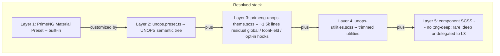
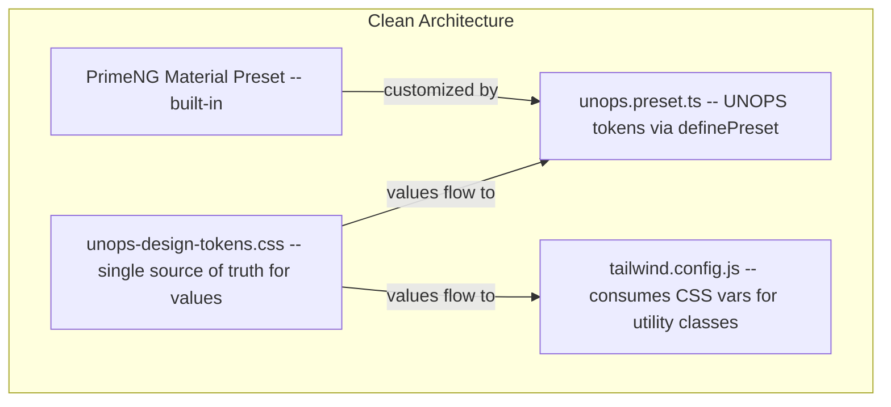

## Implementation status (verified 2026-03-30)

Audit of `UNOPS.PAO.ClientApp` and this plan. **All todos above are completed** per the intent of each phase; details and deliberate scope changes are below.

| Check | Result |
| ----- | ------ |
| Canonical tokens | `src/styles/unops-design-tokens.css` is source of truth; `unops.preset.ts` uses `var(--unops-*)` for primary font (`primitive.fonts.primary` → `var(--unops-font-family-sans)`) and bridges; `unops-design-tokens.scss` aliases via `var(--unops-*)` (file header). |
| Tailwind vs CSS | `tailwind.config.js` documents **literal hex** for main `unops-*` scales so opacity modifiers (e.g. `/80`) work; keep in sync with `:root`. |
| `unops-utilities.scss` / token CSS | No `.unops-button-primary` / `.unops-card` utilities; `unops-design-tokens.css` has removal comment only (legacy classes gone). |
| `styles.scss` contradictions | Mask / tabs / spinner / icon-only: comment points to `unops-design-tokens.css`; no duplicate mask/tab `!important` block at top of `styles.scss`. |
| `::ng-deep` | **No** `::ng-deep` under `UNOPS.PAO.ClientApp/src` except a **comment** in `primeng-unops-theme.scss`. Modern `:deep()` remains in a few components (e.g. breadcrumb, home-dashboard) — allowed. |
| `primeng-unops-theme.scss` | **Not deleted.** Original plan (~885 lines → delete entirely) was **superseded**: file is **~1.5k lines** of **residual global** rules (IconField layout + `!important`, opt-in datatable classes, menu/tooltip/toast-related hooks, scoped dialog/feature shells, workflow splitbutton gap, etc.). Bulk generic `.p-button` / base component blocks migrated to preset + tokens. |
| Phase 4 guardrails | `.cursor/rules/design-system-protection.mdc` §5 + **[`.github/PULL_REQUEST_TEMPLATE.md`](../../.github/PULL_REQUEST_TEMPLATE.md)** “Design system & PrimeNG” checklist (references this plan Phase 4). |
| Residual `.p-*` in feature SCSS | Small set still present (e.g. `role-dialog.component.scss` multiselect panel, `import-dialog.component.scss` `.p-error`). Prefer migrating to global hooks over time; not part of original YAML ids. |

**Tracker:** [primeng-cleanup-progress.md](primeng-cleanup-progress.md) — narrative progress; this section is the codebase verification snapshot.

---

# PrimeNG Override Cleanup

## Problem Statement

The UNOPS Opportunity+ Angular frontend has accumulated 5+ competing styling layers that override PrimeNG's theming system, resulting in ~7,700 lines of redundant code, 62+ files with `::ng-deep`, 40+ files with `!important`, and design tokens duplicated across 4 files. This makes the PrimeNG component library's theming effectively redundant.

Full visual report: [https://emamirelar.github.io/Opportunityplus_UX/primeng-issues-report.html](https://emamirelar.github.io/Opportunityplus_UX/primeng-issues-report.html)

## Layer stack after cleanup (2026-03)

## Target Architecture

## Phase 1: Consolidate Design Tokens

**Goal:** Single source of truth for all design token values.

### Files to modify

- [unops-design-tokens.css](UNOPS.PAO.ClientApp/src/styles/unops-design-tokens.css) -- keep as canonical source (already has all tokens as CSS custom properties)
- [unops.preset.ts](UNOPS.PAO.ClientApp/src/styles/themes/unops.preset.ts) -- replace hardcoded hex values with references where possible, or document that this file maps CSS var values to PrimeNG token structure
- [unops-design-tokens.scss](UNOPS.PAO.ClientApp/src/styles/unops-design-tokens.scss) -- remove duplicated color/spacing/font variables, replace with `var()` references or delete entirely if unused after Phase 2
- [tailwind.config.js](UNOPS.PAO.ClientApp/tailwind.config.js) -- no duplication of hex values; consume from CSS vars where Tailwind supports it

### Key contradictions to resolve

| Token             | Preset value (historical) | Override value (historical)        | File (historical)                  | Status (2026-03) |
| ----------------- | ------------------------- | ---------------------------------- | ---------------------------------- | ------------------ |
| Mask background   | `rgba(0,0,0,0.32)`        | `rgba(255,255,255,0.5) !important` | `styles.scss`                      | **Resolved** — bridges in `unops-design-tokens.css`; `styles.scss` defers (see comment at import). |
| Font family       | Noto vs Inter stack       | split across preset / CSS          | preset + `unops-design-tokens.css` | **Resolved** — `unops.preset.ts` uses `var(--unops-font-family-sans)` (CSS canonical). |
| Icon button width | `3rem` vs `2.4rem`        | `!important` in legacy layout      | was `public/layout/variables/_common.scss` | **Resolved** — `ClientApp/public/layout/variables/_common.scss` defers to `var(--p-*)`; icon-only width / spinner colors documented in comment → `unops-design-tokens.css`. |
| Spinner colors    | PrimeNG default           | `!important` overrides             | was `_common.scss`                 | **Resolved** — spinner colors via token bridges (see `styles.scss` header comment). |
| Tab panel bg      | PrimeNG default           | `transparent !important`           | was `styles.scss`                  | **Resolved** — `--unops-tabs-tabpanel-background` + preset tabpanel background. |

## Phase 2: Migrate SCSS Overrides into Preset

**Goal (original):** Delete [primeng-unops-theme.scss](UNOPS.PAO.ClientApp/src/styles/primeng-unops-theme.scss) entirely (~885 lines at time of writing).

**Outcome (implemented):** Bulk generic overrides were migrated into `unops.preset.ts` + `unops-design-tokens.css`. The theme file **was not deleted**; it remains the home for **residual global** rules (IconField positioning, opt-in datatable `styleClass` hooks, menu/tooltip shells, feature-scoped `.p-dialog` / `.p-button` wrappers, etc.). See **Implementation status** table above.

Work component by component. For each:

1. Comment out the SCSS override block
2. Check if the preset already produces the correct styling
3. If not, fix the preset tokens
4. Verify visually
5. Delete the commented block

### Components to migrate (in order)

| Component                                         | SCSS lines | Preset section                                         |
| ------------------------------------------------- | ---------- | ------------------------------------------------------ |
| `.p-button` (all variants)                        | 9-187      | `components.button`                                    |
| `.p-inputtext` / `.p-dropdown` / `.p-multiselect` | 193-357    | `components.inputtext`, `components.select`            |
| `.p-card`                                         | 363-406    | `components.card`                                      |
| `.p-panel`                                        | 412-447    | `components.panel`                                     |
| `.p-menu`                                         | 453-502    | `components.menu`                                      |
| `.p-dialog`                                       | 508-594    | `components.dialog`                                    |
| `.p-datatable`                                    | 600-656    | `components.datatable`                                 |
| `.p-toast`                                        | 664-705    | `components.toast`                                     |
| `.p-tooltip`                                      | 711-777    | `components.tooltip`                                   |
| `.p-progressbar` / `.p-progress-spinner`          | 783-811    | `components.progressbar`, `components.progressspinner` |
| `.unops-icon-button` utility                      | 818-885    | Use Tailwind classes or preset                         |

### Also delete from [unops-utilities.scss](UNOPS.PAO.ClientApp/src/styles/unops-utilities.scss)

- `.unops-button-primary` (lines 55-84) -- use `p-button` with `severity="primary"`
- `.unops-button-secondary` (lines 87-115) -- use `p-button` with `severity="secondary"`
- `.unops-button-text` (lines 118-143) -- use `p-button` with `variant="text"`
- `.unops-card` / `.unops-card-elevated` (lines 149-170) -- use `p-card` or Tailwind
- Surface/text utilities with `!important` can stay if used in non-PrimeNG contexts, but remove `!important`

### Also clean from [unops-design-tokens.css](UNOPS.PAO.ClientApp/src/styles/unops-design-tokens.css)

- Remove `.unops-button-primary` class (lines 289-307) -- duplicate of utility
- Remove `.unops-button-secondary` class (lines 309-327) -- duplicate of utility
- Remove `.unops-card` class (lines 281-287) -- duplicate of utility

## Phase 3: Eliminate `::ng-deep`

**Goal:** Remove `::ng-deep` from 62+ component files.

With global theming fixed in Phase 2, most `::ng-deep` overrides become unnecessary. For each file:

1. Remove `::ng-deep` wrapper
2. If the style is a legitimate layout concern (not theming), keep it but use `:host` or global styles
3. Verify visually

### Files by area

**Opportunities (18 files):** opportunity-view, overview, where, when, why, what, who, team, dst, collaboration, statement, analysis, documents, ai-comparison, related-items, decision-info-panel, reject-dialog, approve-dialog

**AI (6 files):** ai-assistant-panel (29 usages), ai-panel (46 usages), ai-prompt, ai-content, content-renderer, collapsible-thought

**Partners (7 files):** partner-tree (6 usages), partner-view (18 inline), partner-tree-view, partner-tree-page, partner-tabs, org-structure-dialog, contact-view

**Layouts (5 files):** sidebar, topbar (5 usages), breadcrumb, global-filters-dialog (7 usages), org-unit-selector

**Shared (10 files):** workflow, stage-workflow, responsive-tabs, document-upload, document, timeline (22 usages), tour-control, ai-comparison, dashboard-card, splitter

**Admin/Other (10 files):** entity-manager, user-management, bulk-entity-artifact, search-result, login, sign-up, home-dashboard, interaction-detail, create-opportunity-from-interactions-dialog, duplicate-indicator/summary

## Phase 4: Establish Guardrails

### Code review checklist addition

**Implemented:** [.cursor/rules/design-system-protection.mdc](../../.cursor/rules/design-system-protection.mdc) §5 (PrimeNG theming, `::ng-deep` / `:deep`, `.p-*` placement, `!important` on `var(--p-…)`).

**PR template:** [`.github/PULL_REQUEST_TEMPLATE.md`](../../.github/PULL_REQUEST_TEMPLATE.md) includes the “Design system & PrimeNG (Opportunity+ ClientApp)” checkbox section (aligned with the bullets below). For Azure DevOps–only workflows, mirror the same items in project PR defaults.

Checklist for contributors (also in the template):

- No `.p-`* class overrides in SCSS -- all PrimeNG styling goes through the preset
- No new `::ng-deep` without explicit approval
- No `!important` on PrimeNG CSS variables
- Design token changes happen in `unops-design-tokens.css` only

### Key files to monitor in reviews

- `src/styles/themes/unops.preset.ts` -- the only place for PrimeNG theming
- `src/styles/unops-design-tokens.css` -- the only place for token values
- Any `*.component.scss` -- should not contain `.p-`* selectors

## Expected Outcome

- ~5,000+ lines of redundant code removed
- Single source of truth for design tokens
- PrimeNG version upgrades become safe
- New components automatically inherit the design system
- Styling changes cost 1x instead of 4-6x
