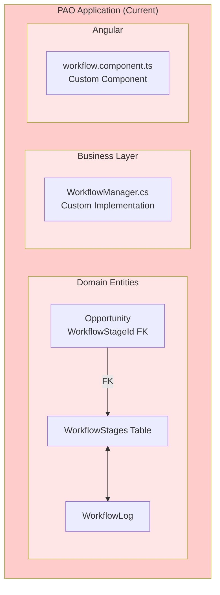
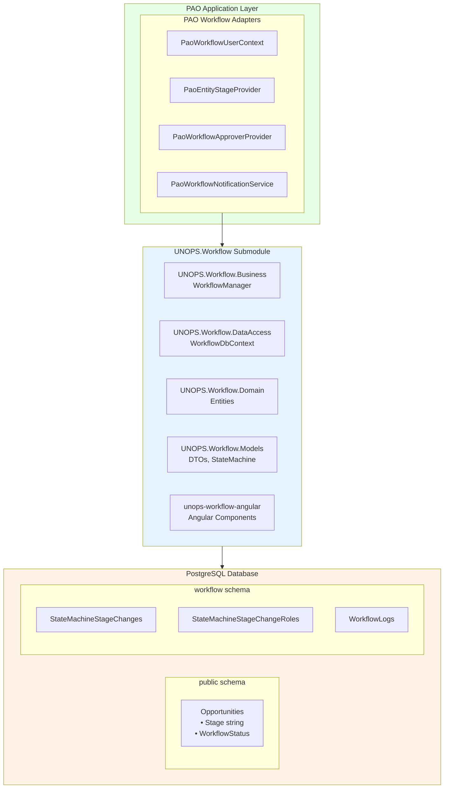
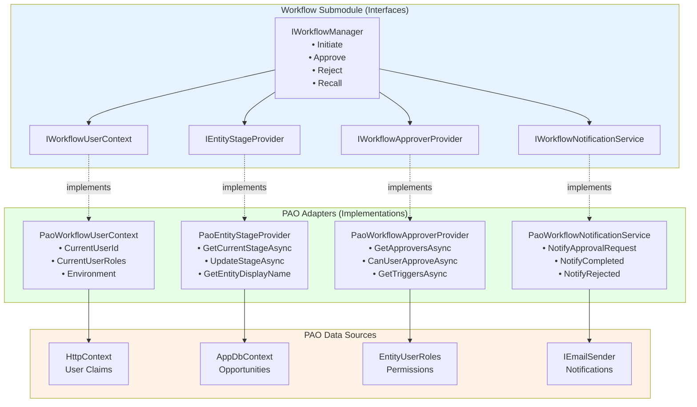
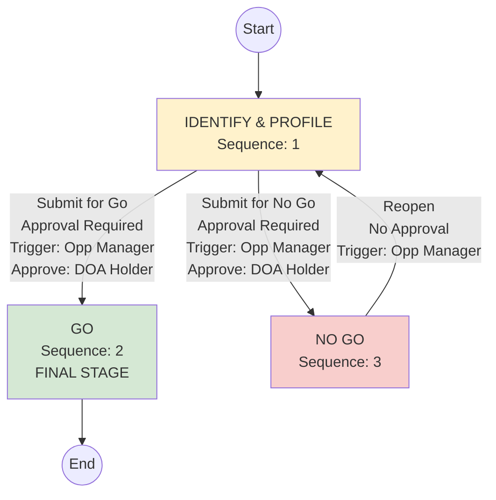
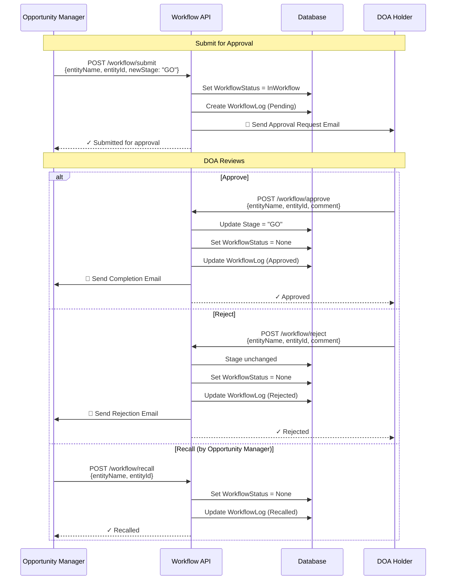
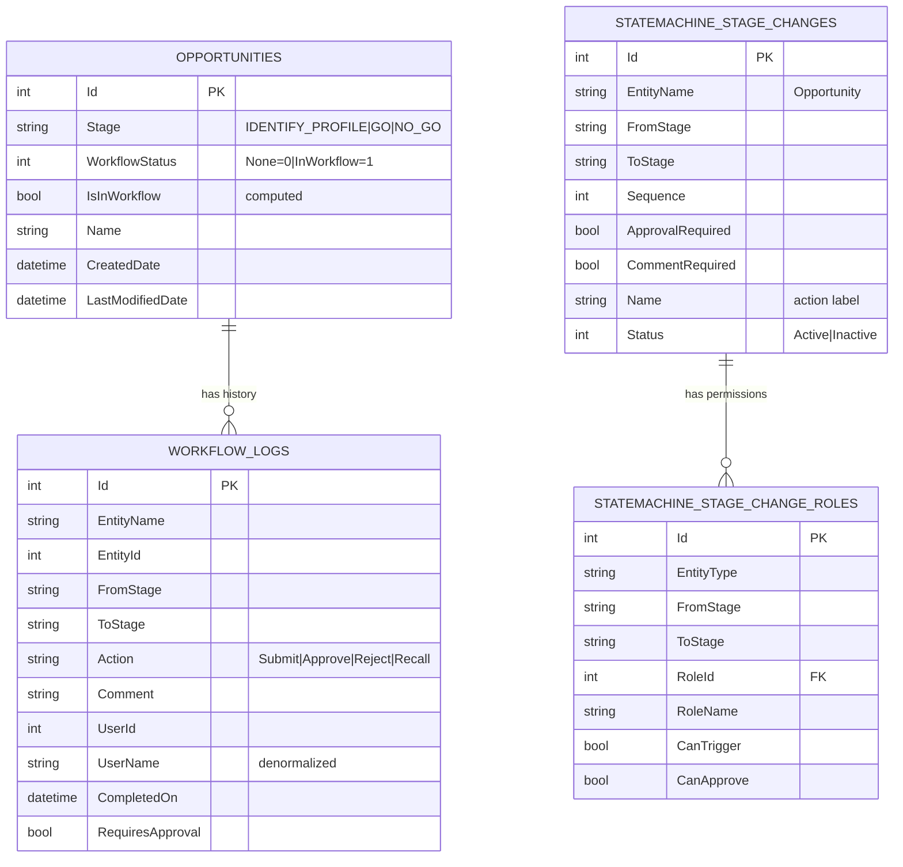
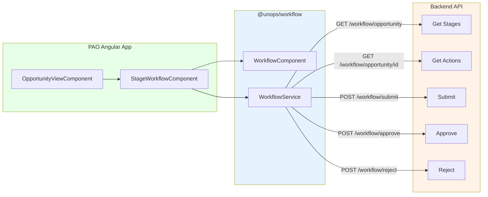

# Product Requirements Document: UNOPS.Workflow Submodule Integration

## Initial Requirement

Integrate the UNOPS.Workflow submodule (used in GMS) into PAO to provide a reusable, production-proven workflow infrastructure for implementing future approval processes across all PAO entities.

---

## Executive Summary

### Business Context

PAO currently uses a simple database-driven `WorkflowStage` system that lacks:
- Multi-step approval workflows
- Role-based approval permissions
- Comprehensive audit trails
- Workflow action history (approve, reject, recall)

The UNOPS.Workflow submodule, already battle-tested in GMS, provides all these capabilities as a reusable library.

### Goal

Establish production-ready workflow infrastructure that enables implementation of any future approval process (Opportunities, Partners, Projects) without rebuilding workflow logic.

---

### Architecture Overview

#### Current State (Before)



**Limitations:**
- ✗ No approval workflow support
- ✗ No role-based permissions for transitions
- ✗ Limited audit trail
- ✗ PAO-specific, not reusable

#### Target State (After)



**Benefits:**
- ✓ Built-in approval workflows (submit → approve/reject)
- ✓ Role-based permissions (who can trigger, who can approve)
- ✓ Complete audit trail with user denormalization
- ✓ Reusable across UNOPS projects
- ✓ Pre-built Angular components

---

### Adapter Pattern (Interface Implementations)



---

### Opportunity Workflow (Initial Implementation)



#### Transition Summary

| # | From → To | Approval | Trigger | Approve |
|---|-----------|----------|---------|---------|
| 1 | IDENTIFY & PROFILE → GO | Required | Opp Manager | DOA Holder |
| 2 | IDENTIFY & PROFILE → NO GO | Required | Opp Manager | DOA Holder |
| 3 | NO GO → IDENTIFY & PROFILE | None | Opp Manager | N/A |

> **Note:** GO is the final stage (no transitions out)

---

### Approval Workflow Flow



---

### Database Schema



---

### High-Level Tasks

| # | Task | Description |
|---|------|-------------|
| 1 | **Project Setup** | Add UNOPS.Workflow Git submodule, configure project references, delete old workflow files |
| 2 | **Database Migration** | Create WorkflowStatus enum, update ModifiableDeletableEntity, add Stage to Opportunity, drop WorkflowStages table, configure workflow schema |
| 3 | **Interface Implementations** | Implement 4 PAO adapters: UserContext, EntityStageProvider, ApproverProvider, NotificationService |
| 4 | **Workflow Configuration** | Create OpportunityWorkflow state machine, seed transitions and role permissions |
| 5 | **API Endpoints** | Create WorkflowController with submit/approve/reject/recall/history endpoints |
| 6 | **Frontend Integration** | Configure Angular path alias, integrate StageWorkflowComponent, add translations |
| 7 | **Testing & Documentation** | Unit tests, integration tests, documentation |

---

### Acceptance Criteria

- [ ] UNOPS.Workflow submodule added and compiling
- [ ] Old WorkflowStage/WorkflowLog entities deleted
- [ ] Workflow schema auto-created with 3 tables
- [ ] 4 PAO adapter interfaces implemented and registered
- [ ] Opportunity workflow seeded (3 stages, 3 transitions)
- [ ] API endpoints working (submit/approve/reject/recall)
- [ ] Angular workflow component displaying on Opportunity page
- [ ] Approval workflow functional end-to-end
- [ ] All unit tests passing (80% coverage)
- [ ] No breaking changes to existing functionality

---

### Frontend Component Integration



---

## PRD

### 1. Introduction/Overview

The Partnerships and Opportunities (PAO) application currently uses a basic database-driven `WorkflowStage` system that lacks comprehensive approval workflow capabilities, audit trails, and role-based transition controls. This PRD outlines the integration of the **UNOPS.Workflow submodule** - the same battle-tested workflow library used by the Grants Management System (GMS) - to provide enterprise-grade workflow infrastructure.

**Problem Statement:** PAO needs a robust workflow system to support approval processes for entities like Opportunities, Partners, and Projects. The current `WorkflowStage` implementation is insufficient for:
- Multi-step approval workflows
- Role-based approval permissions
- Comprehensive audit trails
- Workflow action history (approve, reject, recall)
- Separation of internal vs external user workflows

**Solution:** Integrate UNOPS.Workflow as a Git submodule, delete the existing `WorkflowStage` system, and migrate to the state machine pattern used successfully in GMS.

**Goal:** Establish production-ready workflow infrastructure that enables implementation of any future approval process without rebuilding workflow logic.

---

### 2. Clarifying Questions and Responses

**Q1: Integration Method**
- Use Git submodule (Option A)
- Add separately to PAO (independent from GMS)

**Q2: Database Schema Strategy**
- Use separate `workflow` schema (Option A)
- Keep WorkflowDbContext separate from AppDbContext

**Q3: Existing PAO Workflow Infrastructure**
- Delete existing WorkflowStage and WorkflowLog entities (Option A)
- Use GMS migration strategy for workflow data

**Q4: PAO-Specific Interface Implementations**
- Support only Opportunity entity initially
- Use string Stage field (not WorkflowStageId)
- Leverage PAO's existing EntityRole/EntityRolePerson system
- Integrate with PAO's email service
- Follow GMS implementation patterns

**Q5: Project Structure & Naming**
- Place implementations in `UNOPS.PAO.Business/Workflow/` (same as GMS)
- Use naming: `PaoEntityStageProvider`, `PaoWorkflowApproverProvider`, etc.

**Q6: Seeding & Configuration**
- Include example data for testing
- Use C# seeders (not SQL)

**Q7: Migration Strategy**
- Add string Stage property to Opportunity now
- Follow GMS database migration approach (auto-created by submodule)

**Q8: Testing & Validation**
- Include test/example workflow for Opportunity
- Stages: Identify & Profile → Go (final) or No Go
- Transitions use approval workflow:
  * IDENTIFY & PROFILE → GO (requires approval by DOA Holder)
  * IDENTIFY & PROFILE → NO GO (requires approval by DOA Holder)
  * NO GO → IDENTIFY & PROFILE (Reopen, no approval required, Opportunity Manager)
- Go is the final stage (no changes possible)
- No Go can be reopened back to Identify & Profile
- Include unit tests

**Q9: Scope & Boundaries**
- Include: Submodule integration, 4 interface implementations, database setup, DI registration
- Include: API endpoints (WorkflowController)
- Include: Angular components integration
- Include: Example Opportunity workflow
- Follow GMS implementation patterns

**Q10: Future Extensibility**
- Design for multiple entities (Partner, Contact, etc.)
- Follow GMS implementation pattern for extensibility

---

### 3. Goals

1. **Successfully integrate UNOPS.Workflow submodule** into PAO codebase as a Git submodule
2. **Replace existing WorkflowStage system** with the submodule's state machine pattern (delete old, use new)
3. **Implement 4 required interfaces** to connect PAO-specific logic with the generic workflow engine
4. **Establish separate workflow database schema** auto-managed by the submodule
5. **Create example Opportunity workflow** to validate the integration
6. **Replace existing Angular workflow components** with submodule's pre-built components
7. **Maintain zero breaking changes** to existing PAO functionality during transition
8. **Enable future approval workflows** for any PAO entity without rebuilding infrastructure

---

### 4. Architecture

#### Current Architecture (Before Migration)

**Verified PAO Architecture (as of 2026-01-12):**
```
UNOPS.PAO.Domain/Entities/
├── Opportunity.cs
│   └── WorkflowStageId (int?, FK) → WorkflowStages table
│   └── WorkflowStage (navigation property)
├── WorkflowStage.cs (EntityType, Name, Order, IsFinalStage)
└── WorkflowLog.cs (EntityName, EntityId, Stage, NewStage, Comment)

UNOPS.PAO.Business/Managers/
└── WorkflowManager.cs (Uses StateMachine, State, Facing from Models)

UNOPS.PAO.Models/Workflow/
├── StateMachine.cs (Stage, States[], StateAction)
├── State.cs (StageCode, DisplayName, Sequence, Actions, Facing)
├── StateAction.cs
├── Facing.cs (enum: Internal, External, TwoFace)
├── WorkflowStageModel.cs
├── WorkflowStateModel.cs
└── WorkflowActionModel.cs

UNOPS.PAO.ClientApp/src/app/shared/
├── components/workflows/workflow/
│   ├── workflow.component.ts (uses p-splitButton)
│   ├── workflow.component.html
│   └── workflow.component.scss
└── services/domain/
    └── workflow.service.ts (calls /api/workflow/*)
```

**Limitations (to be replaced by submodule):**
- Uses FK to WorkflowStage table (submodule uses string Stage)
- No approval workflow support (submodule has built-in approvals)
- No role-based permissions for transitions (submodule has StateMachineStageChangeRoles)
- Limited audit trail (submodule has comprehensive WorkflowLogs)
- PAO-specific, not reusable (submodule is shared across UNOPS projects)
- Custom frontend components (submodule has pre-built Angular components)

#### Target Architecture (After Migration)

```
┌─────────────────────────────────────────────────────────────────┐
│                    PAO Application Layer                         │
├─────────────────────────────────────────────────────────────────┤
│  PAO Workflow Adapters (UNOPS.PAO.Business/Workflow/)           │
│  ├── PaoWorkflowUserContext : IWorkflowUserContext              │
│  ├── PaoEntityStageProvider : IEntityStageProvider              │
│  ├── PaoWorkflowApproverProvider : IWorkflowApproverProvider    │
│  └── PaoWorkflowNotificationService : IWorkflowNotificationS... │
├─────────────────────────────────────────────────────────────────┤
│                  UNOPS.Workflow Submodule                        │
│  ├── UNOPS.Workflow.Business (WorkflowManager)                  │
│  ├── UNOPS.Workflow.DataAccess (WorkflowDbContext)              │
│  ├── UNOPS.Workflow.Domain (Entities)                           │
│  ├── UNOPS.Workflow.Models (DTOs)                               │
│  └── unops-workflow-angular (Angular components)                │
├─────────────────────────────────────────────────────────────────┤
│                    PostgreSQL Database                           │
│  ├── public schema (PAO entities)                               │
│  │   └── Opportunities                                          │
│  │       └── Stage (string) - No FK!                            │
│  │                                                               │
│  └── workflow schema (auto-created by submodule)                │
│      ├── StateMachineStageChanges (allowed transitions)         │
│      ├── StateMachineStageChangeRoles (role permissions)        │
│      └── WorkflowLogs (complete audit trail)                    │
└─────────────────────────────────────────────────────────────────┘
```

#### Key Architecture Changes

1. **Entity Changes:**
   - Remove: `Opportunity.WorkflowStageId` (int FK)
   - Add: `Opportunity.Stage` (string property)
   - Remove: `Opportunity.WorkflowStage` navigation property

2. **Base Entity Changes (ModifiableDeletableEntity):**
   Following GMS pattern, add workflow tracking to base entity:
   - Add: `WorkflowStatus` enum property (None, InWorkflow) to `ModifiableDeletableEntity`
   - Add: `IsInWorkflow` computed property (`=> WorkflowStatus == WorkflowStatus.InWorkflow`)
   - Create: `UNOPS.PAO.Domain/Enums/WorkflowStatus.cs` enum
   - This allows any entity inheriting from ModifiableDeletableEntity to participate in approval workflows

3. **Database Schema:**
   - **Delete:** `WorkflowStages` table (create migration to drop)
   - Add: `workflow` schema (auto-created by submodule with 3 tables)
   - Add: `WorkflowStatus` column to entities that inherit from `ModifiableDeletableEntity`

4. **Code Organization:**
   - Add: `UNOPS.Workflow/` submodule folder at solution root
   - Add: `UNOPS.PAO.Business/Workflow/` for PAO adapters and workflow definitions
   - Add: `UNOPS.PAO.Business/Workflow/Adapters/` for interface implementations
   - Add: `UNOPS.PAO.Business/Workflow/Interfaces/` for PAO-specific interfaces (e.g., IPaoWorkflowApproverProvider)
   - Add: `UNOPS.PAO.Business/Workflow/Seeders/` for seeder classes
   - **Delete:** `UNOPS.PAO.Business/Managers/WorkflowManager.cs` (~100 lines, no entity-specific logic)
   - **Delete:** `UNOPS.PAO.Business/Interfaces/IWorkflowManager.cs`
   - **Delete:** `UNOPS.PAO.Models/Workflow/` folder (7 files)
   - **Delete:** `UNOPS.PAO.Domain/Entities/WorkflowStage.cs` and `WorkflowLog.cs`

4. **Service Registration:**
   - Register workflow services from submodule in DI container
   - Register PAO-specific interface implementations
   - Configure WorkflowDbContext with connection string and schema

5. **Angular Integration (Per Submodule README - 3 Options):**
   - **Option 1 (Recommended):** TypeScript path alias in `tsconfig.json`
   - **Option 2:** Build as Angular library with ng-packagr
   - **Option 3:** Copy source files to project
   - Use: `StageWorkflowComponent` and `WorkflowService` from submodule
   - **Delete:** `shared/components/workflows/workflow/` folder
   - **Delete:** `shared/services/domain/workflow.service.ts`

---

### 5. User Stories

#### US-1: Developer Setting Up Workflow Infrastructure
**As a** PAO developer  
**I want to** integrate the UNOPS.Workflow submodule  
**So that** I have production-ready workflow infrastructure available for all future entity approvals

**Acceptance Criteria:**
- Git submodule is added and tracked in repository
- All workflow projects compile successfully
- WorkflowDbContext is registered and creates workflow schema automatically
- No breaking changes to existing PAO functionality
- Documentation is updated with integration details

---

#### US-2: Developer Implementing Entity Workflow
**As a** PAO developer  
**I want to** create a workflow state machine for an entity  
**So that** I can define valid stages and transitions without writing custom logic

**Acceptance Criteria:**
- Can create a StateMachine class for any entity (e.g., `OpportunityWorkflow`)
- Can define states with sequence, facing (Internal/External), and display names
- StateMachine is tracked in code (Git version control)
- Changes to state definitions don't require database migrations

---

#### US-3: Developer Configuring Stage Transitions
**As a** PAO developer  
**I want to** seed stage transition rules in the database  
**So that** I can control which stage changes are allowed, require approval, or need comments

**Acceptance Criteria:**
- Can create seeder class for StateMachineStageChanges
- Can specify FromStage, ToStage, ApprovalRequired, CommentRequired flags
- Can control Internal vs External user access to transitions
- Seeder is idempotent (safe to run multiple times)

---

#### US-4: Developer Testing Opportunity Workflow
**As a** PAO developer  
**I want to** validate the workflow integration with a working Opportunity example  
**So that** I can verify all components are correctly integrated

**Acceptance Criteria:**
- Example Opportunity workflow is implemented with 3 stages:
  * IDENTIFY & PROFILE → GO (requires approval by DOA Holder, final stage)
  * IDENTIFY & PROFILE → NO GO (requires approval by DOA Holder)
  * NO GO → IDENTIFY & PROFILE (Opportunity Manager, reopen, no approval)
- GO stage is final - no transitions out
- Approval workflow controls transitions to GO and NO GO
- Status changes correctly: Draft → Active (GO) or Draft → Closed (NO GO)
- Workflow actions are visible in UI
- Stage changes are logged in workflow.WorkflowLogs table
- Approval requests trigger email notifications
- Unit tests validate workflow operations

---

#### US-5: System Administrator Managing Workflows
**As a** system administrator  
**I want to** view and manage workflow configurations  
**So that** I can troubleshoot issues and update transition rules

**Acceptance Criteria:**
- Can query StateMachineStageChanges table to see all configured transitions
- Can query StateMachineStageChangeRoles to see permission mappings
- Can query WorkflowLogs to see complete audit trail
- Database schema is well-documented

---

#### US-6: Internal User Viewing Entity Workflow Status
**As an** internal PAO user  
**I want to** see the current workflow stage and available actions for an Opportunity  
**So that** I know what actions I can take

**Acceptance Criteria:**
- Opportunity detail page displays current stage
- Available actions are shown based on user permissions
- Workflow component shows stage progression
- User cannot perform actions they don't have permission for

---

#### US-7: Internal User Submitting for Approval (Future)
**As an** internal PAO user  
**I want to** submit an Opportunity for approval  
**So that** it can be reviewed by authorized approvers

**Acceptance Criteria:**
- Can click "Submit for Approval" action
- System validates approval configuration exists
- Pending approval is logged in WorkflowLogs
- Approvers are notified via email
- Stage shows as "Awaiting Approval"

**Note:** Full approval implementation is out of scope for this PRD (infrastructure only)

---

#### US-8: Developer Extending to Other Entities (Future)
**As a** PAO developer  
**I want to** easily add workflow to Partner or other entities  
**So that** I can reuse the infrastructure without rebuilding

**Acceptance Criteria:**
- Can add string Stage property to any entity
- Can create new StateMachine class
- Can add entity case to PaoEntityStageProvider
- Can add seeder for entity's stage changes
- No changes needed to workflow submodule

---

### 6. Functional Requirements

#### FR-1: Submodule Integration
1. Add UNOPS.Workflow as Git submodule in PAO repository root
2. Repository URL: `https://github.com/UNOPS-ITG/unops-workflow.git`
3. Submodule path: `business-partners-and-opportunities/UNOPS.Workflow`
4. Add project references to:
   - `UNOPS.Workflow.Business`
   - `UNOPS.Workflow.DataAccess`
   - `UNOPS.Workflow.Models`
5. Verify all projects compile successfully

#### FR-2: Entity Migration
1. Add `Stage` string property to `Opportunity` entity
2. Add MaxLength attribute: `[MaxLength(100)]`
3. Make Stage nullable initially for migration: `public string? Stage { get; set; }`
4. Remove `WorkflowStageId` property
5. Remove `WorkflowStage` navigation property
6. Create EF Core migration for these changes
7. Add data migration script to populate Stage from existing WorkflowStageId

#### FR-2.5: Add WorkflowStatus to Base Entity (Following GMS Pattern)
1. Create `WorkflowStatus` enum in `UNOPS.PAO.Domain/Enums/`:
   ```csharp
   public enum WorkflowStatus
   {
       None,
       InWorkflow
   }
   ```
2. Update `ModifiableDeletableEntity` base class in `UNOPS.PAO.Domain/Infrastructure/Audit/`:
   - Add `WorkflowStatus` property with default `WorkflowStatus.None`
   - Add computed `IsInWorkflow` property: `public bool IsInWorkflow => WorkflowStatus == WorkflowStatus.InWorkflow;`
3. Create EF Core migration to add `WorkflowStatus` column to applicable tables
4. **Purpose:** This allows entities to track when they have a pending approval workflow
5. **Usage:** When user initiates approval (e.g., "Submit for Go"), set `WorkflowStatus = InWorkflow`
6. **Usage:** When approval completes/rejects/recalls, set `WorkflowStatus = None`

#### FR-3: Delete Old Workflow System
**Per User Requirement:** Delete (not deprecate) existing PAO workflow entities that are replaced by the submodule.

Backend (C#) - **DELETE** the following files:
1. `UNOPS.PAO.Domain/Entities/WorkflowStage.cs` - Replaced by submodule's `StateMachineStageChange`
2. `UNOPS.PAO.Domain/Entities/WorkflowLog.cs` - Replaced by submodule's `WorkflowLog`
3. `UNOPS.PAO.Business/Managers/WorkflowManager.cs` - Replaced by submodule's `IWorkflowManager`
4. `UNOPS.PAO.Business/Interfaces/IWorkflowManager.cs` - Replaced by submodule's interface
5. All files in `UNOPS.PAO.Models/Workflow/` folder:
   - `StateMachine.cs`, `State.cs`, `StateAction.cs`, `Facing.cs`
   - `WorkflowStageModel.cs`, `WorkflowStateModel.cs`, `WorkflowActionModel.cs`

**Why DELETE PAO's WorkflowManager (not keep like GMS):**
- PAO's `WorkflowManager` is only ~100 lines with basic functionality (GetWorkflowPath, GetWorkflowState, AddLog)
- GMS's `WorkflowManager` is 1900+ lines with entity-specific approver methods (FundingOpportunityApprovalUsers, RequestForAwardApprovals, etc.) that query GMS-specific entities
- GMS keeps its manager because it has irreplaceable entity-specific business logic
- PAO has no such entity-specific logic - the submodule's generic `IWorkflowManager` suffices

Database Migration:
6. Create migration to drop `WorkflowStages` table
7. Remove `WorkflowStageId` FK from Opportunity entity
8. Add `Stage` (string) property to Opportunity entity

Frontend (Angular) - **DELETE** the following:
9. `shared/components/workflows/workflow/` folder - Replaced by submodule's `StageWorkflowComponent`
10. `shared/services/domain/workflow.service.ts` - Replaced by submodule's `WorkflowService`

#### FR-4: Implement IWorkflowUserContext
1. Create `PaoWorkflowUserContext` class in `UNOPS.PAO.Business/Workflow/`
2. Implement `IWorkflowUserContext` interface from submodule
3. Properties to implement:
   - `CurrentUserId` - Get from ClaimTypes.NameIdentifier
   - `CurrentUserName` - Get from Identity.Name
   - `CurrentUserEmail` - Get from ClaimTypes.Email
   - `CurrentUserRoles` - Get from ClaimTypes.Role claims
   - `Environment` - Get from ASPNETCORE_ENVIRONMENT
   - `IsAuthenticated` - Check HttpContext.User.Identity.IsAuthenticated
4. Use IHttpContextAccessor for claims access
5. Return sensible defaults when user is not authenticated

#### FR-5: Implement IEntityStageProvider
1. Create `PaoEntityStageProvider` class in `UNOPS.PAO.Business/Workflow/`
2. Implement `IEntityStageProvider` interface from submodule
3. Methods to implement:
   - `GetCurrentStageAsync(entityName, entityId)` - Return entity's Stage property
   - `UpdateStageAsync(entityName, entityId, newStage, userId)` - Update Stage and audit fields
   - `IsEntityValidAsync(entityName, entityId)` - Check entity exists and !IsDeleted
   - `GetEntityDisplayNameAsync(entityName, entityId)` - Return entity Name or identifier
4. Support "opportunity" entity initially (use switch expression on entityName.ToLowerInvariant())
5. Design for easy extension to other entities
6. Use proper async/await patterns
7. Filter by !IsDeleted in all queries

#### FR-6: Implement IWorkflowApproverProvider
**Following GMS pattern:** Leverage PAO's existing EntityRole/EntityRolePerson system for approvals.

1. Create `IPaoWorkflowApproverProvider` interface in `UNOPS.PAO.Business/Workflow/Interfaces/`
   - Extend `IWorkflowApproverProvider` from submodule
   - Keep empty initially as placeholder for future PAO-specific methods
   - Example structure:
   ```csharp
   public interface IPaoWorkflowApproverProvider : IWorkflowApproverProvider
   {
       // Placeholder for future PAO-specific approval methods
       // e.g., Task<bool> CanUserApproveOpportunityAsync(int opportunityId, int userId);
   }
   ```
2. Create `PaoWorkflowApproverProvider` class in `UNOPS.PAO.Business/Workflow/Adapters/`
3. Implement `IPaoWorkflowApproverProvider` interface (which extends base)
4. Methods to implement from base interface:
   - `GetApproversAsync(entityName, entityId, fromStage, toStage)` - Return list of users who can approve
   - `GetApprovalConfigurationAsync(entityName, entityId, fromStage, toStage)` - Return approval config with roles
   - `GetTriggerConfigurationAsync(entityName, entityId, fromStage, toStage)` - Return trigger config with roles
   - `CanUserApproveAsync(entityName, entityId, userId, fromStage, toStage)` - Check specific user permission
5. Query PAO's existing tables:
   - `EntityRolePerson` - Users assigned to entity-specific roles (respects EffectiveDate/EndDate)
   - `EntityUserRole` - Organization-level roles for fallback approvals
   - `EntityRole` - Role definitions (e.g., "Opportunity_Manager", "DOA_Holder")
6. Query `StateMachineStageChangeRoles` from workflow schema for role permissions
7. Join entity role assignments with workflow role permissions
8. Return empty lists for unconfigured transitions (no approvers = can't start workflow)
9. Register as `IPaoWorkflowApproverProvider` AND `IWorkflowApproverProvider` in DI

#### FR-7: Implement IWorkflowNotificationService
**Following GMS pattern:** Use PAO's existing `IEmailSender` from `UNOPS.PAO.MailSender`.

1. Create `PaoWorkflowNotificationService` class in `UNOPS.PAO.Business/Workflow/`
2. Implement `IWorkflowNotificationService` interface from submodule
3. Methods to implement:
   - `NotifyNewApprovalRequestAsync(notification)` - Email approvers about new request
   - `NotifyWorkflowCompletedAsync(notification)` - Email submitter about approval
   - `NotifyWorkflowRejectedAsync(notification)` - Email submitter about rejection
   - `NotifyWorkflowRecalledAsync(notification)` - Email approvers about recall
4. Inject `IEmailSender` from `UNOPS.PAO.MailSender`
5. Create email templates in `UNOPS.PAO.Business/EmailTemplates/`:
   - `WorkflowApprovalRequest.html`
   - `WorkflowCompleted.html`
   - `WorkflowRejected.html`
6. Include entity name, URL, performer, comment in emails
7. Handle multiple recipients gracefully

#### FR-8: Database Schema Setup
1. Configure WorkflowDbContext in Program.cs/Startup.cs
2. Add workflow database connection string (use same DB, different schema)
3. Register `AddWorkflowServices()` extension method in DI
4. Configure PostgreSQL storage: `.UsePostgreSqlStorage(connectionString, "workflow")`
5. Verify workflow schema is auto-created on startup
6. Verify 3 tables are created:
   - `workflow.StateMachineStageChanges`
   - `workflow.StateMachineStageChangeRoles`
   - `workflow.WorkflowLogs`
7. Add DbContext to DbContext factory if needed for migrations

#### FR-9: Service Registration
1. Register workflow services in DI container:
   ```csharp
   services.AddWorkflowServices(options =>
   {
       options.UsePostgreSqlStorage(connectionString, "workflow");
   });
   ```
2. Register PAO implementations:
   ```csharp
   services.AddScoped<IWorkflowUserContext, PaoWorkflowUserContext>();
   services.AddScoped<IEntityStageProvider, PaoEntityStageProvider>();
   services.AddScoped<IWorkflowApproverProvider, PaoWorkflowApproverProvider>();
   services.AddScoped<IWorkflowNotificationService, PaoWorkflowNotificationService>();
   ```
3. Ensure services are registered in correct order
4. Verify IHttpContextAccessor is registered

#### FR-10: Create Opportunity Workflow State Machine
1. Create `OpportunityWorkflow` class in `UNOPS.PAO.Business/Workflow/`
2. Define static StateMachine property
3. Include 3 states:
   - "Identify & Profile" (Sequence: 1, Status: Draft)
   - "Go" (Sequence: 2, IsFinalStage: true, Status: Active)
   - "No Go" (Sequence: 3, IsFinalStage: false, Status: Closed)
4. Set EntityType = "Opportunity"
5. Configure facing (Internal) for all states
6. Note: Go is the ONLY final stage - No Go can be reopened
7. Approval-based transitions:
   - DOA Holder: Can approve transitions to Go or No Go
   - Opportunity Manager: Can trigger transitions to Go/No Go (initiates approval), Can Reopen
8. Follow GMS pattern for structure

#### FR-11: Seed Opportunity Stage Transitions
1. Create `OpportunityWorkflowSeeder` in `UNOPS.PAO.Business/Workflow/Seeders/`
2. Seed stage changes (with approval workflow):
   - IDENTIFY & PROFILE → GO (Action: "Submit for Go")
     * ApprovalRequired: true
     * Trigger Role: Opportunity Manager
     * Approval Role: DOA Holder
     * Status changes to Active
     * CommentRequired: true
     * Note: GO is FINAL - no transitions out
   - IDENTIFY & PROFILE → NO GO (Action: "Submit for No Go")
     * ApprovalRequired: true
     * Trigger Role: Opportunity Manager
     * Approval Role: DOA Holder
     * Status changes to Closed
     * CommentRequired: true
   - NO GO → IDENTIFY & PROFILE (Action: "Reopen")
     * ApprovalRequired: false
     * Role Required: Opportunity Manager
     * Status changes to Draft
3. Note: Go and No Go transitions require DOA Holder approval
4. Configure comment requirements for all transitions to Go/No Go
5. Set Internal access flags (all internal only)
6. Create seeder runner in Program.cs or seed controller
7. Make seeder idempotent (check existing records)

#### FR-12: Create API Endpoints
1. Create `WorkflowController` in `UNOPS.PAO.Presentation/Controllers/`
2. Follow GMS `WorkflowController` pattern for comprehensive workflow handling
3. Implement endpoints:
   - `GET /api/workflow/{entityName}` - Get workflow stages for entity type
   - `GET /api/workflow/{entityName}/{id}` - Get current state and available actions
   - `GET /api/workflow/{entityName}/{id}/history` - Get stage change history
   - `GET /api/workflow/{entityName}/{id}/details` - Get workflow details including approval status
   - `POST /api/workflow/submit` - Submit/initiate workflow action (may start approval)
   - `POST /api/workflow/approve` - Approve pending workflow action
   - `POST /api/workflow/reject` - Reject pending workflow action
   - `POST /api/workflow/recall` - Recall pending workflow action
4. Use authorization attributes for permission checks
5. Include switch statement pattern for routing entity-specific logic (anticipate multiple entities)
6. Return DTOs, never entities directly
7. Add to APIDictionary constants
8. Follow PAO controller patterns (inherit from BaseController)
9. Handle approval workflow state machine (Initiate → Approve/Reject/Recall)

#### FR-13: Update OpportunityManager
1. Inject IWorkflowManager via IManagerWrapper
2. Update GetById to include Stage in response model
3. Add method to get workflow state: `GetWorkflowState(id)`
4. Add method to execute stage change: `ChangeStage(id, newStage, comment)`
5. Use WorkflowManager from submodule
6. Remove old WorkflowStage navigation property usage
7. Add workflow validation before stage changes

#### FR-14: Integrate Submodule's Angular Workflow Library
**Per Submodule README:** Three integration options are available. Choose based on project needs.

**Option 1: TypeScript Path Alias (Recommended)**
Configure `tsconfig.json` in `UNOPS.PAO.ClientApp`:
```json
{
  "compilerOptions": {
    "paths": {
      "@unops/workflow": ["../UNOPS.Workflow/unops-workflow-angular/src/public-api.ts"],
      "@unops/workflow/*": ["../UNOPS.Workflow/unops-workflow-angular/src/*"]
    }
  }
}
```
Import: `import { StageWorkflowComponent, WorkflowService } from '@unops/workflow';`

| Pros | Cons |
|------|------|
| No build step required | Must ensure Angular versions match |
| Changes reflect immediately | Path configuration required |

**Option 2: Build as Angular Library**
```bash
cd UNOPS.Workflow/unops-workflow-angular
npm install ng-packagr --save-dev
ng build
cd ../../UNOPS.PAO.ClientApp
npm install ../UNOPS.Workflow/unops-workflow-angular/dist
```
Import: `import { StageWorkflowComponent, WorkflowService } from '@unops/workflow';`

| Pros | Cons |
|------|------|
| Proper library packaging | Requires build pipeline |
| Versioned releases possible | Must rebuild after changes |

**Option 3: Copy Files (Simple)**
```bash
cp -r UNOPS.Workflow/unops-workflow-angular/src/lib/* \
      UNOPS.PAO.ClientApp/src/app/shared/components/workflow-submodule/
```
Import using project paths after updating imports in copied files.

| Pros | Cons |
|------|------|
| Simple setup | Manual sync required |
| Full control | Easy to get out of sync |

**After Integration:**
1. Delete PAO's existing `shared/components/workflows/workflow/` folder
2. Delete PAO's existing `shared/services/domain/workflow.service.ts`
3. Add translation keys to i18n files (see README for full list)
4. Update any existing workflow usages to use the new components

#### FR-15: Integrate Workflow in Opportunity UI
**Per Submodule README - Component Inputs/Outputs:**

1. Update `opportunity-view.component.ts`:
   ```typescript
   // Use import path based on chosen FR-14 option
   import { StageWorkflowComponent } from '@unops/workflow';
   
   @Component({
     imports: [StageWorkflowComponent, ...],
   })
   ```
2. Add workflow section to template:
   ```html
   <app-stage-workflow
     [entityName]="'Opportunity'"
     [entityId]="opportunityId().toString()"
     [canChangeStage]="canChangeStage()"
     [beforeStageChange]="beforeStageChange"
     (onStageChangeSuccess)="handleStageChangeSuccess()"
   />
   ```
3. **Component Inputs:**
   - `entityName` (string) - Entity type identifier
   - `entityId` (string) - Entity ID (must be string)
   - `canChangeStage` (boolean) - Whether user can perform workflow actions
   - `beforeStageChange` ((nextStage: string) => Promise<boolean>) - Optional validation hook
4. **Component Output:**
   - `onStageChangeSuccess` - Emitted when stage change completes (reload data here)
5. Show workflow based on user permissions

#### FR-16: Update Opportunity Models
1. Add `Stage` property to OpportunityModel DTO
2. Add `WorkflowState` property (optional, for current state details)
3. Remove `WorkflowStageId` from models
4. Update AutoMapper profiles
5. Ensure backward compatibility during migration

#### FR-17: Create Unit Tests
1. Test PaoWorkflowUserContext:
   - Test CurrentUserId extraction from claims
   - Test unauthenticated user handling
   - Test environment detection
2. Test PaoEntityStageProvider:
   - Test GetCurrentStageAsync for Opportunity
   - Test UpdateStageAsync updates Stage and audit fields
   - Test IsEntityValidAsync checks IsDeleted
   - Test unsupported entity types return null/false
3. Test OpportunityWorkflow:
   - Test StateMachine has correct states
   - Test state sequences
   - Test facing configurations
4. Test WorkflowController:
   - Test GET endpoints return correct data
   - Test POST endpoint validates and executes transitions
   - Test permission checks
5. Test workflow integration end-to-end:
   - Create test opportunity
   - Change stage using workflow API
   - Verify Stage property updated
   - Verify WorkflowLog created

#### FR-18: Documentation
1. Update README with workflow integration instructions
2. Document how to add workflow to new entities
3. Add code comments to interface implementations
4. Document seeder usage
5. Add troubleshooting guide
6. Include example workflow diagrams

---

### 7. Non-Goals (Out of Scope)

This PRD specifically does NOT include:

1. ❌ **Full Approval Workflow Implementation** - Infrastructure only; no complete approve/reject/recall flows
2. ❌ **Email Template Design** - Basic email notifications only; no styled HTML templates
3. ❌ **Complex Multi-Level Approvals** - Simple approval setup; no escalation rules
4. ❌ **Workflow for Other Entities** - Only Opportunity example; Partner/Contact out of scope
5. ❌ **Migration of Historical Data** - WorkflowLog migration optional; focus on new workflow
6. ❌ **Workflow Analytics/Reporting** - No dashboards or reports on workflow metrics
7. ❌ **Workflow Automation** - No automatic stage transitions or scheduled actions
8. ❌ **External User Workflow UI** - Focus on internal users; external portal updates separate
9. ❌ **Workflow Permissions Management UI** - Role configuration via database seeders only
10. ❌ **Workflow Engine Modifications** - Use submodule as-is; no changes to workflow submodule code
11. ❌ **Complete Deprecation of Old System** - Old entities marked obsolete but not removed
12. ❌ **Production Deployment** - Development/test environment only initially

---

### 8. Design Considerations

#### 8.1 UI/UX Design

**Workflow Component Location:**
- Add workflow component below Opportunity header on detail page
- Display current stage prominently
- Show available actions as buttons
- Include workflow history section (collapsible)

**Stage Display:**
```
Current Stage: IDENTIFY & PROFILE

● IDENTIFY & PROFILE ──────○ GO ──────○ NO GO

Available Actions: [Submit for Go ▼]  (dropdown includes "Submit for No Go")
```

**Workflow History:**
```
┌─ Workflow History ──────────────────────────┐
│ Date         User          Action     Stage │
│ 2026-01-10   John Doe      Created    IDENTIFY & PROFILE │
└─────────────────────────────────────────────┘
```

#### 8.2 Component Integration Pattern

**Per Submodule README:** Use `StageWorkflowComponent` from the submodule.

```typescript
import { Component, input } from '@angular/core';
// Import path depends on chosen integration option:
// Option 1 (path alias): import { StageWorkflowComponent } from '@unops/workflow';
// Option 2 (built lib):  import { StageWorkflowComponent } from '@unops/workflow';
// Option 3 (copied):     import { StageWorkflowComponent } from '@shared/components/workflow-submodule';
import { StageWorkflowComponent } from '@unops/workflow';

@Component({
  selector: 'app-opportunity-detail',
  standalone: true,
  imports: [StageWorkflowComponent],
  template: `
    <app-stage-workflow
      [entityName]="'Opportunity'"
      [entityId]="opportunityId()"
      [canChangeStage]="canChangeStage()"
      [beforeStageChange]="beforeStageChange"
      (onStageChangeSuccess)="onStageChanged($event)"
    />
  `
})
export class OpportunityDetailComponent {
  opportunityId = input.required<string>();
  canChangeStage = input<boolean>(false);

  // Optional validation before stage change
  beforeStageChange = async (nextStage: string): Promise<boolean> => {
    // Return true to allow, false to cancel
    return true;
  };

  onStageChanged(event: any): void {
    // Reload opportunity after stage change
    this.loadOpportunity();
  }
}
```

#### 8.3 API Design

**RESTful Endpoints:**

```
GET    /api/workflow/opportunity              → Get all stages for Opportunity entity
GET    /api/workflow/opportunity/123          → Get current state and actions for Opportunity #123
GET    /api/workflow/opportunity/123/details  → Get workflow details including approval status
GET    /api/workflow/opportunity/123/history  → Get stage change history
POST   /api/workflow/submit                   → Submit/initiate workflow action (may start approval)
POST   /api/workflow/approve                  → Approve pending workflow action
POST   /api/workflow/reject                   → Reject pending workflow action
POST   /api/workflow/recall                   → Recall pending workflow action
```

**POST /submit Request Body (starts approval):**
```json
{
  "entityName": "opportunity",
  "entityId": "123",
  "newStage": "GO",
  "comment": "Ready for Go decision"
}
```

**Response (approval started):**
```json
{
  "success": true,
  "requiresApproval": true,
  "workflowStatus": "InWorkflow",
  "message": "Approval workflow initiated"
}
```

**POST /approve Request Body:**
```json
{
  "entityName": "opportunity",
  "entityId": "123",
  "comment": "Approved - opportunity meets all criteria"
}
```

**Response (approval completed):**
```json
{
  "success": true,
  "newStage": "GO",
  "workflowStatus": "None",
  "message": "Stage changed to GO"
}
```

---

### 9. Technical Considerations

#### 9.1 Database Considerations

**Schema Isolation:**
- Workflow tables in separate `workflow` schema
- PAO entities remain in `public` schema
- No foreign keys between schemas
- WorkflowDbContext manages workflow schema independently
- AppDbContext manages PAO entities

**Connection String:**
- Use same PostgreSQL database
- Single connection string shared between contexts
- Schema separation handled by EF Core

**Migration Strategy:**
```sql
-- Migration to add Stage to Opportunity
ALTER TABLE public."Opportunities" ADD COLUMN "Stage" VARCHAR(100);

-- Data migration (populate from existing WorkflowStageId)
UPDATE public."Opportunities" o
SET "Stage" = ws."Name"
FROM public."WorkflowStages" ws
WHERE o."WorkflowStageId" = ws."Id";

-- Later: Drop old columns (after validation)
-- ALTER TABLE public."Opportunities" DROP COLUMN "WorkflowStageId";
```

#### 9.2 Performance Considerations

**Query Optimization:**
- Index on `Opportunity.Stage` for filtering by stage
- Composite index on WorkflowLogs (EntityName, EntityId, CreatedDate)
- Use `.AsNoTracking()` for read-only queries
- Eager load related entities when needed

**Caching Strategy:**
- Cache StateMachine definitions (static, never change at runtime)
- Cache StateMachineStageChanges per entity type (rarely changes)
- Don't cache WorkflowLogs (always fetch fresh for audit trail)

#### 9.3 Security Considerations

**Authorization:**
- All workflow API endpoints require authentication
- Stage change permissions checked via IWorkflowApproverProvider
- Use PAO's existing authorization handlers
- Never expose workflow configuration to client (server-side only)

**Self-Approval Prevention:**
- Workflow engine prevents self-approval in Test/Production environments
- Development environment allows for testing

**Audit Trail:**
- All stage changes logged with user ID, timestamp, comment
- WorkflowLogs immutable (append-only)
- Denormalized user names for display independence

#### 9.4 Error Handling

**Validation Errors:**
- Invalid stage transitions return 400 Bad Request
- Missing approvers return 400 with descriptive message
- Entity not found returns 404

**Exception Handling:**
- Use PAO's BusinessException for business rule violations
- Log all errors with context (entity type, ID, user)
- Return user-friendly error messages

**Rollback Strategy:**
- Database transactions ensure Stage update and WorkflowLog creation are atomic
- Failed transitions don't leave partial data

#### 9.5 Testing Strategy

**Unit Tests:**
- Test each interface implementation independently
- Mock dependencies (DbContext, HttpContextAccessor)
- Test edge cases (null values, invalid IDs)
- Verify correct SQL queries generated

**Integration Tests:**
- Test full workflow cycle: create → stage change → verify log
- Test API endpoints with test database
- Verify WorkflowDbContext auto-creates schema
- Test seeder idempotency

**Manual Testing Checklist:**
- Create new Opportunity → verify Stage is null initially
- Change stage via UI → verify Stage updated and log created
- Check workflow history → verify entries shown correctly
- Test permission checks → verify unauthorized users blocked
- Test navigation → verify workflow component displays correctly

#### 9.6 Deployment Considerations

**Deployment Order:**
1. Deploy database migration (add Stage column)
2. Run data migration (populate Stage from WorkflowStageId)
3. Deploy backend code (new workflow services)
4. Run workflow seeders (populate stage transitions)
5. Deploy frontend code (new workflow components)
6. Verify workflow schema created automatically
7. Test stage changes in production

**Rollback Plan:**
- Keep WorkflowStageId column temporarily
- Keep old WorkflowLog table
- Can revert code changes without data loss
- Stage column can remain empty if rollback needed

**Environment Variables:**
- `ASPNETCORE_ENVIRONMENT` - Used by workflow for self-approval prevention
- No new environment variables required
- Use existing connection string

#### 9.7 Dependencies

**New NuGet Packages:**
- None (all provided by submodule)

**Submodule Dependencies:**
- Entity Framework Core (already in PAO)
- AutoMapper (already in PAO)
- Npgsql (already in PAO)

**Angular Dependencies:**
- None (workflow components are standalone)

#### 9.8 Code Quality Standards

**Follow PAO Patterns:**
- Inherit entities from `ModifiableDeletableEntity`
- Use `IManagerWrapper` for manager injection
- Return DTOs from controllers, never entities
- Use async/await throughout
- Filter by `!IsDeleted` in all queries
- Add proper XML comments to all public methods

**Follow C# Guidelines:**
- Use sealed classes where appropriate
- Use records for DTOs
- Use switch expressions for entity type routing
- Use `nameof()` for parameter names in exceptions
- Follow PAO naming conventions

**Code Organization:**
```
UNOPS.PAO.Business/Workflow/
├── PaoWorkflowUserContext.cs
├── PaoEntityStageProvider.cs
├── PaoWorkflowApproverProvider.cs
├── PaoWorkflowNotificationService.cs
├── OpportunityWorkflow.cs
└── Seeders/
    └── OpportunityWorkflowSeeder.cs
```

---

### 10. Success Metrics

**Technical Metrics:**
1. ✅ All projects compile without errors
2. ✅ All unit tests pass (100% pass rate)
3. ✅ Workflow schema auto-created successfully
4. ✅ Zero breaking changes to existing functionality
5. ✅ Code coverage > 80% for new workflow code

**Functional Metrics:**
1. ✅ Opportunity can initiate workflow via API
2. ✅ Stage changes logged in workflow.WorkflowLogs table
3. ✅ Workflow history displays correctly in UI
4. ✅ Example workflow works end-to-end with approval:
   - IDENTIFY & PROFILE → GO (requires DOA Holder approval, final stage)
   - IDENTIFY & PROFILE → NO GO (requires DOA Holder approval)
   - NO GO → IDENTIFY & PROFILE (Opportunity Manager, reopen, no approval)
5. ✅ GO stage is final - no transitions out
6. ✅ Approval workflow enforces correct access (submit → approve/reject/recall)
7. ✅ Status changes correctly with stage transitions
8. ✅ User with trigger permissions can initiate workflow
9. ✅ User with approval permissions can approve/reject
10. ✅ Email notifications sent on approval requests

**Quality Metrics:**
1. ✅ Code review approved by senior developer
2. ✅ Documentation complete and reviewed
3. ✅ No linter errors or warnings
4. ✅ All database migrations tested
5. ✅ Integration validated in test environment

**Timeline Metrics:**
1. ✅ Submodule integration: 1-2 hours
2. ✅ Interface implementations: 6-8 hours
3. ✅ API and UI integration: 4-6 hours
4. ✅ Testing and documentation: 3-4 hours
5. ✅ Total: 14-20 hours (2-3 days)

**Adoption Metrics (Post-Implementation):**
1. 📊 Number of entities using workflow (target: 1 initially, 3+ within 3 months)
2. 📊 Developer satisfaction with workflow integration ease
3. 📊 Time to add workflow to new entity (target: < 2 hours)

---

### 11. User Interface Mockups

The following mockups are based on the **actual GMS workflow component implementation** from `UNOPS.Workflow/unops-workflow-angular/`. These reflect the real structure used in production.

---

#### Mockup 1: Stage Workflow Component (Normal State - Not in Approval Workflow)

Based on `stage-workflow.component.html` - Uses `p-panel`, `p-tabs`, and `p-steps`.

```
┌─ Stage ─────────────────────────────────────────────────────────────────────────────────┬───────────────────────────┐
│                                                                                         │                           │
│  Stage                                                                  [Submit for Go ▼]                          │
│                                                                                                                     │
├─────────────────────────────────────────────────────────────────────────────────────────────────────────────────────┤
│                                                                                                                     │
│  ┌─ Overview ─────────┬─ Stage Change History ─┐                                                                   │
│  └────────────────────┴────────────────────────┘                                                                   │
│                                                                                                                     │
│        ┌─────────────────────────┐          ┌─────────────────────┐          ┌─────────────────────┐               │
│        │                         │          │                     │          │                     │               │
│        │   (●) IDENTIFY          │──────────│   ( ) GO            │──────────│   ( ) NO GO         │               │
│        │       & PROFILE         │          │                     │          │                     │               │
│        │                         │          │                     │          │                     │               │
│        └─────────────────────────┘          └─────────────────────┘          └─────────────────────┘               │
│                                                                                                                     │
└─────────────────────────────────────────────────────────────────────────────────────────────────────────────────────┘
```

**Key Elements (from actual code):**
- Header shows "Stage" title
- Action buttons via `p-splitButton` in header icons area (shows "Submit for Go" with dropdown for "Submit for No Go")
- `p-tabs` with "Overview" and "Stage Change History" tabs
- `p-steps` component shows stage progression (3 stages: IDENTIFY & PROFILE, GO, NO GO)

---

#### Mockup 2: Stage Workflow Component (In Workflow - Pending Approval)

When `workflowData()?.isInWorkflow == true`, shows approval pending tag and approvers tab.

```
┌─ Stage ─────────────────────────────────────────────────────────────────────────────────────────────────────┬─────┐
│                                                                                                             │     │
│  Stage    ┌──────────────────────┐   Current Stage : IDENTIFY & PROFILE    Next Stage : GO                  │[Recall]
│           │ ⚠ Approval Pending   │                                                                          │     │
│           └──────────────────────┘                                                                          │     │
│                                                                                                             │     │
├─────────────────────────────────────────────────────────────────────────────────────────────────────────────┴─────┤
│                                                                                                                   │
│  ┌─ Overview ─────────┬─ Approvers ──────────────┬─ Stage Change History ─┐                                      │
│  └────────────────────┴──────────────────────────┴────────────────────────┘                                      │
│                                                                                                                   │
│        ┌─────────────────────────┐          ┌─────────────────────┐          ┌─────────────────────┐             │
│        │                         │          │                     │          │                     │             │
│        │   (●) IDENTIFY          │──────────│   ( ) GO            │──────────│   ( ) NO GO         │             │
│        │       & PROFILE         │          │   ⏳ pending        │          │                     │             │
│        │                         │          │                     │          │                     │             │
│        └─────────────────────────┘          └─────────────────────┘          └─────────────────────┘             │
│                                                                                                                   │
└───────────────────────────────────────────────────────────────────────────────────────────────────────────────────┘
```

**Key Elements (from actual code):**
- `p-tag` with "Approval Pending" (severity="warn")
- Shows "Current Stage" and "Next Stage" labels
- Additional "Approvers" tab appears when in workflow
- Recall button shown if `workflowInfo()?.canRecall`

---

#### Mockup 3: Approvers Tab (When In Workflow)

Based on approvers table from `stage-workflow.component.html` lines 96-118.

```
┌─ Stage ─────────────────────────────────────────────────────────────────────────────────────────────────────┬─────┐
│                                                                                                             │     │
│  Stage    ┌──────────────────────┐   Current Stage : IDENTIFY & PROFILE    Next Stage : GO                  │[Recall]
│           │ ⚠ Approval Pending   │                                                                          │     │
│           └──────────────────────┘                                                                          │     │
│                                                                                                             │     │
├─────────────────────────────────────────────────────────────────────────────────────────────────────────────┴─────┤
│                                                                                                                   │
│  ┌─ Overview ─────────┬─ Approvers ──────────────┬─ Stage Change History ─┐                                      │
│                       └──────────────────────────┘                                                               │
│                                                                                                                   │
│  ┌───────────────────────────────────────────────────────────────────────────────────────────────────────────────┐│
│  │ User                                              │ Role                                                      ││
│  ├───────────────────────────────────────────────────┼───────────────────────────────────────────────────────────┤│
│  │ Sarah Johnson                                     │ DOA Holder                                                ││
│  ├───────────────────────────────────────────────────┼───────────────────────────────────────────────────────────┤│
│  │ Michael Chen                                      │ DOA Holder                                                ││
│  └───────────────────────────────────────────────────┴───────────────────────────────────────────────────────────┘│
│                                                                                                                   │
└───────────────────────────────────────────────────────────────────────────────────────────────────────────────────┘
```

**Key Elements (from actual code):**
- `p-table` with two columns: "User" and "Role"
- Shows `getUserNameToDisplay(approver)` for user name
- Shows `approver.role` for role

---

#### Mockup 4: Stage Change History Tab (with approval workflow history)

Based on stage change history table from `stage-workflow.component.html` lines 154-182.

```
┌─ Stage ─────────────────────────────────────────────────────────────────────────────────────────────────────┬─────────────────────┐
│                                                                                                             │                     │
│  Stage: GO (Active)                                                                                         │  (no actions - final)│
│                                                                                                             │                     │
├─────────────────────────────────────────────────────────────────────────────────────────────────────────────┴─────────────────────┤
│                                                                                                                                   │
│  ┌─ Overview ─────────┬─ Stage Change History ─┐                                                                                 │
│                       └────────────────────────┘                                                                                 │
│                                                                                                                                   │
│  ┌────────────────┬───────────────┬────────────────────────┬───────────────┬──────────────────────────┬─────────────────────────┐│
│  │ From Stage     │ To Stage      │ Completed On           │ Action        │ Comment                  │ User                    ││
│  ├────────────────┼───────────────┼────────────────────────┼───────────────┼──────────────────────────┼─────────────────────────┤│
│  │ IDENTIFY &     │ GO            │ 15-Jan-2026 14:30      │ Approve       │ Opportunity approved     │ Sarah Johnson           ││
│  │ PROFILE        │               │                        │               │                          │ (DOA Holder)            ││
│  ├────────────────┼───────────────┼────────────────────────┼───────────────┼──────────────────────────┼─────────────────────────┤│
│  │ IDENTIFY &     │ GO            │ 15-Jan-2026 10:30      │ Submit for    │ Ready for Go decision    │ Jane Smith              ││
│  │ PROFILE        │ (pending)     │                        │ Go            │                          │ (Opp Manager)           ││
│  ├────────────────┼───────────────┼────────────────────────┼───────────────┼──────────────────────────┼─────────────────────────┤│
│  │ --             │ IDENTIFY &    │ 10-Jan-2026 14:15      │ Created       │ Initial creation         │ John Doe                ││
│  │                │ PROFILE       │                        │               │                          │                         ││
│  └────────────────┴───────────────┴────────────────────────┴───────────────┴──────────────────────────┴─────────────────────────┘│
│                                                                                                                                   │
└───────────────────────────────────────────────────────────────────────────────────────────────────────────────────────────────────┘
```

**Key Elements (from actual code):**
- `p-table` with six columns: From Stage, To Stage, Completed On, Action, Comment, User
- Date format: `dd-MMM-yyyy HH:mm`
- User displayed via `getUserNameToDisplay(historyItem.user)`
- Shows both Submit and Approve actions for approval workflow

---

#### Mockup 5: Workflow Action Buttons (workflow.component.html)

Based on `workflow.component.html` - shows different states.

**State A: Not In Workflow - Actions Available (at IDENTIFY & PROFILE stage)**
```
┌───────────────────────────────────────────┐
│                                           │
│  ┌─────────────────────┬───┐              │
│  │ Submit for Go       │ ▼ │              │   ← p-splitButton
│  └─────────────────────┴───┘              │
│                                           │
│  Dropdown items:                          │
│  └── Submit for No Go                     │
│                                           │
└───────────────────────────────────────────┘
```

**State B: In Workflow - Approval Actions (for Approver)**
```
┌───────────────────────────────────────────────────────────────────────┐
│                                                                       │
│  ┌──────────────┐  ┌─────────────────────┐  ┌────────────────────┐   │
│  │    Recall    │  │      Approve        │  │       Reject       │   │
│  └──────────────┘  └─────────────────────┘  └────────────────────┘   │
│   (secondary)       (success/green)          (danger/red)            │
│                                                                       │
│  Only shown based on permissions:                                     │
│  - Recall shown if canRecall = true                                   │
│  - Approve shown if canApprove = true                                 │
│  - Reject shown if canReject = true                                   │
│                                                                       │
└───────────────────────────────────────────────────────────────────────┘
```

---

#### Mockup 6: Comment Dialog

Based on `workflow.component.html` lines 43-76.

```
┌─────────────────────────────────────────────────────────────────┐
│                                                                 │
│   Comment                                                [  ✕ ] │
│                                                                 │
├─────────────────────────────────────────────────────────────────┤
│                                                                 │
│   Comment                                                       │
│   (shown if mandatory: * )                                      │
│                                                                 │
│   ┌─────────────────────────────────────────────────────────┐   │
│   │                                                         │   │
│   │   All profile information has been gathered.            │   │
│   │   Partners confirmed and budget validated.              │   │
│   │   Ready to proceed to decision stage.                   │   │
│   │                                                         │   │
│   │                                                         │   │
│   └─────────────────────────────────────────────────────────┘   │
│                                                                 │
├─────────────────────────────────────────────────────────────────┤
│                                                                 │
│                           ┌──────────┐  ┌──────────────────┐    │
│                           │  Cancel  │  │       Save       │    │
│                           └──────────┘  └──────────────────┘    │
│                           (secondary)    (primary)              │
│                                                                 │
└─────────────────────────────────────────────────────────────────┘
```

**Key Elements (from actual code):**
- Dialog header: "Comment" (translated)
- Label: "Comment" with optional `*` for mandatory
- `pTextarea` with 5 rows
- Footer: Cancel (secondary) + Save (primary) buttons
- Width: 25rem

---

#### Mockup 7: Full Page Context - GMS Funding Opportunity Pattern

Based on `fundingOpportunityItem.component.html` showing how the workflow is placed.

```
┌─────────────────────────────────────────────────────────────────────────────────────────────────────────────────┐
│                                                                                                                 │
│  💰 FO-2026-001 - South Sudan Water Infrastructure Development                                                  │
│     Funding Opportunity                                                                             [Clone]    │
│                                                                                                                 │
├─────────────────────────────────────────────────────────────────────────────────────────────────────────────────┤
│                                                                                                                 │
│  ┌─ Requirements Validation (if applicable) ────────────────────────────────────────────────────────────────┐  │
│  │  (Validation component shown before workflow if canTriggerWorkflow is true)                              │  │
│  └──────────────────────────────────────────────────────────────────────────────────────────────────────────┘  │
│                                                                                                                 │
│  ┌─ Stage ──────────────────────────────────────────────────────────────────────────────────────┬─────────────┐│
│  │                                                                                              │             ││
│  │  Stage                                                                                       │[Publish ▼] ││
│  │                                                                                              │             ││
│  ├──────────────────────────────────────────────────────────────────────────────────────────────┴─────────────┤│
│  │                                                                                                            ││
│  │  ┌─ Overview ─────────┬─ Stage Change History ─┐                                                          ││
│  │  └────────────────────┴────────────────────────┘                                                          ││
│  │                                                                                                            ││
│  │  ┌───────────────┐   ┌───────────────┐   ┌───────────────┐   ┌───────────────┐   ┌───────────────┐        ││
│  │  │(●) Not yet    │───│( ) Open       │───│( ) Evaluation │───│( ) Closed     │───│( ) Cancelled  │        ││
│  │  │    open       │   │               │   │               │   │               │   │               │        ││
│  │  └───────────────┘   └───────────────┘   └───────────────┘   └───────────────┘   └───────────────┘        ││
│  │                                                                                                            ││
│  └────────────────────────────────────────────────────────────────────────────────────────────────────────────┘│
│                                                                                                                 │
│  ┌─ Proposal Statistics ────────────────────────────────────────────────────────────────────────────────────┐  │
│  │  (Statistics component)                                                                                   │  │
│  └──────────────────────────────────────────────────────────────────────────────────────────────────────────┘  │
│                                                                                                                 │
│  ┌─ Publicly Available Link ────────────────────────────────────────────────────────────────────────────────┐  │
│  │  (Public URL section)                                                                                     │  │
│  └──────────────────────────────────────────────────────────────────────────────────────────────────────────┘  │
│                                                                                                                 │
│  ┌─────────────────────────────────────────────────────────────────────────────────────────────────────────────┐│
│  │ ┌─ Setup ─┬─ Revisions ─┬─ Review Committee ─┬─ Proposals ─┬─ Review/Evaluation ─┬─ Comments ─┬─ ... ─┐   ││
│  │ └─────────┴─────────────┴────────────────────┴─────────────┴─────────────────────┴────────────┴───────┘   ││
│  │                                                                                                            ││
│  │  (Tab content - Setup form, etc.)                                                                          ││
│  │                                                                                                            ││
│  └────────────────────────────────────────────────────────────────────────────────────────────────────────────┘│
│                                                                                                                 │
└─────────────────────────────────────────────────────────────────────────────────────────────────────────────────┘
```

**Key Elements (from actual code):**
- Page header with icon, reference number, name, and entity type
- `app-stage-workflow` component placed BEFORE main tabs
- Inputs: `entityName`, `entityId`, `canChangeStage`, `beforeStageChange`, `customStageChangeHandler`
- Output: `onStageChangeSuccess` event

---

#### Mockup 8: PAO Opportunity Page with Workflow Integration

Applying GMS pattern to PAO's existing opportunity-view layout.

```
┌─────────────────────────────────────────────────────────────────────────────────────────────────────────────────┐
│                                                                                                                 │
│  ← Back                                                                                                         │
│                                                                                                                 │
│  South Sudan Water Infrastructure Development Project                                                           │
│  ══════════════════════════════════════════════════════                     ┌─────────┐ ┌─────────────────────┐ │
│  ID: 123  |  Manager: Jane Smith  |  Org Unit: AFRO  |  Jan 10, 2026       │ Draft   │ │ IDENTIFY & PROFILE  │ │
│                                                                             └─────────┘ └─────────────────────┘ │
│                                                                                                                 │
│  ┌──────────────┐ ┌──────────┐ ┌──────────┐ ┌──────────┐ ┌──────────┐ ┌──────────┐ ┌──────────┐ ┌───────────┐  │
│  │ 📊 Analysis  │ │ 📄 Overview│ │ 🎯 What  │ │ ❓ Why   │ │ 👥 Who   │ │ 👷 Team  │ │ 🌍 Where │ │ More... ▼ │  │
│  └──────────────┘ └──────────┘ └──────────┘ └──────────┘ └──────────┘ └──────────┘ └──────────┘ └───────────┘  │
│                                                                                                                 │
├─────────────────────────────────────────────────────────────────────────────────────────────────────────────────┤
│                                                                                                                 │
│ ┌──────────┐ ┌──────────────────────────────────────────────────────────────────────────────────────────────────┐
│ │          │ │                                                                                                  │
│ │ 📁       │ │┌─ Stage ───────────────────────────────────────────────────────────────────────┬─────────────────┐│
│ │Documents │ ││                                                                               │                 ││
│ │          │ ││ Stage                                                                         │[Submit for Go ▼]││
│ │──────────│ ││                                                                               │                 ││
│ │          │ │├───────────────────────────────────────────────────────────────────────────────┴─────────────────┤│
│ │📄 ToR.pdf│ ││                                                                                                 ││
│ │          │ ││ ┌─ Overview ─────────┬─ Stage Change History ─┐                                                ││
│ │📄 Budget │ ││ └────────────────────┴────────────────────────┘                                                ││
│ │ .xlsx    │ ││                                                                                                 ││
│ │          │ ││      ┌─────────────────────┐     ┌─────────────────────┐     ┌─────────────────────┐           ││
│ │[📎Upload]│ ││      │(●) IDENTIFY         │─────│( ) GO               │─────│( ) NO GO            │           ││
│ │[🔗 Link] │ ││      │    & PROFILE        │     │                     │     │                     │           ││
│ │          │ ││      └─────────────────────┘     └─────────────────────┘     └─────────────────────┘           ││
│ │  « Hide  │ ││                                                                                                 ││
│ │          │ │└─────────────────────────────────────────────────────────────────────────────────────────────────┘│
│ └──────────┘ │                                                                                                  │
│              │┌─ 📊 Analysis ─────────────────────────────────────────────────────────────────────────────────┐│
│              ││ (Analysis section content)                                                                     ││
│              │└────────────────────────────────────────────────────────────────────────────────────────────────┘│
│              │                                                                                                  │
│              │┌─ 📄 Overview ─────────────────────────────────────────────────────────────── [✏️ Edit] ────────┐│
│              ││ (Overview section content)                                                                     ││
│              │└────────────────────────────────────────────────────────────────────────────────────────────────┘│
│              │                                                                                                  │
│              │ ... (remaining sections) ...                                                                     │
│              │                                                                                                  │
│              └──────────────────────────────────────────────────────────────────────────────────────────────────┘
│                                                                                                                 │
└─────────────────────────────────────────────────────────────────────────────────────────────────────────────────┘
```

---

**Implementation Notes - Based on GMS Code and UNOPS.Workflow Submodule:**

**Important:** These components come from `unops-workflow-angular` in the UNOPS.Workflow submodule. See FR-14 for three integration options (path alias, build library, or copy files).

1. **Component Structure:**
   - `StageWorkflowComponent` (`app-stage-workflow`) is the main component
   - Contains `WorkflowComponent` internally for action buttons
   - Uses `p-panel`, `p-tabs`, `p-steps`, `p-table` from PrimeNG

2. **Workflow States:**
   - `isInWorkflow = false`: Shows `p-splitButton` for stage actions
   - `isInWorkflow = true`: Shows Recall/Approve/Reject buttons based on permissions

3. **Tabs:**
   - Always: "Overview" (p-steps), "Stage Change History" (p-table)
   - When in workflow: Additional "Approvers" tab

4. **History Table Columns:**
   - From Stage, To Stage, Completed On, Action, Comment, User
   - Date format: `dd-MMM-yyyy HH:mm`

5. **Approvers Table Columns:**
   - User, Role (only 2 columns)

6. **Dialog:**
   - Simple comment dialog with textarea
   - Cancel + Save buttons
   - Mandatory comment indicated by `*`

---

### 12. Open Questions

1. **Email Service Integration**
   - Q: Does PAO have an existing `IEmailService` or similar?
   - Action: Confirm email service interface and integrate accordingly
   - Fallback: Use console logging for email notifications initially

2. **EntityRole Configuration**
   - Q: Should we create new EntityRole records for Opportunity workflow roles (e.g., "Opportunity_Approver")?
   - Action: Review existing EntityRole codes and determine naming convention
   - Decision Needed: Who should be the default approver for testing?

3. **Stage Transition Permissions**
   - Q: For the example workflow, which roles should be able to approve "Go" and "No Go" decisions?
   - Action: Define initial role permissions for testing
   - Suggestion: Use existing admin roles for initial testing

4. **WorkflowStageId Data Migration**
   - Q: Should we migrate existing Opportunity.WorkflowStageId data to Stage field immediately?
   - Action: Create data migration script or leave Stage null initially?
   - Decision Needed: Timeline for complete deprecation of WorkflowStageId

5. **Frontend Permissions**
   - Q: How should the Angular component determine if user can change stage?
   - Action: Add `canChangeStage` flag to OpportunityModel?
   - Alternative: Check permissions in component using auth service?

6. **Notification Recipients**
   - Q: For the example workflow, who should receive email notifications?
   - Action: Define recipient logic (role-based? entity-specific?)
   - Suggestion: Use EntityRolePerson assignments for Opportunity

7. **Testing Data**
   - Q: Should we seed test opportunities with different stages?
   - Action: Create test data seeder for development environment?
   - Benefit: Easier to validate workflow UI

8. **Backward Compatibility Window**
   - Q: How long should we keep WorkflowStage/WorkflowLog tables before removal?
   - Action: Define timeline for complete deprecation
   - Suggestion: 1-2 releases (2-3 months)

9. **Angular Component Customization**
   - Q: Should we customize the workflow Angular component for PAO branding?
   - Action: Use as-is from submodule or create PAO-specific wrapper?
   - Decision: Follow GMS pattern (use as-is) or customize?

10. **Performance Baseline**
    - Q: Should we establish performance benchmarks before migration?
    - Action: Measure current Opportunity load times for comparison
    - Benefit: Quantify any performance impact

---

## Next Steps

After PRD approval:

1. ✅ **Review and approve PRD** with stakeholders
2. ✅ **Create task list** using generate-tasks.mdc rule
3. ✅ **Set up development environment** with Git submodule
4. ✅ **Begin Phase 1**: Add UNOPS.Workflow submodule
5. ✅ **Implement interfaces** in order: UserContext → EntityStageProvider → ApproverProvider → NotificationService
6. ✅ **Create example workflow** for Opportunity
7. ✅ **Test integration** thoroughly
8. ✅ **Update documentation**
9. ✅ **Code review** and QA
10. ✅ **Deploy to test environment**

**Estimated Total Time:** 14-20 hours (2-3 days for one developer)

**Dependencies:** Access to UNOPS.Workflow repository, database access, test environment

**Risks:** 
- Migration complexity (Medium) - Mitigated by following GMS patterns
- Breaking changes (Low) - Keeping old entities during transition
- Performance impact (Low) - Separate schema minimizes impact

---

## Appendix

### A. Reference Documents

1. **GMS Workflow Implementation** - Production reference in business-gms-plus (primary reference)
2. **UNOPS.Workflow README.md** - Submodule documentation
3. **PAO Component Development Guide** - `.cursor/rules/component-development.mdc`
4. **PAO .NET Implementation Guide** - `.cursor/rules/dotnet-implementation.mdc`

### B. Key Submodule Files to Review

```
UNOPS.Workflow/
├── README.md                                    ← Overview and integration guide
├── UNOPS.Workflow.Business/
│   ├── Interfaces/
│   │   ├── IWorkflowManager.cs                 ← Core workflow operations
│   │   ├── IWorkflowUserContext.cs             ← To implement
│   │   ├── IEntityStageProvider.cs             ← To implement
│   │   ├── IWorkflowApproverProvider.cs        ← To implement
│   │   └── IWorkflowNotificationService.cs     ← To implement
│   └── Managers/
│       └── WorkflowManager.cs                   ← Core implementation
├── UNOPS.Workflow.DataAccess/
│   ├── WorkflowDbContext.cs                    ← Separate context
│   └── Migrations/                             ← Auto-created migrations
├── UNOPS.Workflow.Domain/
│   └── Entities/
│       ├── WorkflowLog.cs                      ← Audit trail
│       ├── StateMachineStageChange.cs          ← Transition rules
│       └── StateMachineStageChangeRole.cs      ← Role permissions
└── UNOPS.Workflow.Models/
    ├── StateMachine.cs                         ← State machine definition
    ├── State.cs                                ← State/stage definition
    └── WorkflowNotification.cs                 ← Email notification model
```

### C. PAO Implementation Files to Create/Modify

**Files to Create/Modify/Delete:**
```
business-partners-and-opportunities/
├── UNOPS.Workflow/                             ← Git submodule (NEW)
├── UNOPS.PAO.Business/
│   ├── Workflow/                               ← NEW folder
│   │   ├── PaoWorkflowUserContext.cs           ← NEW (implements IWorkflowUserContext)
│   │   ├── PaoEntityStageProvider.cs           ← NEW (implements IEntityStageProvider)
│   │   ├── PaoWorkflowApproverProvider.cs      ← NEW (implements IWorkflowApproverProvider)
│   │   ├── PaoWorkflowNotificationService.cs   ← NEW (implements IWorkflowNotificationService)
│   │   ├── StateMachines/
│   │   │   └── OpportunityWorkflow.cs          ← NEW (defines stages)
│   │   └── Seeders/
│   │       └── OpportunityWorkflowSeeder.cs    ← NEW (seeds transitions)
│   ├── EmailTemplates/
│   │   ├── WorkflowApprovalRequest.html        ← NEW
│   │   ├── WorkflowCompleted.html              ← NEW
│   │   └── WorkflowRejected.html               ← NEW
│   ├── Managers/
│   │   └── WorkflowManager.cs                  ← DELETE (only ~100 lines, no entity-specific logic)
│   └── Interfaces/
│       └── IWorkflowManager.cs                 ← DELETE (replaced by submodule interface)
├── UNOPS.PAO.Presentation/
│   └── Controllers/
│       └── WorkflowController.cs               ← NEW (or extend existing)
├── UNOPS.PAO.Domain/
│   └── Entities/
│       ├── Opportunity.cs                      ← MODIFY (add Stage string, remove WorkflowStageId)
│       ├── WorkflowStage.cs                    ← DELETE (replaced by StateMachineStageChange)
│       └── WorkflowLog.cs                      ← DELETE (replaced by submodule's WorkflowLog)
├── UNOPS.PAO.Models/
│   ├── OpportunityModel.cs                     ← MODIFY (add Stage)
│   └── Workflow/                               ← DELETE entire folder (7 files)
│       ├── StateMachine.cs                     ← DELETE
│       ├── State.cs                            ← DELETE
│       ├── StateAction.cs                      ← DELETE
│       ├── Facing.cs                           ← DELETE
│       ├── WorkflowStageModel.cs               ← DELETE
│       ├── WorkflowStateModel.cs               ← DELETE
│       └── WorkflowActionModel.cs              ← DELETE
└── UNOPS.PAO.ClientApp/
    ├── tsconfig.json                           ← MODIFY (add path alias - Option 1)
    └── src/app/shared/
        ├── components/workflows/workflow/      ← DELETE folder (replaced by submodule)
        └── services/domain/
            └── workflow.service.ts             ← DELETE (replaced by submodule)
```

**Angular Integration (per Submodule README - choose one):**

**Option 1 - Path Alias (Recommended):** Add to `tsconfig.json`:
```json
"paths": {
  "@unops/workflow": ["../UNOPS.Workflow/unops-workflow-angular/src/public-api.ts"]
}
```

**Option 2 - Build Library:**
```bash
cd UNOPS.Workflow/unops-workflow-angular && ng build
cd ../../UNOPS.PAO.ClientApp && npm install ../UNOPS.Workflow/unops-workflow-angular/dist
```

**Option 3 - Copy Files:**
```bash
cp -r UNOPS.Workflow/unops-workflow-angular/src/lib/* UNOPS.PAO.ClientApp/src/app/shared/components/workflow-submodule/
```

**Usage:** Import `StageWorkflowComponent` and `WorkflowService` from chosen path

### D. Database Schema After Migration

```sql
-- public schema (PAO entities)
public."Opportunities"
  - Id (int, PK)
  - Name (varchar)
  - Stage (varchar(100))  ← NEW!
  - WorkflowStageId (int) ← DELETE (migrate data first, then drop column)
  - Status (int)
  - IsDeleted (bool)
  - ...

-- workflow schema (auto-created by submodule)
workflow."StateMachineStageChanges"
  - Id (int, PK)
  - EntityName (varchar)
  - FromStage (varchar)
  - ToStage (varchar)
  - Name (varchar)       -- Action name
  - ApprovalRequired (bool)
  - CommentRequired (bool)
  - CommentOptional (bool)
  - Internal (bool)
  - External (bool)
  - Sequence (int)
  - Status (int)
  - ...audit fields...

workflow."StateMachineStageChangeRoles"
  - Id (int, PK)
  - EntityName (varchar)
  - FromStage (varchar)
  - ToStage (varchar)
  - RoleId (int)
  - RoleName (varchar)
  - CanTrigger (bool)
  - CanApprove (bool)
  - ...audit fields...

workflow."WorkflowLogs"
  - Id (int, PK)
  - EntityName (varchar)
  - EntityId (varchar)
  - Stage (varchar)
  - NewStage (varchar)
  - Action (varchar)
  - Comment (varchar)
  - UserId (int)
  - UserName (varchar)
  - Role (varchar)
  - CompletedOn (timestamp)
  - RequiresApproval (bool)
  - Status (int)
  - ...audit fields...
```

### E. Example Opportunity Workflow Configuration

**State Machine Definition** (`OpportunityWorkflow.cs`):
```csharp
public static StateMachine StateMachine => new()
{
    EntityType = "Opportunity",
    States = new[]
    {
        new State 
        { 
            StageCode = "IDENTIFY & PROFILE",
            DisplayName = "Identify & Profile",
            Sequence = 1,
            Facing = Facing.Internal
            // Status: Draft
        },
        new State 
        { 
            StageCode = "GO",
            DisplayName = "Go",
            Sequence = 2,
            Facing = Facing.Internal
            // Status: Active
            // FINAL - No transitions out
        },
        new State 
        { 
            StageCode = "NO GO",
            DisplayName = "No Go",
            Sequence = 3,
            Facing = Facing.Internal
            // Status: Closed
            // Can be reopened
        }
    }
};
```

**Stage Transitions** (Seeded data):
```
1. IDENTIFY & PROFILE → GO
   Action: "Submit for Go"
   ApprovalRequired: true
   Trigger Role: Opportunity Manager
   Approval Role: DOA Holder
   CommentRequired: true
   Status Change: Draft → Active
   Note: GO is FINAL - no further transitions

2. IDENTIFY & PROFILE → NO GO
   Action: "Submit for No Go"
   ApprovalRequired: true
   Trigger Role: Opportunity Manager
   Approval Role: DOA Holder
   CommentRequired: true
   Status Change: Draft → Closed

3. NO GO → IDENTIFY & PROFILE
   Action: "Reopen"
   ApprovalRequired: false
   Role Required: Opportunity Manager
   CommentRequired: false
   Status Change: Closed → Draft
```

**Workflow Diagram:**
```
        ┌────────────────────────┐
        │  IDENTIFY & PROFILE    │◄──────────────────────────────┐
        │      (Draft)           │                               │
        └─────────┬──────────────┘                               │
                  │                                              │
      ┌───────────┴───────────┐                                  │
      │                       │                                  │
      │ Submit for Go         │ Submit for No Go                 │
      │ [Opp Mgr triggers]    │ [Opp Mgr triggers]               │
      │ ⏳ Awaits Approval    │ ⏳ Awaits Approval               │
      │ [DOA Holder approves] │ [DOA Holder approves]            │
      ▼                       ▼                                  │
┌───────────────┐       ┌───────────────┐                        │
│      GO       │       │    NO GO      │                        │
│   (Active)    │       │   (Closed)    │                        │
│   ★ FINAL ★   │       └───────┬───────┘                        │
└───────────────┘               │                                │
                                │ Reopen                         │
                                │ [Opp Manager]                  │
                                │ (no approval)                  │
                                └────────────────────────────────┘

Legend:
  ★ FINAL ★        = No transitions possible from this stage
  ⏳ Awaits Approval = Transition requires approval before completing
  [Role]           = Role required to perform the action
  Opp Mgr/Manager  = Opportunity Manager
  DOA Holder       = Delegation of Authority holder
```

**Status Mapping:**
| Stage               | Opportunity.Status |
|---------------------|-------------------|
| Identify & Profile  | Draft             |
| Go                  | Active            |
| No Go               | Closed            |

**Role Permissions (With Approval Workflow):**
| Transition                        | Trigger Role        | Approval Role       | ApprovalRequired |
|-----------------------------------|---------------------|---------------------|------------------|
| Identify & Profile → Go           | Opportunity Manager | DOA Holder          | Yes              |
| Identify & Profile → No Go        | Opportunity Manager | DOA Holder          | Yes              |
| No Go → Identify & Profile        | Opportunity Manager | N/A                 | No               |
| Go → (none)                       | N/A (final stage)   | N/A                 | N/A              |

**Approval Workflow Flow:**
1. **Opportunity Manager** clicks "Submit for Go" or "Submit for No Go"
2. System creates pending approval request in `workflow.WorkflowLogs`
3. **DOA Holder(s)** receive email notification about pending approval
4. Entity shows "Approval Pending" status in UI
5. **DOA Holder** can:
   - **Approve**: Completes transition, updates Stage, sends completion notification
   - **Reject**: Cancels transition, entity stays at current stage, sends rejection notification
6. **Opportunity Manager** can:
   - **Recall**: Cancels their own pending approval request

**Note:** Transitions to Go and No Go require DOA Holder approval. The Reopen action does not require approval.

### F. Glossary

- **StateMachine**: Code-based definition of all possible states/stages for an entity type
- **State**: A stage in the workflow (e.g., "IDENTIFY & PROFILE", "GO", "NO GO")
- **StateMachineStageChange**: Database record defining an allowed transition between states
- **WorkflowLog**: Audit trail entry recording a stage change action
- **Facing**: Enum defining whether a state/action is visible to Internal users, External users, or TwoFace (both)
- **ApprovalRequired**: Flag indicating a transition needs approval workflow (Initiate → Approve/Reject/Recall)
- **WorkflowStatus**: Enum (None, InWorkflow) indicating if entity has pending approval
- **IsInWorkflow**: Computed property that returns true when WorkflowStatus == InWorkflow
- **EntityStageProvider**: PAO implementation that reads/updates Stage property on entities
- **WorkflowApproverProvider**: PAO implementation that determines who can approve transitions
- **WorkflowUserContext**: PAO implementation providing current user information
- **WorkflowNotificationService**: PAO implementation that sends workflow emails
- **Submodule**: Git feature to include another repository within a repository as a folder
- **Trigger Role**: Role that can initiate/start a workflow action (may start approval process)
- **Approval Role**: Role that can approve/reject a pending workflow action

---

**Document Version:** 2.0  
**Created:** 2026-01-12  
**Updated:** 2026-01-14  
**Author:** AI Assistant  
**Status:** Draft - Pending Review  
**Reference:** GMS Workflow Implementation (business-gms-plus)  
**Estimated Effort:** 14-20 hours (2-3 days)
